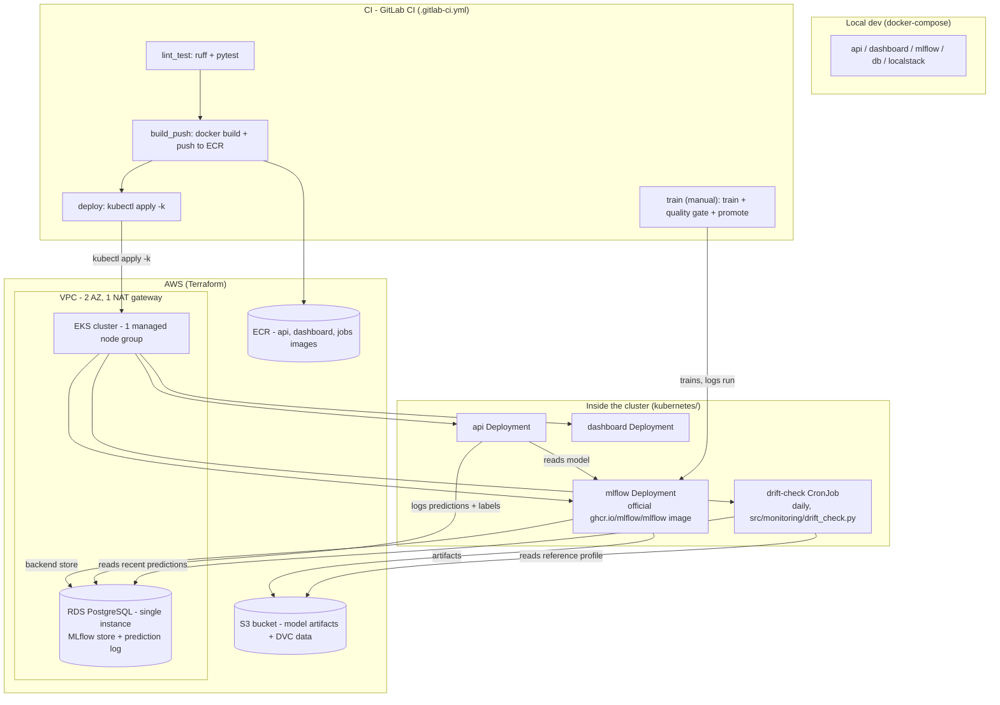

*Read this in other languages: [Español](README_es.md)*

# Hotel Booking Market Segmentation — MLOps Pipeline

[](core_ml/pyproject.toml)
[](LICENSE)
[](.gitlab-ci.yml)
[](Dockerfile)
[-326CE5?logo=kubernetes&logoColor=white)](kubernetes/base)
[](terraform)
[](core_ml/src/train.py)
[](https://github.com/astral-sh/ruff)

## The problem

Hotels take bookings through several channels — direct, online travel
agencies, corporate accounts, groups — and a booking's **market segment**
drives pricing strategy and demand forecasting downstream. Getting that
segment right, and getting it right *consistently* as booking patterns shift
over a season, is what makes this a genuine MLOps problem rather than a
one-off notebook: the interesting part isn't fitting a classifier once, it's
operating it — tracking which version is serving, catching when the world
it was trained on stops matching the world it's scoring, and having a
repeatable, reviewable path from a new training run to a production alias
flip.

This project builds that whole loop end to end: a scikit-learn classifier
(RandomForest + SMOTE for the class imbalance across segments + Optuna for
hyperparameter search) trained on the classic
[hotel booking demand dataset](https://www.sciencedirect.com/science/article/pii/S2352340918315191),
served behind a FastAPI endpoint, versioned in an MLflow Model Registry, and
watched by a scheduled statistical check for data drift — all wired together
with the pieces a small team actually needs to run this in AWS: containerized
services, Infrastructure as Code, a CI/CD pipeline, and Kubernetes manifests
that describe the running system declaratively.

## Architecture



### Why it's built this way

**MLflow as the single source of truth for models.** The API never loads a
local `model.joblib`; it resolves `models:/HotelSegmentClassifier@staging`
against the registry on startup and on a refresh interval. That means "what's
serving in production" is always an answer the registry can give, not a file
that happens to be sitting in an image.

**A quality gate, then a canary comparison, as two separate steps.**
`train.py` only checks a candidate against an absolute floor
(`min_f1_threshold`) — good enough to be considered at all. `promote_model.py`
is the second, independent gate: it compares the candidate's F1 against
whatever is currently aliased `staging` and only moves the alias if the
candidate isn't meaningfully worse (`canary_tolerance`). Splitting these two
concerns means a model can fail loudly for being simply bad, or separately for
being a regression versus what's already live — two different failure modes
that call for different responses.

**A statistical, batch drift check instead of a streaming pipeline.** Every
training run logs a small reference profile (mean/standard deviation per
numeric feature, computed on the data the model was actually fit on) as an
MLflow artifact. A daily `CronJob` pulls a recent window of logged
predictions from Postgres and runs a one-sample z-test per feature against
that baseline, logging the verdict back to MLflow. This is the right level of
machinery for the traffic volumes involved: no message bus, no dedicated
streaming infrastructure to operate — just a scheduled job whose input is
already durable in a database this project runs anyway. A human reads the
result and decides whether a retrain is warranted; nothing retrains or
redeploys itself.

**`kubectl apply -k` in CI instead of a GitOps controller.** The `deploy`
stage builds fresh images, tags the Kustomize overlay, and applies it
directly to the cluster. For a single-environment, single-team deployment
this keeps the entire release path inside one pipeline definition, with one
tool (`kustomize`) to reason about, rather than introducing a second
control plane whose job is to reconcile what the first one already applied.

**One managed node group, one RDS instance, one NAT gateway.** The VPC spans
two availability zones for genuine subnet isolation, but the compute and
database layers are sized for what this workload needs: a couple of
`t3.medium` nodes running the API, MLflow, the dashboard, and the drift job,
and a single-instance Postgres database backing both the MLflow tracking
store and the prediction log. Scaling any of these up is a Terraform variable
change, not an architecture change.

**A Kubernetes Secret for the database password, populated once by hand.**
Terraform generates the RDS password (`random_password`) and the operator
copies it into a plain `kubectl create secret` — a small, explicit manual
step that keeps the credential out of both the Git history and the Terraform
state's more widely-read outputs, without requiring a secrets-management
service to be provisioned and IAM-wired just to hand one password to one
Deployment.

## Tech stack

| Layer | Choice |
|---|---|
| Model | scikit-learn `RandomForestClassifier`, imbalanced-learn `SMOTE`, Optuna for hyperparameter search |
| Data validation | Pandera schemas (`core_ml/src/data_contracts.py`) — fail fast before an expensive training run starts |
| Data versioning | DVC, backed by the same S3 bucket MLflow uses for artifacts |
| Experiment tracking / registry | MLflow (server + Model Registry, alias-based) |
| Serving | FastAPI + Uvicorn, structured JSON logging (`structlog`) |
| Monitoring | Custom prediction/label logger to Postgres (`api/monitoring.py`) + a scheduled z-test drift check |
| Dashboard | Streamlit |
| Containers | Docker (one image per workload: `Dockerfile`, `Dockerfile.dashboard`, `Dockerfile.jobs`) |
| Local stack | Docker Compose (Postgres, LocalStack for S3, MLflow, API, dashboard) |
| Infrastructure as Code | Terraform (VPC, EKS, RDS, S3, ECR, IAM, OIDC federation with GitLab) |
| Orchestration | Kubernetes on EKS, manifests managed with Kustomize (`base` + `production` overlay) |
| CI/CD | GitLab CI (`lint_test` → `build_push` → `deploy`, plus a manual `train` stage) |
| Quality gates | Ruff, mypy, pytest, pre-commit |

## Running locally

Requires Docker and Docker Compose.

```bash
docker compose up --build
```

This starts Postgres, a local S3 emulator (LocalStack), MLflow (backed by
Postgres + S3), the FastAPI serving app, and a Streamlit dashboard:

- API: http://localhost:8000/docs
- MLflow UI: http://localhost:5050
- Dashboard: http://localhost:8501

The API reports `model_loaded: false` on `/health` until a model has been
trained and registered — see the next section.

## Training

Both `api/` and `core_ml/` are separate Poetry projects.

```bash
cd core_ml
poetry install
poetry run dvc pull                       # pulls the tracked dataset
MLFLOW_TRACKING_URI=http://localhost:5050 poetry run python -m src.train
```

Training runs a scikit-learn pipeline (SMOTE + a tuned RandomForest) with
Optuna, logs the run (params, metrics, the model itself, and a small
reference profile used later for drift checking) to MLflow, and writes the
run id to `core_ml/run_id.txt`. A run that doesn't clear
`model.min_f1_threshold` (see `core_ml/config/config.yaml`) is still logged
for audit but is never eligible for promotion.

## Promoting a model to champion

A registered model version isn't served until it's explicitly promoted:

```bash
poetry run python -m src.promote_model --run-id "$(cat run_id.txt)"
```

`promote_model.py` compares the candidate's weighted F1 against whatever
model is currently serving under the `staging` alias (the "champion") and
only moves the alias if the candidate isn't worse than
`model.canary_tolerance` allows. The very first promotion always goes
through, since there's nothing yet to compare against. Every promotion tags
the new version with the one it replaced, so a bad promotion can be undone
with:

```bash
poetry run python -m src.promote_model --rollback
```

`make train` / `make promote` wrap both steps end to end; run `make help` for
the full list of targets.

## Monitoring for drift

`core_ml/src/monitoring/drift_check.py` runs a lightweight, well-scoped
check: at training time it records the mean and standard deviation of every
numeric feature; on a schedule (daily, via the `drift-check` CronJob) it
pulls a recent batch of logged predictions from Postgres and runs a
one-sample z-test per feature against that baseline. A feature whose batch
mean has drifted many standard errors from what training saw gets flagged.
The check only logs its verdict to MLflow and to stdout — it never retrains
or redeploys anything by itself. Deciding to retrain, and reviewing the
outcome, stays a human's job (`make train` + `make promote`, or the manual
`train` stage in `.gitlab-ci.yml`).

Try the whole loop locally:

```bash
make replay          # replays real 2016 bookings through /predict + /feedback
make drift-check      # runs the same check the CronJob runs, from the same image
```

## Deploying

### 1. Infrastructure (Terraform)

```bash
cd terraform
terraform init -backend-config="bucket=<your-tfstate-bucket>" \
                -backend-config="key=hotel-mlops/terraform.tfstate" \
                -backend-config="region=us-east-1"
terraform apply
```

This provisions a VPC (2 availability zones, 1 NAT gateway), an EKS cluster
with a single managed node group, a single-instance RDS Postgres database,
an S3 bucket for MLflow/DVC artifacts, ECR repositories, and the IAM role
GitLab CI assumes via OIDC to build, push, and deploy. The stack is designed
to be brought up on demand for a demo or a review and torn down again with
`terraform destroy` when it isn't needed.

Once the cluster exists, create the one secret Terraform doesn't manage
directly:

```bash
kubectl create namespace hotel-mlops
kubectl create secret generic mlops-secrets \
  --from-literal=POSTGRES_PASSWORD="$(terraform -chdir=terraform output -raw db_password)" \
  -n hotel-mlops
```

### 2. Application (kubectl / kustomize)

```bash
kubectl apply -k kubernetes/overlays/production
```

`.gitlab-ci.yml`'s `deploy` stage runs the same command after building and
pushing fresh images, so the cluster's state always reflects the last
successful pipeline run on `main`.

## Testing and quality

```bash
make lint    # ruff + mypy, both projects
make test    # pytest, both projects
make install # registers pre-commit hooks
```

These are the exact commands `.gitlab-ci.yml`'s `lint_test` stage runs and
that `pre-commit` runs on every commit, so there's a single definition of
"passing" shared by a laptop and CI.

## Repository layout

```
api/            FastAPI serving app (Poetry project, own tests)
core_ml/        Data pipeline, training, drift check, dashboard (Poetry project, own tests)
terraform/      AWS infrastructure: VPC, EKS, RDS, S3, ECR, IAM
kubernetes/     Kustomize manifests (base + production overlay)
docker-compose.yml   Local stack: db, localstack (S3), mlflow, api, dashboard
Dockerfile*     One image per workload: api, dashboard, jobs (core_ml batch code)
.gitlab-ci.yml  lint_test -> build_push -> deploy -> train (manual)
```

## License

MIT — see [LICENSE](LICENSE).
