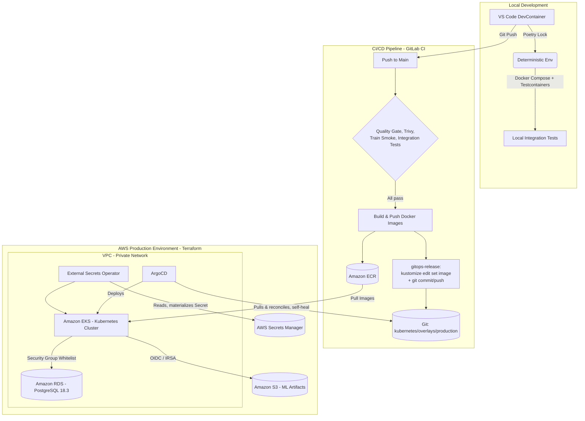

*Read this in other languages: [Español](README_es.md)*

# Hotel Booking Market Segmentation — End-to-End MLOps Pipeline

[](https://github.com/arguar13/hotel-booking-mlops)
[](LICENSE)
[](.gitlab-ci.yml)
[](Dockerfile)
[-326CE5?logo=kubernetes&logoColor=white)](kubernetes/base)
[](terraform)
[](core_ml/src/train.py)
[](gitops/argocd/application.yaml)
[](https://github.com/psf/black)
[](https://github.com/astral-sh/ruff)

---

## Summary

**The problem.** Hotels receive bookings through many channels — direct reservations, online travel agencies, corporate contracts, groups — and the market segment of a given booking materially affects pricing strategy, personalization, and demand forecasting. Classifying that segment by hand or with static rules does not scale, and machine learning models that are trained once, exported as a file, and never revisited drift silently as booking patterns change.

**The solution.** This repository implements a production-grade MLOps system that trains, validates, versions, serves, and continuously redeploys a market-segment classifier with no manual intervention between a `git push` and a running change in production. Every dataset is contract-validated before it is used, every trained model is versioned and traceable back to the exact code, data, and hyperparameters that produced it, and every model that reaches the serving API has already cleared an automated quality gate.

**The engineering value.** The system is built around three properties senior MLOps work is judged on:

- **Reproducibility** — a model version, a Git commit, a DVC data hash, and a container image tag are always linked, so any prediction in production can be traced back to exactly what produced it.
- **Safety of change** — nothing reaches the Kubernetes cluster without first passing static analysis, security scanning, a live end-to-end training smoke test, and hermetic integration tests against real (containerized) infrastructure; deployment itself is pull-based and self-healing, so CI never holds credentials to the production cluster.
- **Decoupled lifecycles** — promoting a new model version is a metadata operation against the MLflow Model Registry, not a code deploy; shipping an application change does not require retraining, and shipping a new model does not require rebuilding the API image.

---

## System Architecture

The architecture follows zero-trust networking, high-availability, and full deployment-automation principles: CI can only ever change *desired state in Git*, never the live cluster.



**Data and control flow.** A developer's change flows through the DevContainer and local Docker Compose stack first. Once pushed, GitLab CI validates it (quality gate, security scan, a live training run against a small toy dataset, and containerized integration tests) before building any image — `build-push-ecr` and `gitops-release` are structurally unreachable if any prior stage fails. `gitops-release` never touches AWS or the cluster: it commits the new image tag to `kubernetes/overlays/production/kustomization.yaml`. ArgoCD, running independently inside the cluster, is the only component that ever changes what is deployed — it pulls that commit, reconciles the cluster to match it, and reverts any manual drift (`selfHeal: true`). External Secrets Operator closes the same loop for credentials: secrets are read from AWS Secrets Manager and materialized as native Kubernetes Secrets, so no credential is ever committed to Git.

Note the deliberate asymmetry: CI (top half of the diagram) only ever writes to **Git** and to **ECR** — it has no arrow into the EKS cluster. Everything that changes production (bottom half) runs inside the cluster and pulls, on its own schedule, from sources CI cannot bypass.

---

## Technology Stack

| Category | Tools | Purpose in this project |
|---|---|---|
| **Infrastructure as Code** | Terraform, AWS (VPC, EKS, RDS, S3, ECR, IAM/IRSA) | Declarative definition of the entire AWS topology, with remote state (S3 + DynamoDB lock) |
| **Container Orchestration** | Kubernetes (EKS), Kustomize | Declarative deployment manifests; a base + production overlay pattern for environment-specific values |
| **GitOps & Delivery** | ArgoCD, External Secrets Operator | Pull-based, self-healing cluster reconciliation from Git; secrets synced declaratively from AWS Secrets Manager |
| **CI/CD** | GitLab CI, OpenID Connect (OIDC) | Quality gate, security scanning, training smoke test, integration tests, image build/push, GitOps release commit — with no long-lived AWS credentials in CI |
| **Experiment Tracking & Model Registry** | MLflow | Immutable model versioning, run/params/metrics logging, alias-based promotion to serving |
| **Data Versioning & Validation** | DVC, Pandera | Content-hashed, reproducible dataset pipeline; schema validation before training |
| **Model Serving** | FastAPI, Uvicorn | Low-latency, synchronous REST inference with automatic OpenAPI documentation |
| **Messaging** | Apache Kafka | Optional, decoupled asynchronous feed of prediction events |
| **Dashboard** | Streamlit | Human-facing exploration and demo interface |
| **Local Development** | Docker Compose, VS Code DevContainers, LocalStack | The full stack, including a simulated AWS, runnable end-to-end on a laptop |
| **Testing** | Pytest, Testcontainers | Fast unit tests plus hermetic, ephemeral integration tests against real Postgres/Kafka/LocalStack/API containers |
| **Observability & Resilience** | structlog, tenacity, pybreaker | Structured JSON logs, bounded retries with backoff, a circuit breaker on the non-critical path |
| **Code Quality & Security** | Ruff, Black, isort, mypy, Bandit, Trivy, detect-secrets, yamllint | Static analysis, typing, SAST, and IaC/secret/vulnerability scanning |
| **Dependency Management** | Poetry | Per-service, cryptographically locked, reproducible environments |
| **Machine Learning** | Scikit-learn, Imbalanced-learn (SMOTE), Optuna, Pandas | Model training, class-imbalance handling, automated hyperparameter search |

---

## The MLOps Pipeline

### Data Pipeline

Every dataset is validated against a [Pandera](https://pandera.readthedocs.io/) schema ([`core_ml/src/data_contracts.py`](core_ml/src/data_contracts.py)) at two points: immediately after the raw CSV is read, and again immediately before the cleaned data reaches Optuna/SMOTE/training. A malformed or out-of-range dataset is rejected in milliseconds — fail fast — instead of after minutes of wasted compute.

**DVC** (backed by the same S3 bucket MLflow uses) versions both the raw dataset and a small, fixed, stratified **toy dataset** (~1,000 rows, [`core_ml/scripts/make_toy_dataset.py`](core_ml/scripts/make_toy_dataset.py)). A [`dvc.yaml`](core_ml/dvc.yaml) pipeline turns the cleaning step itself into a reproducible, content-hashed stage (`dvc repro`), so `dvc.lock` always records exactly which bytes of data produced which processed CSV. The toy dataset exists purely for iteration speed: it lets the full clean → validate → tune → train → quality-gate loop run end-to-end in seconds (`make train-toy`), instead of spending real time or compute against the full dataset for every local change or CI run.

### Training Pipeline

Training ([`core_ml/src/train.py`](core_ml/src/train.py)) runs an Optuna hyperparameter search over a `RandomForestClassifier` wrapped in a scikit-learn `Pipeline` (imputation, scaling/one-hot encoding, SMOTE for class imbalance). **MLflow is the single, immutable source of truth for trained models** — there is no `model.joblib` anywhere in this repository. Every run tags itself with the full traceability tuple:

| Leg | Source |
|---|---|
| Git commit hash | `CI_COMMIT_SHA` in CI, `git rev-parse HEAD` locally |
| DVC data hash | `dvc.lock` / the dataset's `.dvc` file |
| Hyperparameters | Logged via `mlflow.log_params` (from the Optuna study) |
| MLflow run ID | Assigned by `mlflow.start_run()` |
| Container image tag | `CI_COMMIT_SHA` / `IMAGE_TAG` env var |

A **quality gate** then decides whether the run is servable: the model is promoted to the `staging` Model Registry alias (`models:/HotelSegmentClassifier@staging`, the alias `api/main.py` loads at startup) only if its weighted F1 on the held-out split clears `model.min_f1_threshold` in [`config.yaml`](core_ml/config/config.yaml). A run that misses the bar is still fully logged for audit — metrics, params, artifact, traceability tags — it simply never becomes reachable by the serving API, and the training job itself fails loudly (`QualityGateError`) instead of silently shipping a weak model.

### Deployment Pipeline (CI/CD)

The pipeline's stage order — `test → build → deploy` — is a structural guarantee, not a convention: `build-push-ecr` and `gitops-release` cannot run unless every job in `test` has already passed.

```
Push to main
  └─ test stage (all must pass)
       ├─ quality-gate        → make ci (ruff, mypy, pytest+coverage, bandit, yamllint)
       ├─ trivy-scan          → filesystem + IaC/secret scanning
       ├─ train-smoke         → live clean→validate→tune→train→quality-gate run, toy dataset
       └─ integration-tests   → Testcontainers: Postgres, Kafka, LocalStack, the real API Dockerfile
  └─ build stage
       └─ build-push-ecr      → build & push api / dashboard / mlflow images to Amazon ECR
  └─ deploy stage
       └─ gitops-release      → kustomize edit set image + git commit/push (commits to Git only)

ArgoCD (independent, in-cluster, polling Git) → pulls the new commit → reconciles the cluster
```

Every job's `script:` is the same `make` target (`make ci`, `make train-toy`, `make test-integration`) a developer already ran locally via pre-commit or by hand — there is no CI-only logic that can drift from what was validated on a laptop. `gitops-release` itself never runs `kubectl apply` or touches AWS; it only commits an image-tag bump to Git. Authentication throughout uses GitLab's native OpenID Connect (OIDC) federated to a scoped IAM role (`terraform/iam.tf`), so no long-lived AWS access key is ever stored as a CI secret.

---

## Engineering Practices

**Deterministic dependencies (Poetry).** `api/`, `core_ml/`, and `integration-tests/` are each their own Poetry project with their own committed `poetry.lock`, so the environment validated in development is byte-for-byte the one running inside production containers.

**Shift-left validation (pre-commit + Makefile).** Every commit runs `ruff`, `black`, `isort`, and `mypy` for static analysis and typing, `pytest` for tests, `bandit` and `trivy` for security, and `yamllint` / `detect-secrets` for infrastructure manifests and credential leaks — orchestrated entirely through [`Makefile`](Makefile) and [`.pre-commit-config.yaml`](.pre-commit-config.yaml). A commit is rejected automatically on any failure, and GitLab CI runs the exact same `make` targets, so there is one, and only one, definition of "passing."

**Containerized development (DevContainers).** Opening the repository in VS Code provisions a containerized environment with the correct Python runtime, system dependencies, and tooling automatically — no local Python installation is required, and there is no environment drift between contributors.

**Local integration testing (Docker Compose).** The entire application stack — PostgreSQL, LocalStack (S3/SQS/Secrets Manager), Kafka, MLflow (with an S3-backed, not filesystem-backed, artifact store), FastAPI, and Streamlit — runs locally via `make up`, exercising the same code paths (network calls, S3-backed storage, database connectivity) as production before anything reaches AWS.

**Ephemeral integration tests (Testcontainers) against a simulated cloud (LocalStack).** [`integration-tests/`](integration-tests) spins up real, short-lived containers to prove each moving part in isolation — the Postgres connection pattern MLflow's backend depends on, the Kafka produce/consume roundtrip the API's prediction feed depends on, the exact S3/SQS/Secrets Manager calls this project makes in production, and the real `Dockerfile` building and serving `/health`. LocalStack backs both this suite and the Docker Compose stack, so S3/SQS/Secrets Manager calls hit a local emulator rather than a real AWS account during development.

**GitOps with zero manual `kubectl apply` and zero `sed`.** Every raw text-substitution pattern from earlier iterations of this project has been replaced with a structural equivalent: `ExternalSecret` CRDs instead of `sed`-injected passwords, `kustomize edit set image` instead of `sed`-rewritten image tags, DVC's own CLI instead of `sed`-edited remote URLs. The cluster's desired state lives entirely under [`kubernetes/`](kubernetes), and [`gitops/argocd/application.yaml`](gitops/argocd/application.yaml) is the only thing that tells ArgoCD to reconcile it. Preview exactly what would be deployed, with no cluster access needed, via `make k8s-build`.

---

## Monitoring and Observability

**Structured logs.** Both `api/main.py` and `core_ml/src/train.py` log through [structlog](https://www.structlog.org/), configured to emit one JSON object per event (timestamp, level, event name, structured context) — the format CloudWatch Logs and Elasticsearch ingest natively, with no separate log-parsing layer:

```json
{"model_uri": "models:/HotelSegmentClassifier@staging", "event": "model_load_failed", "error": "...", "timestamp": "2026-08-25T21:48:11Z", "level": "error"}
```

**Health and latency signal.** `/health` doubles as the Kubernetes readiness/liveness probe target and a machine-readable status endpoint: it reports whether a model is currently loaded (`model_loaded`) and the live state of the Kafka circuit breaker (`closed` / `open` / `half-open`), so a partial degradation is visible without reading logs.

**Bounded failure instead of cascading failure.** Loading the model from the MLflow Registry at startup retries with capped exponential backoff (`tenacity`, at most 3 attempts) rather than hanging indefinitely — a pod that cannot reach the registry finishes starting and reports `model_loaded: false` instead of never becoming ready. The optional Kafka prediction-event publish is wrapped in a circuit breaker (`pybreaker`) that opens after 5 consecutive failures and stays open for 30 seconds, so a downed broker degrades a non-critical side channel instead of adding a connection-timeout to every `/predict` request. Both mechanisms are covered by tests ([`api/tests/test_api.py`](api/tests/test_api.py)) that simulate a failing Kafka and assert the breaker opens and the request path never raises.

**Prediction audit trail.** Every successful prediction is optionally published as an event to Kafka's `predictions` topic (booking features, predicted segment, model name and alias, timestamp) — a fire-and-forget, decoupled feed that never blocks or fails the HTTP response, and the natural foundation for a future drift-detection consumer.

**Deliberately out of scope today.** There is no Prometheus/Grafana metrics stack and no automated data or concept drift detection (e.g., Evidently AI) wired up yet. The Kafka prediction feed above, together with the full traceability tags already attached to every MLflow run, are exactly the groundwork such a service would consume — adding it is the natural next increment once the model is serving real production traffic rather than a portfolio-scale volume.

---

## Architectural Decisions and Trade-offs

Senior engineering is judged as much by what was deliberately not built as by what was. Each choice below was made under a real constraint, and each carries a cost that was accepted knowingly rather than discovered later.

**Synchronous REST inference (FastAPI) over batch or streaming scoring.** The business need is to know a booking's market segment at the moment it enters the system, so pricing and personalization logic downstream can act on it immediately — a nightly batch job would be cheaper to run but introduces a latency window that is unacceptable for that use case, while a full streaming architecture (e.g., a Kafka Streams/Flink job consuming bookings and emitting predictions) would solve latency at a level of infrastructure and operational complexity the current request volume does not justify. The implemented compromise is synchronous request/response for the prediction itself, with an optional, fully decoupled Kafka feed for everything that *can* tolerate asynchronous delivery — audit logging, and eventually drift monitoring.

**FastAPI over Flask.** FastAPI's ASGI foundation (Uvicorn) supports concurrent I/O-bound work — the internal Kafka publish today, other outbound calls tomorrow — without a separate worker-pool story, and Pydantic-based request/response validation plus an auto-generated OpenAPI schema replace what would otherwise be hand-written marshalling and hand-maintained API docs. For a single-model prediction endpoint, that was worth the small added conceptual surface over Flask's simplicity.

**MLflow Model Registry aliases as the only path to a servable model — no `model.joblib` in the repository or the image.** Baking a serialized model into the Docker image couples every model update to a full image rebuild and redeploy. Loading from the registry by alias (`models:/HotelSegmentClassifier@staging`) decouples "ship a new model version" from "ship a new version of the application" — promoting a model is a metadata operation (`set_registered_model_alias`), not a CI/CD run. The accepted cost is a runtime dependency: the API is unable to serve if the registry is unreachable at startup, which is exactly why model loading is wrapped in a bounded retry and `/health` reports the failure explicitly instead of the pod crashing.

**GitOps (ArgoCD, pull-based) over CI running `kubectl apply` (push-based).** A push-based pipeline is simpler and has zero reconciliation lag, but it requires CI to hold live cluster credentials — a large blast radius for a CI runner to carry. Pull-based GitOps confines CI's blast radius to Git and ECR; ArgoCD, running inside the cluster with its own scoped access, is the only thing that ever mutates it, and it self-heals manual drift automatically. The accepted trade-off is a small window between merge and rollout (ArgoCD's sync interval) instead of an immediate push.

**Kustomize over Helm for this repository's own manifests.** With exactly one environment (production) and a handful of environment-specific values (image tags, DB host, bucket name), a templating engine's parameterization is unneeded complexity — Kustomize's structural patches (`kustomize edit set image`) are enough, and they keep the base manifests plain, readable Kubernetes YAML. Helm is still used, deliberately, for the two pieces of infrastructure that genuinely are third-party and versioned upstream: ArgoCD and the External Secrets Operator, both installed via `helm_release` in Terraform.

**Poetry with per-service lockfiles over one repository-wide `requirements.txt`.** `api/` and `core_ml/` have different runtime dependencies (the API does not need Optuna or DVC; training does not need Uvicorn) and different release cadences. Two Poetry projects with two committed lockfiles let each evolve and redeploy independently, at the cost of some pinning (`numpy<2.0.0`, the `scikit-learn` floor) that has to be kept in sync by hand where the two genuinely overlap.

**RandomForest + Optuna over a deep learning model.** The dataset is tabular, with a moderate number of categorical and numeric features — the class of problem where tree ensembles typically match or beat deep networks, train in seconds rather than GPU-hours, and load reliably into a synchronous request path. Optuna adds automated hyperparameter search on top of that baseline without paying for a heavier training framework or a GPU-aware serving story.

**GitLab CI over GitHub Actions.** The pipeline itself runs on GitLab CI — this repository is mirrored to GitHub as a portfolio artifact. The deciding factor was GitLab's native OIDC federation to AWS IAM (`aws_iam_openid_connect_provider` in `terraform/iam.tf`), which removes the need for any long-lived AWS access key stored as a CI secret; an equivalent exists for GitHub Actions, but the pipeline predates that specific migration, and the underlying security property — no static credentials in CI — is identical either way.

---

## Getting Started (Reproducibility)

### 1. Local Development (DevContainer)

1. Clone the repository.
2. Open it in VS Code.
3. Select **Reopen in Container** when prompted.

The environment automatically builds and runs `make install`, which installs every Poetry environment (`api/`, `core_ml/`, `integration-tests/`) from its lockfile and registers the pre-commit git hooks.

### 2. Quality Gates (Makefile + pre-commit)

| Command | What it does |
|---|---|
| `make format` | Auto-format code with `isort` + `black` |
| `make lint` | Static analysis with `ruff` |
| `make typecheck` | Static typing with `mypy` |
| `make test` | Run both unit test suites with coverage |
| `make security` | `bandit` SAST + `trivy` IaC/vulnerability scan |
| `make yaml-lint` | `yamllint` over Kubernetes manifests, CI config, docker-compose |
| `make ci` | Everything above, exactly as run in the pipeline |
| `make precommit` | Run every pre-commit hook against all files |

### 3. Local CI Validation (zero GitLab minutes)

Two layers, cheapest first, so no push has to reach GitLab to find out a job is broken:

1. **[`gitlab-ci-local`](https://github.com/firecow/gitlab-ci-local)** — reads `.gitlab-ci.yml` and runs jobs as plain Docker containers on this machine, never contacting GitLab. Covers everything that doesn't touch AWS or push real artifacts.
2. **A real self-hosted GitLab Runner**, registered against this project and running on this same hardware (`docker-compose`'s `ci-local` profile). Every job in `.gitlab-ci.yml` carries `tags: ["local-hardware"]`, so once this runner is registered and running, GitLab dispatches every job to it — never to GitLab.com's shared runners.

| Command | What it does |
|---|---|
| `make ci-dry-run` | Runs `quality-gate`, `trivy-scan`, and `integration-tests` locally via `gitlab-ci-local` — 0 GitLab minutes |
| `make ci-dry-run-train` | Runs `train-smoke` locally; needs AWS creds in `.gitlab-ci-local-variables.yml` (copy `.gitlab-ci-local-variables.yml.example`) since there's no `GITLAB_OIDC_TOKEN` outside real GitLab |
| `make runner-register` | Registers this machine as a project runner (needs `GITLAB_URL` + `GITLAB_RUNNER_TOKEN` from Settings → CI/CD → Runners → New project runner) |
| `make runner-start` | Starts the registered runner so it picks up real pipelines pushed to `main` |
| `make runner-stop` | Stops it |

`build-push-ecr` and `gitops-release` are deliberately excluded from `ci-dry-run`: they push real images to ECR and commit to Git, so there's no useful way to "dry-run" them without the side effects being real — they're validated for real, on this hardware, once the self-hosted runner picks up an actual push.

**Once `tags: ["local-hardware"]` is in place, a push to `main` stays pending forever if the runner isn't registered and running** — start it with `make runner-start` before pushing.

### 4. Training the Model (Data Contracts + DVC + MLflow)

| Command | What it does |
|---|---|
| `make data-toy` | Regenerate the ~1,000-row DVC-tracked toy dataset from the raw CSV |
| `make dvc-pull` / `make dvc-push` | Fetch / publish DVC-tracked datasets from/to the S3 remote |
| `make dvc-repro` | Re-run the DVC cleaning pipeline (`dvc.yaml`), refreshing `dvc.lock` |
| `make train-toy` | Full clean → validate → tune → train → quality-gate loop against the toy dataset, in seconds |
| `make train` | The same loop against the full dataset (needs a reachable MLflow server, e.g. `make up`) |

Both fail loudly (`QualityGateError`) if the trained model's weighted F1 misses `model.min_f1_threshold` in [`core_ml/config/config.yaml`](core_ml/config/config.yaml) — a run that fails the gate is still logged to MLflow for audit, but is never aliased into the `staging` Model Registry alias the API serves from.

To smoke-test `make train-toy` without Docker, point MLflow at a local SQLite store:

```bash
export MLFLOW_TRACKING_URI="sqlite:////tmp/mlflow-local.db"
make train-toy
```

### 5. Local Integration Testing

```bash
make up   # equivalent to: docker compose up --build
```

| Service | URL |
|---|---|
| FastAPI Documentation | `http://localhost:8000/docs` |
| FastAPI Health Check | `http://localhost:8000/health` |
| MLflow UI | `http://localhost:5050` |
| Streamlit Dashboard | `http://localhost:8501` |
| LocalStack (S3/SQS/Secrets Manager) | `http://localhost:4566` |
| Kafka broker | `localhost:19092` |

Run the ephemeral Testcontainers suite (separate from the long-running stack above) with:

```bash
make test-integration
```

### 6. Deploying Infrastructure

One-time bootstrap of the remote state backend:

```bash
aws s3api create-bucket --bucket hotel-mlops-tfstate-<account-id> --region us-east-1
aws dynamodb create-table --table-name hotel-mlops-tfstate-lock \
  --attribute-definitions AttributeName=LockID,AttributeType=S \
  --key-schema AttributeName=LockID,KeyType=HASH --billing-mode PAY_PER_REQUEST
```

Then, from `terraform/`:

```bash
make tf-fmt
terraform -chdir=terraform init \
  -backend-config="bucket=hotel-mlops-tfstate-<account-id>" \
  -backend-config="key=hotel-mlops/terraform.tfstate" \
  -backend-config="region=us-east-1" \
  -backend-config="dynamodb_table=hotel-mlops-tfstate-lock"
make tf-validate
terraform -chdir=terraform plan
terraform -chdir=terraform apply
```

This provisions the VPC/EKS/RDS/S3/ECR/IAM *and* bootstraps ArgoCD and External Secrets Operator into the cluster via Helm.

### 7. GitOps Bootstrap

After `terraform apply`, point ArgoCD at this repository once:

```bash
kubectl apply -f gitops/argocd/application.yaml
```

From here on, pushing to `main` runs the full CI/CD pipeline described above, and ArgoCD rolls out the result on its own.

---

## API Usage Example

```http
POST /predict
```

```bash
curl -X 'POST' \
  'http://<LOAD_BALANCER_IP>:8000/predict' \
  -H 'Content-Type: application/json' \
  -d '{
    "hotel": "Resort Hotel",
    "lead_time": 10,
    "arrival_date_year": 2017,
    "arrival_date_week_number": 27,
    "arrival_date_day_of_month": 1,
    "stays_in_weekend_nights": 0,
    "stays_in_week_nights": 3,
    "adults": 2,
    "meal": "BB",
    "country": "PRT",
    "distribution_channel": "Direct",
    "reserved_room_type": "A",
    "assigned_room_type": "A",
    "deposit_type": "No Deposit",
    "customer_type": "Transient",
    "adr": 98.0,
    "month": 7
}'
```

```json
{
  "predicted_market_segment": "Direct"
}
```

---

## Project Structure

```text
hotel-booking-mlops/
├── .devcontainer/           # Isolated VS Code environment definitions
├── .pre-commit-config.yaml  # Shift-left git hooks (lint, format, type-check, test, secrets, YAML)
├── .yamllint.yml            # YAML style/validity rules for CI + Kubernetes manifests
├── .secrets.baseline        # detect-secrets audited baseline (blocks new secrets only)
├── Makefile                 # Single command interface, shared by local dev and GitLab CI
├── api/                     # FastAPI inference microservice (own pyproject.toml + poetry.lock)
│   ├── pyproject.toml
│   ├── poetry.lock
│   └── tests/
├── core_ml/                 # Training pipeline, data processing, Streamlit dashboard
│   ├── pyproject.toml
│   ├── poetry.lock
│   ├── .dvc/                # DVC project root (`dvc init --subdir`), S3 remote config
│   ├── dvc.yaml             # Data-cleaning pipeline stages (full + toy)
│   ├── dvc.lock             # Content hashes for every stage's deps/outs
│   ├── data/                # Raw + processed CSVs - DVC-tracked, gitignored
│   │   └── toy/             # ~1000-row deterministic sample for fast local runs
│   ├── scripts/             # One-off tooling (make_toy_dataset.py)
│   ├── src/                 # data_contracts.py, data_processing.py, train.py, traceability.py
│   ├── dashboard/
│   └── tests/
├── integration-tests/       # Testcontainers: ephemeral Postgres/Kafka/LocalStack/API container tests
│   ├── pyproject.toml
│   ├── poetry.lock
│   └── tests/
├── localstack-init/         # Scripts LocalStack runs on startup (creates S3 buckets, SQS queue, secret)
├── kubernetes/              # Desired cluster state - GitOps source of truth for ArgoCD
│   ├── base/                # Deployments, Services, ConfigMap, ExternalSecret, ClusterSecretStore
│   └── overlays/
│       └── production/      # Image tags + env-specific patches (kustomize edit set image/...)
├── gitops/
│   └── argocd/
│       └── application.yaml # ArgoCD Application: reconciles kubernetes/overlays/production
├── terraform/               # Modular Infrastructure as Code
│   ├── ecr.tf               # Container registries (api, dashboard, mlflow) and lifecycle policies
│   ├── eks.tf               # Kubernetes cluster with OIDC enabled
│   ├── iam.tf               # IRSA roles + GitLab CI's OIDC-federated role
│   ├── argocd.tf            # ArgoCD Helm release (cluster bootstrap)
│   ├── external-secrets.tf  # External Secrets Operator Helm release (cluster bootstrap)
│   ├── provider.tf          # AWS/Kubernetes/Helm providers, remote S3 state backend
│   ├── rds.tf               # PostgreSQL database for MLflow backend
│   ├── s3.tf                # Versioned object storage for ML artifacts
│   ├── variables.tf         # Parametric variables and secrets management
│   └── vpc.tf               # Network topology (NAT, Private/Public Subnets)
├── Dockerfile.mlflow        # MLflow image with boto3/psycopg2 baked in (S3 artifact store + Postgres backend)
└── docker-compose.yml       # Local integration testing environment (db, localstack, kafka, mlflow, api, dashboard)
```

Each deployable unit (`api/`, `core_ml/`) is its own Poetry project with its own lockfile, so the two services can evolve and be deployed independently while still sharing one Makefile-driven quality gate.

---

## License

Distributed under the MIT License. See [LICENSE](LICENSE) for details.
