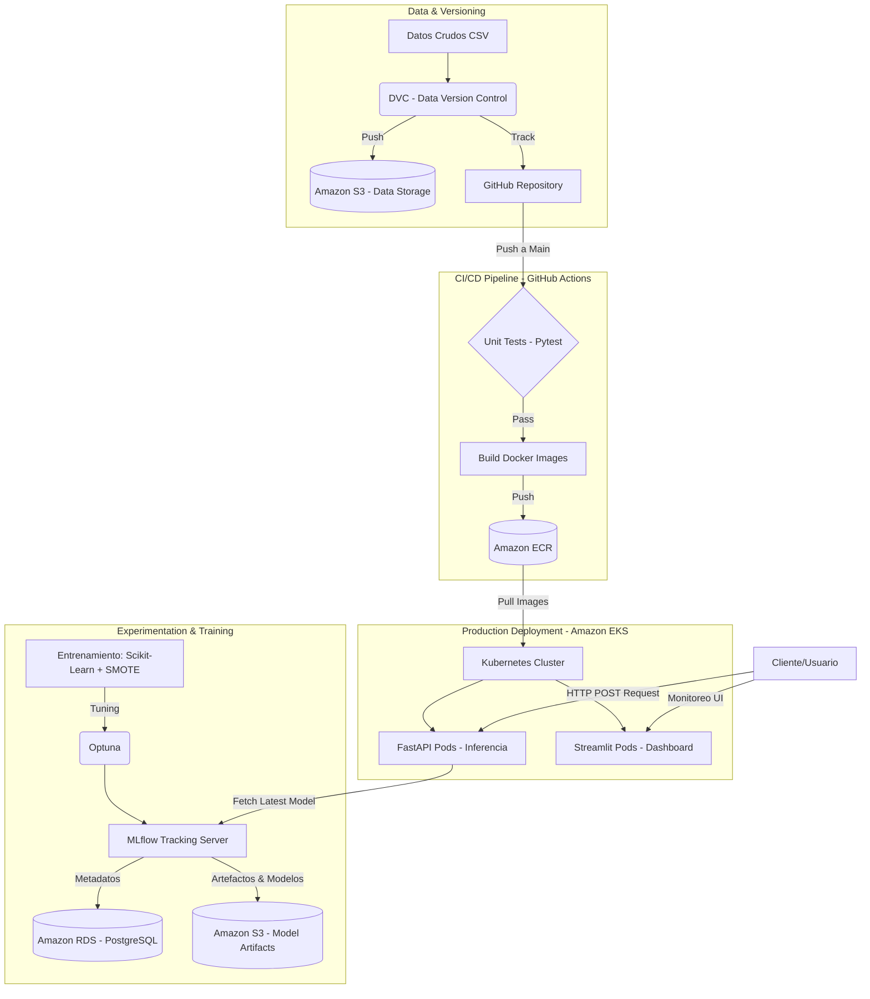

# 🏨 Hotel Market Segmentation - End-to-End MLOps Pipeline en AWS

<p align="center">
  
  
  
  
  
  
</p>

> **Nivel de Madurez MLOps (Google Cloud Architecture):** Nivel 2 (Automatización completa del Pipeline de CI/CD, Entrenamiento y Despliegue).

## 📋 Resumen Ejecutivo
Este proyecto implementa un sistema MLOps completo y escalable diseñado para la industria hotelera. Su objetivo principal es predecir la **segmentación de mercado** de las reservas mediante un modelo de Machine Learning (`RandomForestClassifier` optimizado con `Optuna` y balanceado con `SMOTE`).

La infraestructura está completamente contenerizada y desplegada en **Amazon Web Services (AWS)** utilizando **Amazon EKS** (Kubernetes) para orquestar los microservicios: una API de inferencia en tiempo real (FastAPI), un panel de monitoreo (Streamlit) y un servidor de tracking de experimentos (MLflow).

---

## 🏗️ Arquitectura del Sistema

El flujo del proyecto abarca desde el control de versiones de los datos hasta el despliegue automático de la infraestructura en Kubernetes.



---

## 🛠️ Stack Tecnológico

| Categoría | Herramientas Utilizadas | Propósito |
|-----------|------------------------|-----------|
| **Modelado & ML** | `scikit-learn`, `imbalanced-learn`, `pandas` | Limpieza, preprocesamiento y entrenamiento (Random Forest + SMOTE). |
| **Optimización** | `Optuna` | Búsqueda bayesiana de hiperparámetros. |
| **Data Versioning** | `DVC` | Versionado del dataset de reservas en Amazon S3. |
| **Experiment Tracking** | `MLflow` | Registro de métricas, parámetros y almacenamiento del modelo (Registry). |
| **Model Serving** | `FastAPI`, `Uvicorn`, `Pydantic` | API REST robusta y tipada para servir predicciones en tiempo real. |
| **Monitoreo & UI** | `Streamlit` | Interfaz de usuario para inferencia y monitoreo de Data Drift (Evidently). |
| **Contenedores** | `Docker` | Aislamiento de entornos (API y Dashboard). |
| **CI/CD** | `GitHub Actions` | Pruebas automáticas, construcción de imágenes y actualización de despliegues. |
| **Cloud & Orquestación**| `AWS (EKS, ECR, S3, RDS)`, `Kubernetes` | Despliegue de microservicios escalables y tolerantes a fallos. |

---

## 📂 Estructura del Proyecto

```text
hotel-booking-mlops/
├── .github/workflows/
│   └── ci_cd.yml               # Pipeline de Integración y Despliegue Continuo
├── api/
│   ├── main.py                 # Endpoint FastAPI (Carga dinámica de modelo MLflow/Local)
│   └── schemas.py              # Validación de datos de entrada con Pydantic
├── config/
│   └── config.yaml             # Configuración centralizada (Data, Modelo, MLflow)
├── dashboard/
│   └── app.py                  # Streamlit UI (Inferencia y Monitoreo de Data Drift)
├── data/                       # Datos gestionados por DVC (.dvc)
├── kubernetes/                 # Manifiestos K8s
│   ├── 01-config-secrets.yaml  # ConfigMaps y Secrets (RDS, URIs)
│   ├── 04-mlflow.yaml          # Servidor MLflow en K8s
│   ├── 05-api.yaml             # Deployment y LoadBalancer para la API
│   └── 06-dashboard.yaml       # Deployment para el Dashboard Streamlit
├── src/                        # Código fuente del pipeline de ML
│   ├── config_loader.py        # Cargador de configuración YAML
│   ├── data_processing.py      # Limpieza y preparación de datos
│   └── train.py                # Pipeline de entrenamiento y tracking con MLflow
├── tests/
│   └── test_api.py             # Pruebas unitarias para FastAPI
├── Dockerfile                  # Contenedor para FastAPI
├── Dockerfile.dashboard        # Contenedor para Streamlit
└── requirements.txt            # Dependencias del proyecto
```

---

## 🚀 Guía de Ejecución Local (Entorno de Desarrollo)

### 1. Requisitos Previos
* Python 3.12+
* Docker & Docker Compose
* Configuración de AWS CLI y credenciales locales válidas (`aws configure`).

### 2. Instalación y Configuración
```bash
# Clonar el repositorio
git clone https://github.com/tu-usuario/hotel-booking-mlops.git
cd hotel-booking-mlops

# Crear entorno virtual e instalar dependencias
python -m venv venv
source venv/bin/activate  # En Windows: venv\Scripts\activate
pip install -r requirements.txt
```

### 3. Recuperar Datos Versionados con DVC
El proyecto utiliza DVC acoplado a Amazon S3 para no saturar el repositorio con datos pesados.
```bash
dvc pull
```
*Esto descargará `hotel_bookings.csv` en la carpeta `data/`.*

### 4. Entrenamiento del Modelo
Ejecuta el script de procesamiento y entrenamiento. Este proceso limpiará los datos, buscará los mejores hiperparámetros con Optuna y registrará el modelo en MLflow.
```bash
# Iniciar servidor local de MLflow (opcional si se usa remoto)
mlflow server --backend-store-uri sqlite:///mlflow.db --default-artifact-root ./mlruns --host 0.0.0.0 --port 5000 &

# Ejecutar preprocesamiento
python -m src.data_processing

# Entrenar el modelo
python -m src.train
```

### 5. Levantar Servicios (API y Dashboard)
Construye y levanta los servicios localmente usando Docker:
```bash
docker build -t hotel-mlops-api -f Dockerfile .
docker build -t hotel-mlops-dashboard -f Dockerfile.dashboard .

docker run -d -p 8000:8000 hotel-mlops-api
docker run -d -p 8501:8501 hotel-mlops-dashboard
```
* **API Inferencia:** `http://localhost:8000/docs` (Swagger UI)
* **Dashboard Streamlit:** `http://localhost:8501`

---

## ☁️ Despliegue en Producción (AWS EKS)

La infraestructura de producción está diseñada para ejecutarse en Kubernetes (Amazon EKS).

### Despliegue Manual con `kubectl`
1. **Aplicar secretos y configuración (Conecta K8s con RDS y MLflow):**
   ```bash
   kubectl apply -f kubernetes/01-config-secrets.yaml
   ```
2. **Desplegar Servidor MLflow:**
   ```bash
   kubectl apply -f kubernetes/04-mlflow.yaml
   ```
3. **Desplegar la API y el Dashboard:**
   ```bash
   kubectl apply -f kubernetes/05-api.yaml
   kubectl apply -f kubernetes/06-dashboard.yaml
   ```

### 🔄 CI/CD Pipeline (GitHub Actions)
La integración continua está completamente automatizada mediante `.github/workflows/ci_cd.yml`:
1. **Trigger:** Push a las ramas `main` o `master`.
2. **Testing:** Configura Python 3.12, instala dependencias y ejecuta `pytest tests/`.
3. **AWS OIDC:** Se autentica en AWS mediante GitHub Actions OIDC (IAM Role) por motivos de seguridad.
4. **Build & Push:** Construye imágenes Docker y las publica en **Amazon ECR**.
5. **Continuous Deployment:** Actualiza el KubeConfig de EKS y hace deploy automático de la nueva versión modificando dinámicamente el `image_tag` de Kubernetes.

---

## 📡 Uso de la API (Ejemplo de Payload)

El modelo en producción clasifica el segmento de mercado del cliente.

**Endpoint:** `POST /predict`

```bash
curl -X 'POST'   'http://<TU_API_LOAD_BALANCER_URL>:8000/predict'   -H 'accept: application/json'   -H 'Content-Type: application/json'   -d '{
  "hotel": "Resort Hotel",
  "lead_time": 342,
  "arrival_date_year": 2015,
  "arrival_date_week_number": 27,
  "arrival_date_day_of_month": 1,
  "stays_in_weekend_nights": 0,
  "stays_in_week_nights": 2,
  "adults": 2,
  "children": 0,
  "babies": 0,
  "meal": "BB",
  "country": "PRT",
  "distribution_channel": "Direct",
  "is_repeated_guest": 0,
  "previous_cancellations": 0,
  "previous_bookings_not_canceled": 0,
  "reserved_room_type": "C",
  "assigned_room_type": "C",
  "booking_changes": 3,
  "deposit_type": "No Deposit",
  "days_in_waiting_list": 0,
  "customer_type": "Transient",
  "adr": 98.0,
  "required_car_parking_spaces": 0,
  "total_of_special_requests": 0,
  "month": 7
}'
```

**Respuesta Esperada:**
```json
{
  "predicted_market_segment": "Direct"
}
```

---
*Desarrollado con excelencia técnica para asegurar escalabilidad, trazabilidad y alta disponibilidad de modelos en entornos productivos.*
