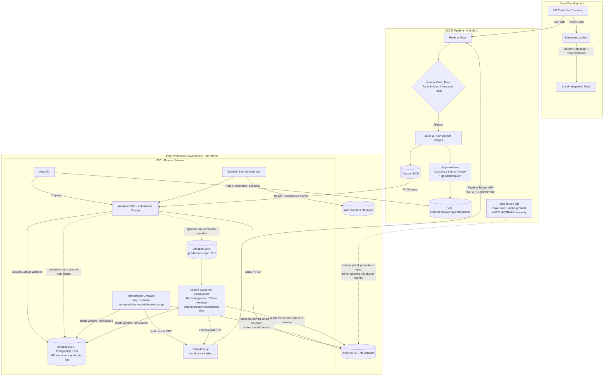

*Read this in other languages: [Español](README_es.md)*

# Hotel Booking Market Segmentation — End-to-End MLOps Pipeline

[](https://github.com/arguar13/hotel-booking-mlops)
[](LICENSE)
[](.gitlab-ci.yml)
[](Dockerfile)
[-326CE5?logo=kubernetes&logoColor=white)](kubernetes/base)
[](terraform)
[](core_ml/src/train.py)
[](gitops/argocd/application.yaml)
[](https://github.com/psf/black)
[](https://github.com/astral-sh/ruff)

---

## Summary

**The problem.** Hotels receive bookings through many channels — direct reservations, online travel agencies, corporate contracts, groups — and the market segment of a given booking materially affects pricing strategy, personalization, and demand forecasting. Classifying that segment by hand or with static rules does not scale, and machine learning models that are trained once, exported as a file, and never revisited drift silently as booking patterns change.

**The solution.** This repository implements a production-grade MLOps system that trains, validates, versions, serves, and continuously redeploys a market-segment classifier with no manual intervention between a `git push` and a running change in production. Every dataset is contract-validated before it is used, every trained model is versioned and traceable back to the exact code, data, and hyperparameters that produced it, and every model that reaches the serving API has already cleared an automated quality gate.

**The engineering value.** The system is built around three properties senior MLOps work is judged on:

- **Reproducibility** — a model version, a Git commit, a DVC data hash, and a container image tag are always linked, so any prediction in production can be traced back to exactly what produced it.
- **Safety of change** — nothing reaches the Kubernetes cluster without first passing static analysis, security scanning, a live end-to-end training smoke test, and hermetic integration tests against real (containerized) infrastructure; deployment itself is pull-based and self-healing, so CI never holds credentials to the production cluster.
- **Decoupled lifecycles** — promoting a new model version is a metadata operation against the MLflow Model Registry, not a code deploy; shipping an application change does not require retraining, and shipping a new model does not require rebuilding the API image.

---

## System Architecture

The architecture follows zero-trust networking, high-availability, and full deployment-automation principles: CI can only ever change *desired state in Git*, never the live cluster.



**Data and control flow.** A developer's change flows through the DevContainer and local Docker Compose stack first. Once pushed, GitLab CI validates it (quality gate, security scan, a live training run against a small toy dataset, and containerized integration tests) before building any image — `build-push-ecr` and `gitops-release` are structurally unreachable if any prior stage fails. `gitops-release` never touches AWS or the cluster: it commits the new image tag to `kubernetes/overlays/production/kustomization.yaml`. ArgoCD, running independently inside the cluster, is the only component that ever changes what is deployed — it pulls that commit, reconciles the cluster to match it, and reverts any manual drift (`selfHeal: true`). External Secrets Operator closes the same loop for credentials: secrets are read from AWS Secrets Manager and materialized as native Kubernetes Secrets, so no credential is ever committed to Git.

Note the deliberate asymmetry: CI (top half of the diagram) only ever writes to **Git** and to **ECR** — it has no arrow into the EKS cluster. Everything that changes production (bottom half) runs inside the cluster and pulls, on its own schedule, from sources CI cannot bypass. The one exception, and it is a narrow one: `mitigation.py` can call back *out* to CI's Pipeline Trigger API on a confirmed drift alert, bounded by a cooldown and a hard ceiling on how many times it may do that in a rolling window. Even that path still cannot touch the cluster directly — the `auto-retrain` job it launches ends at `promote_model.py`'s canary comparison, which only ever writes a new model version and, if it wins, a registry alias in MLflow. Nothing about this loop grants CI, or the retrain it triggers, the ability to `kubectl apply` anything; the asymmetry above holds even for the automated path.

---

## Technology Stack

| Category | Tools | Purpose in this project |
|---|---|---|
| **Infrastructure as Code** | Terraform, AWS (VPC, EKS, RDS, S3, ECR, IAM/IRSA) | Declarative definition of the entire AWS topology, with versioned remote state in S3 and S3-native conditional-write locking |
| **Container Orchestration** | Kubernetes (EKS), Kustomize | Declarative deployment manifests; a base + production overlay pattern for environment-specific values |
| **GitOps & Delivery** | ArgoCD, External Secrets Operator | Pull-based, self-healing cluster reconciliation from Git; secrets synced declaratively from AWS Secrets Manager |
| **CI/CD** | GitLab CI, OpenID Connect (OIDC) | Quality gate, security scanning, training smoke test, integration tests, image build/push, GitOps release commit — with no long-lived AWS credentials in CI |
| **Experiment Tracking & Model Registry** | MLflow | Immutable model versioning, run/params/metrics logging, alias-based promotion to serving |
| **Data Versioning & Validation** | DVC, Pandera | Content-hashed, reproducible dataset pipeline; schema validation before training |
| **Model Serving** | FastAPI, Uvicorn | Low-latency, synchronous REST inference with automatic OpenAPI documentation |
| **Messaging** | Apache Kafka (Amazon MSK in production) | Optional, decoupled, circuit-breaker-guarded feed of prediction events — the trigger for near-real-time drift early warning, never a substitute for the durable Postgres log |
| **Dashboard** | Streamlit | Human-facing exploration and demo interface |
| **Local Development** | Docker Compose, VS Code DevContainers, LocalStack | The full stack, including a simulated AWS, runnable end-to-end on a laptop |
| **Testing** | Pytest, Testcontainers | Fast unit tests plus hermetic, ephemeral integration tests against real Postgres/Kafka/LocalStack/API containers — including a schema contract test that applies the API's real DDL to a throwaway Postgres and runs the drift monitor's real queries against it |
| **Observability & Resilience** | structlog, tenacity, pybreaker | Structured JSON logs, bounded retries with backoff, circuit breakers on both non-critical paths |
| **Drift Monitoring** | Kubernetes CronJob + Deployment, PSI / Jensen-Shannon / bootstrap CIs (numpy), Postgres | Durable prediction log, delayed ground-truth ingestion, and both a daily (batch) and ~15-minute (Kafka-triggered) data / prediction / confidence / **concept** drift verdict recorded as an MLflow run |
| **Automatic Mitigation & Promotion** | GitLab Pipeline Trigger API, MLflow Model Registry aliases | Cooldown- and ceiling-bounded auto-retrain on a confirmed alert; canary comparison against the currently-served version gates every promotion, automatic or manual, with a one-step rollback path |
| **Code Quality & Security** | Ruff, Black, isort, mypy, Bandit, Trivy, detect-secrets, yamllint | Static analysis, typing, SAST, and IaC/secret/vulnerability scanning |
| **Dependency Management** | Poetry | Per-service, cryptographically locked, reproducible environments |
| **Machine Learning** | Scikit-learn, Imbalanced-learn (SMOTE), Optuna, Pandas | Model training, class-imbalance handling, automated hyperparameter search |

---

## The MLOps Pipeline

### Data Pipeline

Every dataset is validated against a [Pandera](https://pandera.readthedocs.io/) schema ([`core_ml/src/data_contracts.py`](core_ml/src/data_contracts.py)) at two points: immediately after the raw CSV is read, and again immediately before the cleaned data reaches Optuna/SMOTE/training. A malformed or out-of-range dataset is rejected in milliseconds — fail fast — instead of after minutes of wasted compute.

**DVC** (backed by the same S3 bucket MLflow uses) versions both the raw dataset and a small, fixed, stratified **toy dataset** (~1,000 rows, [`core_ml/scripts/make_toy_dataset.py`](core_ml/scripts/make_toy_dataset.py)). A [`dvc.yaml`](core_ml/dvc.yaml) pipeline turns the cleaning step itself into a reproducible, content-hashed stage (`dvc repro`), so `dvc.lock` always records exactly which bytes of data produced which processed CSV. The toy dataset exists purely for iteration speed: it lets the full clean → validate → tune → train → quality-gate loop run end-to-end in seconds (`make train-toy`), instead of spending real time or compute against the full dataset for every local change or CI run.

### Training Pipeline

Training ([`core_ml/src/train.py`](core_ml/src/train.py)) runs an Optuna hyperparameter search over a `RandomForestClassifier` wrapped in a scikit-learn `Pipeline` (imputation, scaling/one-hot encoding, SMOTE for class imbalance). **MLflow is the single, immutable source of truth for trained models** — there is no `model.joblib` anywhere in this repository. Every run tags itself with the full traceability tuple:

| Leg | Source |
|---|---|
| Git commit hash | `CI_COMMIT_SHA` in CI, `git rev-parse HEAD` locally |
| DVC data hash | `dvc.lock` / the dataset's `.dvc` file |
| Hyperparameters | Logged via `mlflow.log_params` (from the Optuna study) |
| MLflow run ID | Assigned by `mlflow.start_run()` |
| Container image tag | `CI_COMMIT_SHA` / `IMAGE_TAG` env var |

A **quality gate** then decides whether the run is servable: the model is promoted to the `staging` Model Registry alias (`models:/HotelSegmentClassifier@staging`, the alias `api/main.py` loads at startup) only if its weighted F1 on the held-out split clears `model.min_f1_threshold` in [`config.yaml`](core_ml/config/config.yaml). A run that misses the bar is still fully logged for audit — metrics, params, artifact, traceability tags — it simply never becomes reachable by the serving API, and the training job itself fails loudly (`QualityGateError`) instead of silently shipping a weak model.

### Deployment Pipeline (CI/CD)

The pipeline's stage order — `test → build → deploy` — is a structural guarantee, not a convention: `build-push-ecr` and `gitops-release` cannot run unless every job in `test` has already passed. Four images are built, not three: `api`, `dashboard`, `mlflow`, and `jobs` — the last one ([`Dockerfile.jobs`](Dockerfile.jobs)) packages `core_ml`'s code so it can run *inside* the cluster. Until it existed nothing on the training or monitoring side could run anywhere but a laptop, which is why the drift monitor needed it before it needed a single line of statistics.

```
Push to main
  └─ test stage (all must pass)
       ├─ quality-gate        → make ci (ruff, mypy, pytest+coverage, bandit, yamllint)
       ├─ trivy-scan          → filesystem + IaC/secret scanning
       ├─ train-smoke         → live clean→validate→tune→train→quality-gate run, toy dataset
       └─ integration-tests   → Testcontainers: Postgres, Kafka, LocalStack, the real API Dockerfile
  └─ build stage
       └─ build-push-ecr      → build & push api / dashboard / mlflow / jobs images to Amazon ECR
  └─ deploy stage
       └─ gitops-release      → kustomize edit set image + git commit/push (commits to Git only)

ArgoCD (independent, in-cluster, polling Git) → pulls the new commit → reconciles the cluster
```

Every job's `script:` is the same `make` target (`make ci`, `make train-toy`, `make test-integration`) a developer already ran locally via pre-commit or by hand — there is no CI-only logic that can drift from what was validated on a laptop. `gitops-release` itself never runs `kubectl apply` or touches AWS; it only commits an image-tag bump to Git. Authentication throughout uses GitLab's native OpenID Connect (OIDC) federated to a scoped IAM role (`terraform/iam.tf`), so no long-lived AWS access key is ever stored as a CI secret.


### Monitoring Pipeline

Training and serving are only two thirds of a model's lifecycle; the third is finding out whether the model is still right, and — when it is not — doing something bounded about it. Every prediction served in the cluster is written to a durable log with a correlation id, ground truth for those predictions is ingested through `POST /feedback` when the booking is reconciled, and a daily `CronJob` compares the two against the baseline that was logged with the serving model version. A second, long-running consumer reacts to the same prediction stream over much shorter, Kafka-triggered windows for early warning on data/prediction/confidence drift specifically. A confirmed alert from either one may launch a bounded, cooldown-guarded retrain, whose output only ever reaches production through a separate canary comparison against whatever is already serving. What each piece measures, why it is deliberately hard to trigger, and exactly where its authority ends are all in [Monitoring and Observability](#monitoring-and-observability) below.

The important structural point is that the batch and stream monitors are the first workloads here that are not request-serving services in the usual sense — one runs once a day and exits, the other holds a Kafka consumer group membership indefinitely. Both run from the same fourth image ([`Dockerfile.jobs`](Dockerfile.jobs), a different `command:` per workload), reach the cluster through exactly the same path as everything else — `kustomize edit set image`, a Git commit, ArgoCD — and consume exactly the same `mlops-config` ConfigMap and `mlops-secrets` Secret the API does, so "where the monitoring store is" has one definition and it lives in Git.

---

## Engineering Practices

**Deterministic dependencies (Poetry).** `api/`, `core_ml/`, and `integration-tests/` are each their own Poetry project with their own committed `poetry.lock`, so the environment validated in development is byte-for-byte the one running inside production containers.

**Shift-left validation (pre-commit + Makefile).** Every commit runs `ruff`, `black`, `isort`, and `mypy` for static analysis and typing, `pytest` for tests, `bandit` and `trivy` for security, and `yamllint` / `detect-secrets` for infrastructure manifests and credential leaks — orchestrated entirely through [`Makefile`](Makefile) and [`.pre-commit-config.yaml`](.pre-commit-config.yaml). A commit is rejected automatically on any failure, and GitLab CI runs the exact same `make` targets, so there is one, and only one, definition of "passing."

**Containerized development (DevContainers).** Opening the repository in VS Code provisions a containerized environment with the correct Python runtime, system dependencies, and tooling automatically — no local Python installation is required, and there is no environment drift between contributors.

**Local integration testing (Docker Compose).** The entire application stack — PostgreSQL, LocalStack (S3/SQS/Secrets Manager), Kafka, MLflow (with an S3-backed, not filesystem-backed, artifact store), FastAPI, and Streamlit — runs locally via `make up`, exercising the same code paths (network calls, S3-backed storage, database connectivity) as production before anything reaches AWS.

**Ephemeral integration tests (Testcontainers) against a simulated cloud (LocalStack).** [`integration-tests/`](integration-tests) spins up real, short-lived containers to prove each moving part in isolation — the Postgres connection pattern MLflow's backend depends on, the Kafka produce/consume roundtrip the API's prediction feed depends on, the exact S3/SQS/Secrets Manager calls this project makes in production, and the real `Dockerfile` building and serving `/health`. LocalStack backs both this suite and the Docker Compose stack, so S3/SQS/Secrets Manager calls hit a local emulator rather than a real AWS account during development.

**A contract test where a type checker cannot reach.** The two halves of the monitoring loop are separate Poetry projects that ship as separate images: `api/monitoring.py` owns the `monitoring.*` tables and writes to them, `core_ml/src/monitoring/store.py` only ever reads them back. Nothing at import time can catch the day someone renames a column on one side, and the consequence of that divergence is not a red test — it is a CronJob that starts failing at 04:00, or worse, one that quietly returns zero rows and reports "no drift" forever. [`test_monitoring_schema.py`](integration-tests/tests/test_monitoring_schema.py) closes that gap by extracting the real SQL constants out of both source files with `ast` (rather than importing the modules and dragging in mlflow, pandas, structlog and pybreaker to read four strings), applying the writer's own DDL to a throwaway Postgres container, writing through the writer's own `INSERT`s, and reading back through the reader's own `SELECT`s. A rename on either side fails in CI, on the commit that caused it.

**GitOps with zero manual `kubectl apply` and zero `sed`.** Every raw text-substitution pattern from earlier iterations of this project has been replaced with a structural equivalent: `ExternalSecret` CRDs instead of `sed`-injected passwords, `kustomize edit set image` instead of `sed`-rewritten image tags, DVC's own CLI instead of `sed`-edited remote URLs. The cluster's desired state lives entirely under [`kubernetes/`](kubernetes), and [`gitops/argocd/application.yaml`](gitops/argocd/application.yaml) is the only thing that tells ArgoCD to reconcile it. Preview exactly what would be deployed, with no cluster access needed, via `make k8s-build`.

**Configuration changes that actually reach running pods.** Non-secret configuration lives in [`kubernetes/base/mlops-config.env`](kubernetes/base/mlops-config.env) and is rendered by a Kustomize `configMapGenerator`, which appends a hash of the contents to the ConfigMap's name. Because `envFrom` values are only read when a container starts, a plain, statically named ConfigMap would let an edited value sit unnoticed until something else happened to restart the pod. A content hash changes the Deployment spec itself, so a config change is a rollout like any other.

**Hardened workloads by default.** Every Deployment runs as a non-root user (UID 1000, baked into each Dockerfile) with `runAsNonRoot`, a read-only root filesystem, all Linux capabilities dropped, `allowPrivilegeEscalation: false`, and the `RuntimeDefault` seccomp profile. The few paths that genuinely need to be written — MLflow's artifact staging directory, the client cache under `$HOME`, Streamlit's run state — get an explicit `emptyDir` each, so "read-only" stays a real constraint instead of one relaxed away the first time something failed to start.

---

## Monitoring and Observability

**Structured logs.** Both `api/main.py` and `core_ml/src/train.py` log through [structlog](https://www.structlog.org/), configured to emit one JSON object per event (timestamp, level, event name, structured context) — the format CloudWatch Logs and Elasticsearch ingest natively, with no separate log-parsing layer:

```json
{"model_uri": "models:/HotelSegmentClassifier@staging", "event": "model_load_failed", "error": "...", "timestamp": "2026-08-25T21:48:11Z", "level": "error"}
```

**Health and readiness are separate questions.** `/health` is the liveness target: it reports that the process itself is alive, along with whether a model is currently loaded (`model_loaded`), the alias being served, and the live state of the Kafka circuit breaker (`closed` / `open` / `half-open`) — so a partial degradation is visible without reading logs. It deliberately stays `200` when no model is loaded, because a missing model is not a reason to kill the container. `/ready` is the readiness target and answers the narrower question the load balancer cares about: it returns `503` until a model is actually loaded, keeping a replica out of the Service's endpoints instead of routing traffic to a pod that can only answer `503`. Collapsing both onto one endpoint is precisely what used to let a rollout leave the API dead behind a pod Kubernetes considered healthy.

**Bounded failure instead of cascading failure.** Loading the model from the MLflow Registry at startup retries with capped exponential backoff (`tenacity`, at most 3 attempts) rather than hanging indefinitely — a pod that cannot reach the registry finishes starting and reports `model_loaded: false` instead of never becoming ready. Because every rollout restarts the `mlflow` and `api` Deployments at the same time, exhausting those three attempts is routine rather than exceptional, so a background loader keeps retrying every `MODEL_RETRY_SECONDS` (15s by default) for as long as there is no model, with `/ready` returning `503` throughout. The same loop re-reads the alias every `MODEL_REFRESH_SECONDS` (300s in the cluster), so a newly promoted model version is picked up without a pod restart. That setting used to be an optimization, off by default; drift monitoring made it load-bearing. The monitor evaluates whichever version the alias currently resolves to and filters the prediction log by it, so an API still serving the previous version would produce a window with zero matching rows and a permanent `SKIPPED` verdict — a monitor that looks healthy while measuring nothing. MLflow's own client-side retry layer is dialled down to a single attempt (`MLFLOW_HTTP_REQUEST_MAX_RETRIES=1`) so it cannot compound with this one and turn a few bounded seconds into minutes of invisible backoff. The optional Kafka prediction-event publish is wrapped in a circuit breaker (`pybreaker`) that opens after 5 consecutive failures and stays open for 30 seconds, so a downed broker degrades a non-critical side channel instead of adding a connection-timeout to every `/predict` request. Both mechanisms are covered by tests ([`api/tests/test_api.py`](api/tests/test_api.py)) that simulate a failing Kafka and assert the breaker opens and the request path never raises.

**Prediction audit trail — durable, and actually running in production.** Every prediction is persisted to `monitoring.predictions` in the same RDS instance MLflow already uses: a `prediction_id` returned to the caller, the model *version* that produced it, the full feature vector as JSONB, and the classifier's top-class probability and its margin over the runner-up. The write never enters the request path — records go onto a bounded in-memory queue and are flushed in batches by a background task, behind the same circuit breaker already proven around the Kafka publish — so a dead database costs observability data and never a prediction. `/health` reports queue depth, rows written and rows dropped, because a starved sink must be visible *before* it produces a confident drift verdict over an unrepresentative sample.

> An earlier version of this document described the Kafka `predictions` topic as this audit trail, and for a while that was not true of production at all: there was no broker in the EKS cluster, `KAFKA_BOOTSTRAP_SERVERS` was unset there, and the feed only ever ran under `docker compose`. That changed with [`terraform/msk.tf`](terraform/msk.tf) — production now has a real (small, TLS-only) MSK cluster. Kafka is still not the audit trail, and the reasoning above for why Postgres is still holds: the durable, joinable record concept drift's ground-truth reconciliation depends on is a poor fit for at-most-once delivery to a topic with no history. What the broker now feeds is a *different* consumer with a *different* job — see [`stream_consumer.py`](core_ml/src/monitoring/stream_consumer.py) below — which is a new decision made explicitly, not a quiet reversal of the old one.

**Near-real-time early warning, on top of — not instead of — the daily batch job.** [`stream_consumer.py`](core_ml/src/monitoring/stream_consumer.py) is a small, single-replica Deployment holding a Kafka consumer group membership against the `predictions` topic `api/main.py` publishes to. Each message is a *trigger*, never the analysed data: every `trigger_batch_size` messages or `trigger_max_interval_seconds`, whichever comes first, it calls the exact same `run_monitor()` the CronJob calls — same statistics, same reference profile, same Postgres-backed read — over a 15-minute window instead of a 24-hour one, in its own MLflow experiment so its hysteresis counter never mixes with the daily job's. Concept drift is not special-cased out of that call; a 15-minute window almost never has enough reconciled labels, and `compute_concept_drift` correctly reports `SKIPPED`, the honest answer for a signal that cannot exist before a booking reconciles against its channel of record. What this buys is the other three questions — data, prediction and confidence drift — answered hours before the daily job would see the same window at all. A liveness probe execs a freshness check against a heartbeat file the consumer touches on every poll and every evaluation, the same "silence is the signal" idea 612's CloudWatch heartbeat alarm uses for its own batch job, applied here as a Kubernetes probe because a wedged-not-crashed consumer produces no exit code Kubernetes could otherwise notice.

**Ground truth — the delayed-label loop.** `POST /feedback` records the true market segment for previously served predictions, keyed on `prediction_id`. This is the half that makes *concept* drift measurable at all, and it exists because in this domain the truth is genuinely knowable: a booking's segment is settled when the reservation is reconciled against its channel of record, hours to days after the prediction was served. That is what a nightly reconciliation job posts, in batches. Unlike `/predict`, this write is synchronous and idempotent — labels are low-volume and worthless if silently dropped, and a batch job that cannot tell whether its labels landed will eventually compute accuracy over a biased sample.

**Drift monitoring — four questions, only one of which is concept drift.** A Kubernetes `CronJob` ([`drift-monitor-cronjob.yaml`](kubernetes/base/drift-monitor-cronjob.yaml)) runs [`core_ml/src/monitoring/`](core_ml/src/monitoring) once a day over one window and records its verdict as an MLflow run:

| Question | What moved | Needs labels? |
|---|---|---|
| **Data drift** | P(X) — per-feature PSI against the training baseline, plus missing-rate change | no |
| **Prediction drift** | P(ŷ) — the mix of predicted segments | no |
| **Confidence drift** | mean top-class probability, and the margin over the runner-up | no |
| **Concept drift** | **P(y&#124;X) — is the model still _right_?** | **yes** |

Only the last is concept drift in the strict sense, and it is the only one allowed to raise `ALERT` on its own. The other three are early warning during the reconciliation delay; treating them as alerts is how a monitor ends up paging someone for a seasonal shift in booking mix. Conflating the four is the most common way "drift monitoring" ends up reporting confidently on a model's *inputs* while the model quietly gets worse.

**The baseline travels with the model.** Drift is a comparison, so it needs a reference that is immutable and precisely identified. Training logs one — feature histograms, the target mix, and the held-out F1, accuracy, confidence and margin — as `monitoring/reference_profile.json`, an artifact of the model's own MLflow run. The monitor resolves the serving alias, downloads that version's profile, and compares. No DVC, no dataset, no bucket scan: a few kilobytes of histograms that cannot silently change under a model that never retrained. It is the same pattern SageMaker Model Monitor's baselining job and Vertex AI's skew detection use, for the same reasons.

**Why it is deliberately hard to trigger.** A monitor that cries wolf is switched off within a fortnight, and a switched-off monitor is worse than none because it is still believed. Three mechanisms:

- **A sample-size guard.** Below `min_predictions` / `min_labelled` the run reports `SKIPPED`, never "no drift" — "we could not tell" and "we checked and it is fine" call for opposite responses.
- **Effect sizes, not p-values.** PSI (the standard 0.10 / 0.25 bands) and Jensen–Shannon distance, not chi-square or KS. With tens of thousands of predictions a hypothesis test rejects the null on differences nobody would act on; an effect size answers the question an operator can act on.
- **Hysteresis.** A single alerting window is recorded but does not escalate. `consecutive_alerts_required` windows on the same model version must agree first — read back out of MLflow's own run history rather than from a second store to keep consistent.

For concept drift specifically, `ALERT` requires the drop to be both **material** (at least `f1_alert_tolerance` below the baseline) and **conclusive** (the whole bootstrap 95% interval for live F1 sitting below the baseline). A drop that is material but not conclusive is a `WARN`: the right response is to wait for more labels, not to pull a model that may be fine.

**Statistics implemented here rather than imported.** PSI, Jensen–Shannon and the bootstrap interval are forty lines of numpy in [`statistics.py`](core_ml/src/monitoring/statistics.py). A drift alert is an operational claim about a production model, and when someone asks six months later why version 7 was pulled, the answer has to be a formula and a threshold that were both under version control at the time — not "the library said so", where the binning strategy and default thresholds may have moved across a minor release. It also keeps a large transitive dependency graph, and its rendering stack, out of a `make security` gate that fails the build on any HIGH or CRITICAL finding.

**It may trigger a retrain on a confirmed `ALERT` — it still never promotes anything.** The job records a finding and exits non-zero on `ALERT`, which marks the Job failed and is what Kubernetes already surfaces everywhere. A confirmed `ALERT` (batch or stream) also reaches [`mitigation.py`](core_ml/src/monitoring/mitigation.py), which may launch a retrain through GitLab's Pipeline Trigger API — bounded by a cooldown (one trigger per incident, not one per monitor), a hard ceiling on automatic retrains per rolling window (a drift source a retrain cannot fix reaches a human instead of retriggering forever), and a fixed-timeout HTTP call with no retry loop. What it still cannot do is move the registry alias: promotion is a separate, later decision in [`promote_model.py`](core_ml/src/promote_model.py), gated on a canary comparison against whatever is already serving. The concern the original, retrain-refusing design of this job was protecting against — a data-quality incident upstream promoting a model trained on itself, with no check in between — is still structurally impossible; it is enforced one layer further down instead of by never retraining at all.

**A backtest against drift that actually happened.** [`scripts/replay_bookings.py`](core_ml/scripts/replay_bookings.py) replays real bookings through `/predict` and posts their real segments to `/feedback`. The dataset spans 2015-07 to 2017-08 and its booking mix genuinely shifts over that period, so setting `train_max_year: 2016` and replaying 2017 measures the monitor against a shift that really happened rather than against injected noise. Measured on the local stack:

| Window | Predictions / labelled | Live weighted F1 (95% CI) | Baseline | Features drifted | Concept drift |
|---|---|---|---|---|---|
| 2016 (in-period) | 1500 / 1200 | 0.9374 [0.9232, 0.9494] | 0.9267 | 3% | `OK` |
| 2017 (out-of-period) | 2000 / 1600 | 0.8982 [0.8842, 0.9121] | 0.9267 | 13% | `OK` |

The 2017 window is the instructive one. The inputs moved measurably — 13% of features, with `adr` up from a mean of 99 to 120 and the arrival-month distribution shifted — and live F1 fell by 0.0285 with the *entire* confidence interval below the baseline, so the degradation is real and statistically conclusive. It is nevertheless below the 0.03 tolerance, so the monitor correctly declines to escalate. Data drift is not concept drift, and this system is built to tell the difference.

That first run also surfaced a genuine train/serve skew nobody had noticed: `company` and `agent` are null for most training rows but default to `0.0` in the API's request schema, so a client that omits them sends a value the model never trained on. It is reported as an explicit `missing 94% -> 0%` finding rather than as an unexplained PSI of 5.6.

**Promotion — the canary/shadow gate a retrain has to clear.** [`promote_model.py`](core_ml/src/promote_model.py) is what `train.py` no longer does itself: move the registry alias. A candidate that cleared `train.py`'s absolute `min_f1_threshold` still has to beat whatever is currently aliased — both figures read from each version's own logged `reference_profile.json`, the same standard the concept-drift check above already holds a *serving* model to, within `canary_tolerance` (a small negative number, so a retrain that recovers most but not all of a real regression can still ship). No version aliased yet always promotes — there is nothing to compare against. Every promotion tags the new version with the one it replaced, which `--rollback` reads to move the alias back exactly one step; deliberately one step, not a full history walk, since unwinding more than one promotion without a human choosing which earlier version is safe is exactly the kind of unattended authority this system is built not to have.

**Deliberately out of scope today.** There is still no Prometheus/Grafana metrics stack — four numbers a day about one model belong in MLflow, which is already this project's system of record for exactly that, rather than in a second observability plane to operate and secure. The canary comparison above reads each version's already-logged held-out metric rather than replaying live traffic through an unpromoted challenger — a true shadow deployment would need a labelled slice of current production traffic kept back from both models, infrastructure this project's volume does not justify building (the same class of trade-off already made for the Kafka side channel). And ground truth here is replayed from the dataset rather than arriving from a real reservation system, which is the one part of this loop a production deployment would have to supply for itself.

---

## Architectural Decisions and Trade-offs

Senior engineering is judged as much by what was deliberately not built as by what was. Each choice below was made under a real constraint, and each carries a cost that was accepted knowingly rather than discovered later.

**Synchronous REST inference (FastAPI) over batch or streaming scoring.** The business need is to know a booking's market segment at the moment it enters the system, so pricing and personalization logic downstream can act on it immediately — a nightly batch job would be cheaper to run but introduces a latency window that is unacceptable for that use case, while a full streaming architecture (e.g., a Kafka Streams/Flink job consuming bookings and emitting predictions) would solve latency at a level of infrastructure and operational complexity the current request volume does not justify. The implemented compromise is synchronous request/response for the prediction itself, with everything that *can* tolerate asynchronous delivery moved off the request path: the prediction log is a non-blocking enqueue flushed in batches (see Monitoring below), and an optional, circuit-breaker-guarded Kafka publish feeds [`stream_consumer.py`](core_ml/src/monitoring/stream_consumer.py)'s near-real-time drift early warning without the request path ever depending on the broker being reachable.

**A Postgres prediction log over the Kafka topic the API already publishes to.** The obvious sink for inference logging was the `predictions` topic that already existed — except it only ever existed under `docker compose`. Deploying a broker into EKS to move a few thousand rows a day would have contradicted the streaming trade-off two paragraphs above, and an object-store append log cannot answer the query the monitor actually asks: "the predictions served in this window, joined to whatever ground truth has arrived for them". RDS is already provisioned, already reachable, already credentialed for the API pod through `mlops-secrets`, and it does the join. The accepted cost is that the serving path now touches a database — paid for with a bounded, non-blocking queue, batched flushes on a background task, a circuit breaker, and at-most-once delivery: losing a handful of rows to a hard pod kill is acceptable for a statistic computed over thousands, and buying at-least-once would have put the serving path back into the dependency chain the whole design exists to keep it out of.

**Drift statistics implemented rather than imported (no Evidently).** A drift finding is an operational claim that has to be reproducible from documented inputs months later, which argues for a formula and a threshold under version control rather than a library whose binning strategy and defaults can move across a minor release. PSI, Jensen–Shannon and a percentile bootstrap are forty lines of numpy, and keeping them here also keeps a large transitive dependency graph out of a `make security` gate that fails the build on any HIGH or CRITICAL finding. The accepted cost is the rendering: no interactive report, just a self-contained HTML artifact with proportional bars, which is also all that MLflow's artifact viewer can serve without a CDN.

**Effect sizes with fixed bands over hypothesis tests.** With a window of tens of thousands of predictions, chi-square or KS rejects the null on differences far too small to change any decision — the classic failure mode that makes a p-value-driven monitor cry wolf nightly until somebody silences it. PSI's 0.10 / 0.25 bands are an industry-standard vocabulary, so "PSI 0.31 on `lead_time`" needs no local explanation to be actionable. The one place inference genuinely belongs is the concept-drift verdict, where a labelled window really is a sample, and there the bootstrap confidence interval has to sit entirely below the baseline before anything escalates.

**A baseline profile logged with the model, not the training dataset re-read.** The alternative — have the monitor `dvc pull` the training data — needs DVC and bucket credentials in a batch pod, downloads tens of megabytes to throw away, and leaves nothing preventing the reference from silently changing under a model that never retrained. Logging a few kilobytes of histograms as an artifact of the training run makes the baseline immutable and reachable from the model version alone. The accepted cost is that a model trained before this existed has no baseline; the monitor reports that as `SKIPPED` with "retrain to publish one" rather than crashing.

**A Kubernetes CronJob over a workflow engine.** One container, once a day, no fan-out and no inter-task dependencies. Airflow, Argo Workflows or Step Functions would each add a control plane to operate, upgrade and secure in exchange for scheduling semantics Kubernetes already has — the same reasoning that kept Kustomize instead of Helm for this repository's own manifests. When there is a second task with a real dependency on the first, that trade changes.

**Drift reports as MLflow runs, not a Prometheus/Grafana stack.** These are four numbers a day about one model, already tied to the model version and the run that produced it, and MLflow is already this project's system of record for exactly that — it even plots one feature's PSI across every window, which is the view that turns "PSI is 0.3 today" into "PSI has been climbing for a week". A metrics stack would be a second observability plane to operate and secure for no question it could answer that this cannot. The accepted cost is no alertmanager: a confirmed `ALERT` exits non-zero instead, which marks the Job failed and surfaces through whatever already watches Kubernetes job failures.

**Detection without automatic retraining.** Closing the loop — drift fires, model retrains, alias moves — is the demo everyone wants and the design nobody should ship. It lets a data-quality incident upstream promote a model trained on that incident, with no human between the two, and it makes the quality gate the only thing standing between a bad day and production. The job's authority therefore ends at recording a finding and failing loudly. Retraining is a decision; this system produces the evidence for it.

**A separate IAM identity for batch workloads.** `jobs-sa` gets its own IRSA role rather than borrowing `api-sa`'s, even though today they need exactly the same S3 permissions. They are different workloads with different blast radii and different lifecycles, and sharing the role would mean every permission a future batch job needs is silently granted to the internet-facing API as well. The accepted cost is one more Terraform module and one more annotation to fill in after `terraform apply`.

**FastAPI over Flask.** FastAPI's ASGI foundation (Uvicorn) supports concurrent I/O-bound work — the internal Kafka publish today, other outbound calls tomorrow — without a separate worker-pool story, and Pydantic-based request/response validation plus an auto-generated OpenAPI schema replace what would otherwise be hand-written marshalling and hand-maintained API docs. For a single-model prediction endpoint, that was worth the small added conceptual surface over Flask's simplicity.

**MLflow Model Registry aliases as the only path to a servable model — no `model.joblib` in the repository or the image.** Baking a serialized model into the Docker image couples every model update to a full image rebuild and redeploy. Loading from the registry by alias (`models:/HotelSegmentClassifier@staging`) decouples "ship a new model version" from "ship a new version of the application" — promoting a model is a metadata operation (`set_registered_model_alias`), not a CI/CD run. The accepted cost is a runtime dependency: the API is unable to serve if the registry is unreachable at startup, which is exactly why model loading is wrapped in a bounded retry, kept alive by a background loader, and reported explicitly through `/ready` instead of the pod crashing.

**GitOps (ArgoCD, pull-based) over CI running `kubectl apply` (push-based).** A push-based pipeline is simpler and has zero reconciliation lag, but it requires CI to hold live cluster credentials — a large blast radius for a CI runner to carry. Pull-based GitOps confines CI's blast radius to Git and ECR; ArgoCD, running inside the cluster with its own scoped access, is the only thing that ever mutates it, and it self-heals manual drift automatically. The accepted trade-off is a small window between merge and rollout (ArgoCD's sync interval) instead of an immediate push.

**A separate, minimal Terraform configuration for the identity everything else runs as.** [`terraform/bootstrap/`](terraform/bootstrap/main.tf) creates exactly one IAM user (`hotel-mlops-terraform-automation`) in its own local state, applied once with the account root key; every other `terraform` command in this repository then runs as that user's CLI profile. The reason it is not simply another `.tf` file alongside the rest is a failure mode that only appears on teardown: a `terraform destroy` that includes the identity performing the destroy deletes it partway through its own run, and every remaining API call fails with `InvalidClientTokenId` — stranding EKS, RDS and the VPC half-deleted behind a stuck state lock. An identity must not live in the state it is being used to destroy. The accepted costs are a two-step bootstrap and a local `terraform.tfstate` holding a secret access key (gitignored, and disposable once the CLI profile is configured) — itself deliberate, since putting those credentials' state in the S3 bucket they exist to unlock is the same circular dependency one level up.

**Adopting account-wide AWS resources instead of owning them.** This project shares an AWS account with other work, and an IAM OIDC provider is a singleton per issuer URL for the *entire account*, not per Terraform state: a second `resource` block for `https://gitlab.com` fails with `EntityAlreadyExists` the moment a sibling project has registered it first, and managing it here would mean a `terraform destroy` in this repository silently breaking their CI. It is read as a `data` source instead, so this configuration adopts whichever provider already exists without ever creating or destroying something another project depends on. Every resource this configuration *does* own is prefixed with `project_name` for the same reason — IAM role names are unique per account, and the CI role was previously a bare `GitLabCIRole` that collided with an identically named role from another project.

**Kustomize over Helm for this repository's own manifests.** With exactly one environment (production) and a handful of environment-specific values (image tags, DB host, bucket name), a templating engine's parameterization is unneeded complexity — Kustomize's structural patches (`kustomize edit set image`) are enough, and they keep the base manifests plain, readable Kubernetes YAML. Helm is still used, deliberately, for the two pieces of infrastructure that genuinely are third-party and versioned upstream: ArgoCD and the External Secrets Operator, both installed via `helm_release` in Terraform.

**Poetry with per-service lockfiles over one repository-wide `requirements.txt`.** `api/` and `core_ml/` have different runtime dependencies (the API does not need Optuna or DVC; training does not need Uvicorn) and different release cadences. Two Poetry projects with two committed lockfiles let each evolve and redeploy independently, at the cost of some pinning (`numpy<2.0.0`, the `scikit-learn` floor) that has to be kept in sync by hand where the two genuinely overlap.

**RandomForest + Optuna over a deep learning model.** The dataset is tabular, with a moderate number of categorical and numeric features — the class of problem where tree ensembles typically match or beat deep networks, train in seconds rather than GPU-hours, and load reliably into a synchronous request path. Optuna adds automated hyperparameter search on top of that baseline without paying for a heavier training framework or a GPU-aware serving story.

**GitLab CI over GitHub Actions.** The pipeline itself runs on GitLab CI — this repository is mirrored to GitHub as a portfolio artifact. The deciding factor was GitLab's native OIDC federation to AWS IAM (`data.aws_iam_openid_connect_provider` in `terraform/iam.tf`), which removes the need for any long-lived AWS access key stored as a CI secret; an equivalent exists for GitHub Actions, but the pipeline predates that specific migration, and the underlying security property — no static credentials in CI — is identical either way.

---

## Getting Started (Reproducibility)

### 1. Local Development (DevContainer)

1. Clone the repository.
2. Open it in VS Code.
3. Select **Reopen in Container** when prompted.

The environment automatically builds and runs `make install`, which installs every Poetry environment (`api/`, `core_ml/`, `integration-tests/`) from its lockfile and registers the pre-commit git hooks.

### 2. Quality Gates (Makefile + pre-commit)

| Command | What it does |
|---|---|
| `make format` | Auto-format code with `isort` + `black` |
| `make lint` | Static analysis with `ruff` |
| `make typecheck` | Static typing with `mypy` |
| `make test` | Run both unit test suites with coverage |
| `make security` | `bandit` SAST + `trivy` IaC/vulnerability scan |
| `make yaml-lint` | `yamllint` over Kubernetes manifests, CI config, docker-compose |
| `make ci` | Everything above, exactly as run in the pipeline |
| `make precommit` | Run every pre-commit hook against all files |

### 3. Local CI Validation (zero GitLab minutes)

Two layers, cheapest first, so no push has to reach GitLab to find out a job is broken:

1. **[`gitlab-ci-local`](https://github.com/firecow/gitlab-ci-local)** — reads `.gitlab-ci.yml` and runs jobs as plain Docker containers on this machine, never contacting GitLab. Covers everything that doesn't touch AWS or push real artifacts.
2. **A real self-hosted GitLab Runner**, registered against this project and running on this same hardware (`docker-compose`'s `ci-local` profile). Every job in `.gitlab-ci.yml` carries `tags: ["local-hardware"]`, so once this runner is registered and running, GitLab dispatches every job to it — never to GitLab.com's shared runners.

| Command | What it does |
|---|---|
| `make ci-dry-run` | Runs `quality-gate`, `trivy-scan`, and `integration-tests` locally via `gitlab-ci-local` — 0 GitLab minutes |
| `make ci-dry-run-train` | Runs `train-smoke` locally; needs AWS creds in `.gitlab-ci-local-variables.yml` (copy `.gitlab-ci-local-variables.yml.example`) since there's no `GITLAB_OIDC_TOKEN` outside real GitLab |
| `make runner-register` | Registers this machine as a project runner (needs `GITLAB_URL` + `GITLAB_RUNNER_TOKEN` from Settings → CI/CD → Runners → New project runner) |
| `make runner-start` | Starts the registered runner so it picks up real pipelines pushed to `main` |
| `make runner-stop` | Stops it |

`build-push-ecr` and `gitops-release` are deliberately excluded from `ci-dry-run`: they push real images to ECR and commit to Git, so there's no useful way to "dry-run" them without the side effects being real — they're validated for real, on this hardware, once the self-hosted runner picks up an actual push.

**Once `tags: ["local-hardware"]` is in place, a push to `main` stays pending forever if the runner isn't registered and running** — start it with `make runner-start` before pushing.

### 4. Training the Model (Data Contracts + DVC + MLflow)

| Command | What it does |
|---|---|
| `make data-toy` | Regenerate the ~1,000-row DVC-tracked toy dataset from the raw CSV |
| `make dvc-pull` / `make dvc-push` | Fetch / publish DVC-tracked datasets from/to the S3 remote |
| `make dvc-repro` | Re-run the DVC cleaning pipeline (`dvc.yaml`), refreshing `dvc.lock` |
| `make train-toy` | Full clean → validate → tune → train → quality-gate loop against the toy dataset, in seconds |
| `make train` | The same loop against the full dataset (needs a reachable MLflow server, e.g. `make up`) |

Both fail loudly (`QualityGateError`) if the trained model's weighted F1 misses `model.min_f1_threshold` in [`core_ml/config/config.yaml`](core_ml/config/config.yaml) — a run that fails the gate is still logged to MLflow for audit, but is never aliased into the `staging` Model Registry alias the API serves from.

To smoke-test `make train-toy` without Docker, point MLflow at a local SQLite store:

```bash
export MLFLOW_TRACKING_URI="sqlite:////tmp/mlflow-local.db"
make train-toy
```

### 5. Local Integration Testing

```bash
make up   # equivalent to: docker compose up --build
```

| Service | URL |
|---|---|
| FastAPI Documentation | `http://localhost:8000/docs` |
| FastAPI Health Check | `http://localhost:8000/health` |
| MLflow UI | `http://localhost:5050` |
| Streamlit Dashboard | `http://localhost:8501` |
| LocalStack (S3/SQS/Secrets Manager) | `http://localhost:4566` |
| Kafka broker | `localhost:19092` |

Run the ephemeral Testcontainers suite (separate from the long-running stack above) with:

```bash
make test-integration
```

### 6. The Monitoring Loop (locally, end to end)

With the stack from step 5 running and a model trained and aliased, the whole loop can be exercised on a laptop — the drift job runs from the same image and the same entrypoint the production `CronJob` uses:

| Command | What it does |
|---|---|
| `make replay` | Replays 3,000 real 2016 bookings through `/predict`, then reconciles 80% of them through `/feedback` |
| `make replay-drift` | Replays real 2017 bookings — the period where the booking mix actually shifted |
| `make drift-report` | Runs the drift monitor (`Dockerfile.jobs`) against the window and records the verdict as an MLflow run |

The report lands in the MLflow UI under the `hotel_market_segmentation_monitoring` experiment: metrics (`concept_live_f1`, `concept_baseline_f1`, `drift_share`, one `psi_<feature>` per feature) plus `drift/drift_report.html` and `drift/drift_report.json` as artifacts.

To reproduce the backtest in [Monitoring and Observability](#monitoring-and-observability) — a baseline that genuinely predates the data being replayed — set `train_max_year: 2016` in [`config.yaml`](core_ml/config/config.yaml), run `make train`, then `make replay-drift` and `make drift-report`. Left at `null`, training uses the whole dataset and 2017 traffic is in-distribution by construction.

The monitor is honest about having nothing to say: below `min_predictions` (500) or `min_labelled` (300) it reports `SKIPPED` with the reason, rather than an all-clear it has not earned.

### 7. Deploying Infrastructure

**Step 0 — the bootstrap identity (once, with the account root key).** Everything below runs as a dedicated IAM user rather than the root key, and that user is created by its own small Terraform configuration with its own local state — see [`terraform/bootstrap/main.tf`](terraform/bootstrap/main.tf) for why it deliberately does not live alongside the infrastructure it creates.

```bash
cd terraform/bootstrap
AWS_ACCESS_KEY_ID=<root> AWS_SECRET_ACCESS_KEY=<root> terraform init
AWS_ACCESS_KEY_ID=<root> AWS_SECRET_ACCESS_KEY=<root> terraform apply

aws configure set aws_access_key_id     "$(terraform output -raw automation_user_access_key_id)"     --profile hotel-mlops
aws configure set aws_secret_access_key "$(terraform output -raw automation_user_secret_access_key)" --profile hotel-mlops
aws configure set region                us-east-1                                                    --profile hotel-mlops
```

**Step 1 — the remote state backend (once).** `terraform/provider.tf` declares `backend "s3" {}` with no values ("partial configuration"), because the state bucket has to exist before the configuration that would otherwise create it. Bucket versioning is what makes a corrupted or truncated state recoverable. There is no DynamoDB lock table: locking uses S3's own conditional writes (`use_lockfile`), which needs no second resource to provision, pay for, or keep in sync with the bucket — `dynamodb_table` has been deprecated since Terraform 1.11.

```bash
export AWS_PROFILE=hotel-mlops
aws s3api create-bucket --bucket hotel-mlops-tfstate-<account-id> --region us-east-1
aws s3api put-bucket-versioning --bucket hotel-mlops-tfstate-<account-id> \
  --versioning-configuration Status=Enabled
```

**Step 2 — the infrastructure.** Set `gitlab_project_path` in [`terraform/terraform.tfvars`](terraform/terraform.tfvars) to your own GitLab project path first: it is what scopes the OIDC trust policy to your pipeline, and CI cannot assume the role while it is left at the `CHANGE_ME/hotel-mlops` default.

```bash
make tf-fmt
terraform -chdir=terraform init \
  -backend-config="bucket=hotel-mlops-tfstate-<account-id>" \
  -backend-config="key=hotel-mlops/terraform.tfstate" \
  -backend-config="region=us-east-1" \
  -backend-config="use_lockfile=true"
make tf-validate
make tf-plan
terraform -chdir=terraform apply
```

This provisions the VPC/EKS/RDS/S3/ECR/IAM *and* bootstraps ArgoCD and External Secrets Operator into the cluster via Helm.

Teardown runs in the reverse order, for the same reason the bootstrap is split: `terraform -chdir=terraform destroy` as the automation profile first, then `terraform/bootstrap` on its own with the root key.

### 8. GitOps Bootstrap

`terraform apply` produces the handful of values the production overlay cannot know in advance. They change only when the infrastructure does, so unlike image tags (which CI rewrites on every build) they are set by hand, once:

```bash
terraform -chdir=terraform output rds_endpoint          # -> DB_HOST
terraform -chdir=terraform output s3_bucket_name        # -> S3_BUCKET_NAME
terraform -chdir=terraform output mlflow_iam_role_arn   # -> mlflow-sa annotation
terraform -chdir=terraform output api_iam_role_arn      # -> api-sa annotation
terraform -chdir=terraform output jobs_iam_role_arn     # -> jobs-sa annotation (drift-monitor CronJob)
```

`DB_HOST` and `S3_BUCKET_NAME` go in [`kubernetes/overlays/production/mlops-config.env`](kubernetes/overlays/production/mlops-config.env); the three IRSA role ARNs go in [`patch-service-account-arns.yaml`](kubernetes/overlays/production/patch-service-account-arns.yaml).

Then point ArgoCD at this repository once:

```bash
kubectl apply -f gitops/argocd/application.yaml
```

One value is only knowable after the cluster is running. MLflow >=3 rejects any request whose `Host` header is not on its `--allowed-hosts` list (it reads an unrecognized host as a possible DNS-rebinding attack), and the Load Balancer hostname for `mlflow-service` is assigned by AWS only once the Service exists. Until it is added, in-cluster traffic works but the MLflow UI answers `403` through the ELB — and a fresh Service means a fresh hostname, so this is repeated after any teardown and rebuild:

```bash
kubectl get svc mlflow-service -o jsonpath='{.status.loadBalancer.ingress[0].hostname}'
```

Append that hostname and `<hostname>:5000` to `MLFLOW_ALLOWED_HOSTS` in the production overlay, then commit — the hashed `configMapGenerator` is what makes ArgoCD roll the pods for a ConfigMap-only change.

From here on, pushing to `main` runs the full CI/CD pipeline described above, and ArgoCD rolls out the result on its own.

---

## API Usage Example

```http
POST /predict
```

```bash
curl -X 'POST' \
  'http://<LOAD_BALANCER_IP>:8000/predict' \
  -H 'Content-Type: application/json' \
  -d '{
    "hotel": "Resort Hotel",
    "lead_time": 10,
    "arrival_date_year": 2017,
    "arrival_date_week_number": 27,
    "arrival_date_day_of_month": 1,
    "stays_in_weekend_nights": 0,
    "stays_in_week_nights": 3,
    "adults": 2,
    "meal": "BB",
    "country": "PRT",
    "distribution_channel": "Direct",
    "reserved_room_type": "A",
    "assigned_room_type": "A",
    "deposit_type": "No Deposit",
    "customer_type": "Transient",
    "adr": 98.0,
    "month": 7
}'
```

```json
{
  "predicted_market_segment": "Direct",
  "prediction_id": "6f1c3f2a-6b1e-4a9e-9a8d-1f0f0f4a2b77",
  "model_version": "7",
  "confidence": 0.92,
  "margin": 0.84
}
```

`prediction_id` is the contract that makes concept-drift monitoring possible: quote it back once the booking's true segment is known and this prediction joins the labelled sample the monitor scores. `confidence` is the winning class probability and `margin` its gap to the runner-up — a model can stay confident while flipping between two classes it can no longer separate, and only the margin shows that.

```http
POST /feedback
```

```bash
curl -X 'POST' \
  'http://<LOAD_BALANCER_IP>:8000/feedback' \
  -H 'Content-Type: application/json' \
  -d '[
    {
      "prediction_id": "6f1c3f2a-6b1e-4a9e-9a8d-1f0f0f4a2b77",
      "actual_market_segment": "Online TA",
      "label_source": "reconciliation"
    }
]'
```

```json
{ "accepted": 1, "skipped": 0 }
```

A batch endpoint, because ground truth arrives from a reconciliation job rather than from the caller of `/predict`. It is an idempotent upsert, so re-posting a batch is safe — and necessary: `skipped` counts rows whose prediction had not yet been flushed to the log (predictions are persisted asynchronously so `/predict` stays fast), which the caller re-posts. A `skipped` count that survives retries means those ids were never served.

---

## Project Structure

```text
hotel-booking-mlops/
├── .devcontainer/           # Isolated VS Code environment definitions
├── .gitattributes           # Forces LF on shell/YAML/Makefile so a Windows checkout still passes `make ci`
├── .pre-commit-config.yaml  # Shift-left git hooks (lint, format, type-check, test, secrets, YAML)
├── .yamllint.yml            # YAML style/validity rules for CI + Kubernetes manifests
├── .secrets.baseline        # detect-secrets audited baseline (blocks new secrets only)
├── Makefile                 # Single command interface, shared by local dev and GitLab CI
├── api/                     # FastAPI inference microservice (own pyproject.toml + poetry.lock)
│   ├── pyproject.toml
│   ├── poetry.lock
│   ├── schemas.py           # Pydantic request/response contracts, incl. prediction_id and the /feedback batch
│   ├── monitoring.py        # Inference log + ground-truth sink (bounded queue, batched flush, breaker)
│   └── tests/
├── core_ml/                 # Training pipeline, data processing, Streamlit dashboard
│   ├── pyproject.toml
│   ├── poetry.lock
│   ├── .dvc/                # DVC project root (`dvc init --subdir`), S3 remote config
│   ├── dvc.yaml             # Data-cleaning pipeline stages (full + toy)
│   ├── dvc.lock             # Content hashes for every stage's deps/outs
│   ├── config/config.yaml   # Data paths, training period, Optuna trials, quality-gate threshold, registry name/alias, drift thresholds
│   ├── data/                # Raw + processed CSVs - DVC-tracked, gitignored
│   │   └── toy/             # ~1000-row deterministic sample for fast local runs
│   ├── scripts/             # One-off tooling (make_toy_dataset.py, replay_bookings.py)
│   ├── src/                 # data_contracts.py, data_processing.py, train.py, traceability.py
│   │   └── monitoring/      # Drift monitor: profile, statistics, store, report, drift_monitor (CronJob entrypoint)
│   ├── dashboard/
│   └── tests/
├── integration-tests/       # Testcontainers: ephemeral Postgres/Kafka/LocalStack/API container tests
│   ├── pyproject.toml
│   ├── poetry.lock
│   └── tests/               # incl. test_monitoring_schema.py - the writer's DDL vs the monitor's queries, on real Postgres
├── localstack-init/         # Scripts LocalStack runs on startup (creates S3 buckets, SQS queue, secret)
├── docker/                  # Optional local CA cert for TLS-intercepting proxies (empty placeholder by default)
├── kubernetes/              # Desired cluster state - GitOps source of truth for ArgoCD
│   ├── base/                # Deployments, Services, drift-monitor CronJob, ExternalSecret, ClusterSecretStore, mlops-config.env
│   └── overlays/
│       └── production/      # Image tags, IRSA role ARNs, env-specific config (kustomize edit set image/...)
├── gitops/
│   └── argocd/
│       └── application.yaml # ArgoCD Application: reconciles kubernetes/overlays/production
├── terraform/               # Modular Infrastructure as Code
│   ├── bootstrap/           # Separate config + local state: the one-time IAM identity everything else runs as
│   ├── ecr.tf               # Container registries (api, dashboard, mlflow, jobs) and lifecycle policies
│   ├── eks.tf               # Kubernetes cluster with OIDC enabled
│   ├── iam.tf               # IRSA roles + GitLab CI's OIDC-federated role
│   ├── argocd.tf            # ArgoCD Helm release (cluster bootstrap)
│   ├── external-secrets.tf  # External Secrets Operator Helm release (cluster bootstrap)
│   ├── provider.tf          # AWS/Kubernetes/Helm providers, remote S3 state backend (S3-native locking)
│   ├── rds.tf               # PostgreSQL database for MLflow backend
│   ├── s3.tf                # Versioned object storage for ML artifacts
│   ├── variables.tf         # Parametric variables and secrets management
│   ├── terraform.tfvars     # gitlab_project_path - scopes the OIDC trust policy to this GitLab project
│   └── vpc.tf               # Network topology (NAT, private/public subnets, EKS node + RDS security groups)
├── Dockerfile               # FastAPI inference image (non-root UID 1000)
├── Dockerfile.dashboard     # Streamlit dashboard image (non-root UID 1000)
├── Dockerfile.mlflow        # MLflow image with boto3/psycopg2 baked in (S3 artifact store + Postgres backend)
├── Dockerfile.jobs          # Batch image: core_ml packaged to run inside the cluster (drift-monitor CronJob)
└── docker-compose.yml       # Local stack (db, localstack, kafka, mlflow, api, dashboard) + the drift-monitor job
```

Each deployable unit (`api/`, `core_ml/`) is its own Poetry project with its own lockfile, so the two services can evolve and be deployed independently while still sharing one Makefile-driven quality gate.

---

## License

Distributed under the MIT License. See [LICENSE](LICENSE) for details.
