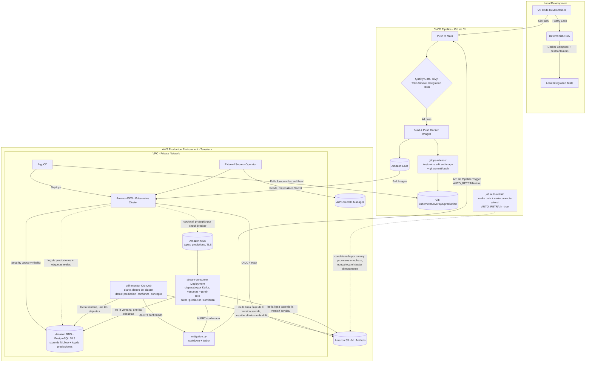

*Read this in other languages: [English](README.md)*

# Segmentación de Mercado en Reservas Hoteleras — Pipeline MLOps End-to-End

[](https://github.com/arguar13/hotel-booking-mlops)
[](LICENSE)
[](.gitlab-ci.yml)
[](Dockerfile)
[-326CE5?logo=kubernetes&logoColor=white)](kubernetes/base)
[](terraform)
[](core_ml/src/train.py)
[](gitops/argocd/application.yaml)
[](https://github.com/psf/black)
[](https://github.com/astral-sh/ruff)

---

## Resumen

**El problema.** Los hoteles reciben reservas a través de múltiples canales — reservas directas, agencias de viaje online, contratos corporativos, grupos — y el segmento de mercado de una reserva concreta afecta de forma directa a la estrategia de precios, la personalización y la previsión de demanda. Clasificar ese segmento a mano o con reglas estáticas no escala, y los modelos de machine learning que se entrenan una vez, se exportan como un archivo y nunca vuelven a revisarse se degradan silenciosamente a medida que cambian los patrones de reserva.

**La solución.** Este repositorio implementa un sistema MLOps de nivel producción que entrena, valida, versiona, sirve y redespliega de forma continua un clasificador de segmento de mercado sin intervención manual entre un `git push` y un cambio funcionando en producción. Cada dataset se valida contra un contrato antes de usarse, cada modelo entrenado queda versionado y es trazable hasta el código, los datos y los hiperparámetros exactos que lo produjeron, y todo modelo que llega a la API de serving ya ha superado una compuerta de calidad automatizada.

**El valor de ingeniería.** El sistema está construido alrededor de tres propiedades por las que se juzga el trabajo MLOps senior:

- **Reproducibilidad** — una versión de modelo, un commit de Git, un hash de datos de DVC y un tag de imagen de contenedor están siempre vinculados, de modo que cualquier predicción en producción puede rastrearse hasta exactamente lo que la produjo.
- **Seguridad ante el cambio** — nada llega al clúster de Kubernetes sin antes pasar análisis estático, escaneo de seguridad, una prueba de humo de entrenamiento end-to-end en vivo y pruebas de integración herméticas contra infraestructura real (contenedorizada); el despliegue en sí es pull-based y auto-reparable, por lo que CI nunca posee credenciales del clúster de producción.
- **Ciclos de vida desacoplados** — promover una nueva versión de modelo es una operación de metadatos contra el MLflow Model Registry, no un despliegue de código; publicar un cambio de aplicación no requiere reentrenar, y publicar un nuevo modelo no requiere reconstruir la imagen de la API.

---

## Arquitectura del Sistema

La arquitectura sigue principios de redes de confianza cero, alta disponibilidad y automatización completa del despliegue: CI solo puede cambiar *el estado deseado en Git*, nunca el clúster en ejecución.



**Flujo de datos y de control.** El cambio de un desarrollador pasa primero por el DevContainer y el stack local de Docker Compose. Una vez enviado, GitLab CI lo valida (compuerta de calidad, escaneo de seguridad, una ejecución de entrenamiento en vivo contra un dataset "toy" reducido y pruebas de integración contenedorizadas) antes de construir ninguna imagen — `build-push-ecr` y `gitops-release` son estructuralmente inalcanzables si alguna etapa anterior falla. `gitops-release` nunca toca AWS ni el clúster: solo confirma el nuevo tag de imagen en `kubernetes/overlays/production/kustomization.yaml`. ArgoCD, ejecutándose de forma independiente dentro del clúster, es el único componente que llega a cambiar lo que está desplegado — extrae ese commit, reconcilia el clúster para que coincida con él, y revierte cualquier desviación manual (`selfHeal: true`). External Secrets Operator cierra el mismo ciclo para las credenciales: los secretos se leen de AWS Secrets Manager y se materializan como Secrets nativos de Kubernetes, de modo que ninguna credencial se confirma jamás en Git.

Nótese la asimetría deliberada: CI (mitad superior del diagrama) solo escribe en **Git** y en **ECR** — no tiene ninguna flecha hacia el clúster de EKS. Todo lo que cambia producción (mitad inferior) se ejecuta dentro del clúster y extrae, con su propio calendario, de fuentes que CI no puede evitar. La única excepción, y es acotada: `mitigation.py` puede llamar de vuelta a la API de Pipeline Trigger de CI ante una alerta de drift confirmada, acotada por un cooldown y un techo duro de cuántas veces puede hacerlo en una ventana móvil. Incluso ese camino sigue sin poder tocar el clúster directamente — el job `auto-retrain` que lanza termina en la comparación canary de `promote_model.py`, que solo llega a escribir una nueva versión de modelo y, si gana, un alias de registry en MLflow. Nada en este bucle le da a CI, ni al reentrenamiento que dispara, la capacidad de hacer `kubectl apply` de nada; la asimetría de arriba se mantiene incluso para el camino automatizado.

---

## Stack Tecnológico

| Categoría | Herramientas | Propósito en el proyecto |
|---|---|---|
| **Infraestructura como Código** | Terraform, AWS (VPC, EKS, RDS, S3, ECR, IAM/IRSA) | Definición declarativa de toda la topología de AWS, con estado remoto versionado en S3 y bloqueo nativo de S3 por escrituras condicionales |
| **Orquestación de Contenedores** | Kubernetes (EKS), Kustomize | Manifiestos de despliegue declarativos; patrón de overlay base + producción para valores específicos por entorno |
| **GitOps y Entrega** | ArgoCD, External Secrets Operator | Reconciliación pull-based y auto-reparable del clúster desde Git; secretos sincronizados de forma declarativa desde AWS Secrets Manager |
| **CI/CD** | GitLab CI, OpenID Connect (OIDC) | Compuerta de calidad, escaneo de seguridad, prueba de humo de entrenamiento, pruebas de integración, build/push de imágenes, commit de release GitOps — sin credenciales de AWS de larga duración en CI |
| **Tracking y Registro de Experimentos** | MLflow | Versionado inmutable de modelos, registro de runs/parámetros/métricas, promoción a serving basada en alias |
| **Versionado y Validación de Datos** | DVC, Pandera | Pipeline de datasets reproducible y con hash de contenido; validación de esquema antes del entrenamiento |
| **Serving del Modelo** | FastAPI, Uvicorn | Inferencia REST síncrona de baja latencia, con documentación OpenAPI automática |
| **Mensajería** | Apache Kafka (Amazon MSK en producción) | Feed opcional, desacoplado y protegido por circuit breaker de eventos de predicción — el disparador del monitoreo de drift casi en tiempo real, nunca un sustituto del log duradero en Postgres |
| **Dashboard** | Streamlit | Interfaz de exploración y demostración orientada a personas |
| **Desarrollo Local** | Docker Compose, VS Code DevContainers, LocalStack | El stack completo, incluyendo una AWS simulada, ejecutable de punta a punta en una laptop |
| **Testing** | Pytest, Testcontainers | Pruebas unitarias rápidas más pruebas de integración herméticas y efímeras contra contenedores reales de Postgres/Kafka/LocalStack/API — incluida una prueba de contrato de esquema que aplica el DDL real de la API sobre un Postgres desechable y ejecuta contra él las consultas reales del monitor de drift |
| **Observabilidad y Resiliencia** | structlog, tenacity, pybreaker | Logs JSON estructurados, reintentos acotados con backoff, circuit breakers en ambas rutas no críticas |
| **Monitoreo de Drift** | CronJob + Deployment de Kubernetes, PSI / Jensen-Shannon / IC bootstrap (numpy), Postgres | Log duradero de predicciones, ingesta de ground truth diferido, y un veredicto de drift de datos / predicción / confianza / **concepto** tanto diario (batch) como cada ~15 minutos (disparado por Kafka), registrado como run de MLflow |
| **Mitigación y Promoción Automáticas** | API de Pipeline Trigger de GitLab, alias del MLflow Model Registry | Reentrenamiento automático acotado por cooldown y techo ante una alerta confirmada; una comparación canary contra la versión actualmente servida condiciona toda promoción, automática o manual, con un camino de rollback de un paso |
| **Calidad de Código y Seguridad** | Ruff, Black, isort, mypy, Bandit, Trivy, detect-secrets, yamllint | Análisis estático, tipado, SAST, y escaneo de vulnerabilidades/secretos/IaC |
| **Gestión de Dependencias** | Poetry | Entornos reproducibles, con bloqueo criptográfico, por cada servicio |
| **Machine Learning** | Scikit-learn, Imbalanced-learn (SMOTE), Optuna, Pandas | Entrenamiento del modelo, manejo de desbalance de clases, búsqueda automatizada de hiperparámetros |

---

## El Pipeline de MLOps

### Data Pipeline

Cada dataset se valida contra un esquema de [Pandera](https://pandera.readthedocs.io/) ([`core_ml/src/data_contracts.py`](core_ml/src/data_contracts.py)) en dos puntos: inmediatamente después de leer el CSV crudo, y de nuevo inmediatamente antes de que los datos limpios lleguen a Optuna/SMOTE/entrenamiento. Un dataset malformado o fuera de rango se rechaza en milisegundos — fail fast — en lugar de después de minutos de cómputo desperdiciado.

**DVC** (respaldado por el mismo bucket de S3 que usa MLflow) versiona tanto el dataset crudo como un pequeño y fijo **dataset "toy"** estratificado (~1.000 filas, [`core_ml/scripts/make_toy_dataset.py`](core_ml/scripts/make_toy_dataset.py)). Un pipeline [`dvc.yaml`](core_ml/dvc.yaml) convierte el propio paso de limpieza en una etapa reproducible con hash de contenido (`dvc repro`), de modo que `dvc.lock` siempre registra exactamente qué bytes de datos produjeron qué CSV procesado. El dataset toy existe puramente por velocidad de iteración: permite que el ciclo completo limpiar → validar → tunear → entrenar → compuerta de calidad se ejecute de punta a punta en segundos (`make train-toy`), en lugar de gastar tiempo o cómputo real contra el dataset completo en cada cambio local o ejecución de CI.

### Training Pipeline

El entrenamiento ([`core_ml/src/train.py`](core_ml/src/train.py)) ejecuta una búsqueda de hiperparámetros con Optuna sobre un `RandomForestClassifier` envuelto en un `Pipeline` de scikit-learn (imputación, escalado/one-hot encoding, SMOTE para el desbalance de clases). **MLflow es la única fuente de verdad, inmutable, para los modelos entrenados** — no existe ningún `model.joblib` en este repositorio. Cada run se etiqueta con la tupla completa de trazabilidad:

| Elemento | Origen |
|---|---|
| Hash del commit de Git | `CI_COMMIT_SHA` en CI, `git rev-parse HEAD` en local |
| Hash de datos de DVC | `dvc.lock` / el archivo `.dvc` del dataset |
| Hiperparámetros | Registrados vía `mlflow.log_params` (desde el estudio de Optuna) |
| ID del run de MLflow | Asignado por `mlflow.start_run()` |
| Tag de la imagen de contenedor | `CI_COMMIT_SHA` / variable de entorno `IMAGE_TAG` |

Una **compuerta de calidad** decide entonces si el run es servible: el modelo se promueve al alias `staging` del Model Registry (`models:/HotelSegmentClassifier@staging`, el alias que `api/main.py` carga al arrancar) solo si su F1 ponderado sobre el split de validación supera `model.min_f1_threshold` en [`config.yaml`](core_ml/config/config.yaml). Un run que no alcanza el umbral se sigue registrando por completo para auditoría — métricas, parámetros, artefacto, tags de trazabilidad — simplemente nunca queda accesible para la API de serving, y el propio job de entrenamiento falla de forma explícita (`QualityGateError`) en lugar de publicar silenciosamente un modelo débil.

### Deployment Pipeline (CI/CD)

El orden de las etapas del pipeline — `test → build → deploy` — es una garantía estructural, no una convención: `build-push-ecr` y `gitops-release` no pueden ejecutarse a menos que todos los jobs de `test` ya hayan pasado. Se construyen cuatro imágenes, no tres: `api`, `dashboard`, `mlflow` y `jobs` — esta última ([`Dockerfile.jobs`](Dockerfile.jobs)) empaqueta el código de `core_ml` para que pueda ejecutarse *dentro* del clúster. Hasta que existió, nada del lado de entrenamiento o monitoreo podía correr en otro sitio que no fuera una laptop, y por eso el monitor de drift la necesitó antes que una sola línea de estadística.

```
Push a main
  └─ etapa test (todos deben pasar)
       ├─ quality-gate        → make ci (ruff, mypy, pytest+coverage, bandit, yamllint)
       ├─ trivy-scan          → escaneo de filesystem + IaC/secretos
       ├─ train-smoke         → ejecución en vivo limpiar→validar→tunear→entrenar→compuerta, dataset toy
       └─ integration-tests   → Testcontainers: Postgres, Kafka, LocalStack, el Dockerfile real de la API
  └─ etapa build
       └─ build-push-ecr      → build & push de las imágenes api / dashboard / mlflow / jobs a Amazon ECR
  └─ etapa deploy
       └─ gitops-release      → kustomize edit set image + git commit/push (solo confirma en Git)

ArgoCD (independiente, dentro del clúster, monitoreando Git) → extrae el nuevo commit → reconcilia el clúster
```

El `script:` de cada job es exactamente el mismo target de `make` (`make ci`, `make train-toy`, `make test-integration`) que un desarrollador ya ejecutó localmente vía pre-commit o a mano — no existe lógica exclusiva de CI que pueda desviarse de lo validado en una laptop. `gitops-release` en sí nunca ejecuta `kubectl apply` ni toca AWS; solo confirma en Git un incremento del tag de imagen. La autenticación en todo el proceso usa el OpenID Connect (OIDC) nativo de GitLab, federado a un rol de IAM con permisos acotados (`terraform/iam.tf`), de modo que nunca se almacena una clave de acceso de AWS de larga duración como secreto de CI.

### Monitoring Pipeline

Entrenar y servir son solo dos tercios del ciclo de vida de un modelo; el tercio restante es averiguar si el modelo sigue estando en lo cierto, y — cuando no lo está — hacer algo acotado al respecto. Cada predicción servida en el clúster se escribe en un log duradero con un id de correlación, el ground truth de esas predicciones se ingiere por `POST /feedback` cuando la reserva se concilia, y un `CronJob` diario compara ambos contra la línea base registrada junto con la versión del modelo que está sirviendo. Un segundo consumidor de larga duración reacciona al mismo flujo de predicciones sobre ventanas mucho más cortas, disparadas por Kafka, para alerta temprana específicamente de drift de datos/predicción/confianza. Una alerta confirmada de cualquiera de los dos puede lanzar un reentrenamiento acotado y protegido por cooldown, cuyo resultado solo llega a producción a través de una comparación canary separada contra lo que ya está sirviendo. Qué mide cada pieza, por qué es deliberadamente difícil de disparar, y dónde termina exactamente su autoridad están todos en [Monitoreo y Observabilidad](#monitoreo-y-observabilidad) más abajo.

El punto estructural importante es que los monitores batch y stream son las primeras cargas de trabajo del proyecto que no son servicios de petición-respuesta en el sentido habitual — uno corre una vez al día y termina, el otro mantiene membresía en un grupo consumidor de Kafka indefinidamente. Ambos corren desde la misma cuarta imagen ([`Dockerfile.jobs`](Dockerfile.jobs), un `command:` distinto por carga de trabajo), llegan al clúster por exactamente el mismo camino que todo lo demás — `kustomize edit set image`, un commit a Git, ArgoCD — y consumen exactamente el mismo ConfigMap `mlops-config` y el mismo Secret `mlops-secrets` que la API, de modo que "dónde está el almacén de monitoreo" tiene una única definición y vive en Git.

---

## Prácticas de Ingeniería

**Dependencias deterministas (Poetry).** `api/`, `core_ml/` e `integration-tests/` son, cada uno, su propio proyecto de Poetry con su propio `poetry.lock` confirmado, de modo que el entorno validado en desarrollo es, byte a byte, el mismo que se ejecuta dentro de los contenedores de producción.

**Validación shift-left (pre-commit + Makefile).** Cada commit ejecuta `ruff`, `black`, `isort` y `mypy` para análisis estático y tipado, `pytest` para pruebas, `bandit` y `trivy` para seguridad, y `yamllint` / `detect-secrets` para manifiestos de infraestructura y fugas de credenciales — todo orquestado a través de [`Makefile`](Makefile) y [`.pre-commit-config.yaml`](.pre-commit-config.yaml). Un commit se rechaza automáticamente ante cualquier fallo, y GitLab CI ejecuta exactamente los mismos targets de `make`, por lo que existe una, y solo una, definición de "pasa."

**Desarrollo contenedorizado (DevContainers).** Abrir el repositorio en VS Code aprovisiona automáticamente un entorno contenedorizado con el runtime de Python correcto, las dependencias de sistema y las herramientas necesarias — no se requiere instalación local de Python, y no hay desviación de entorno entre colaboradores.

**Pruebas de integración locales (Docker Compose).** El stack completo de la aplicación — PostgreSQL, LocalStack (S3/SQS/Secrets Manager), Kafka, MLflow (con almacén de artefactos respaldado por S3, no por el sistema de archivos), FastAPI y Streamlit — se ejecuta localmente vía `make up`, ejerciendo las mismas rutas de código (llamadas de red, almacenamiento respaldado por S3, conectividad de base de datos) que en producción antes de que nada llegue a AWS.

**Pruebas de integración efímeras (Testcontainers) contra una nube simulada (LocalStack).** [`integration-tests/`](integration-tests) levanta contenedores reales y de corta vida para probar cada pieza móvil de forma aislada — el patrón de conexión de Postgres del que depende el backend de MLflow, el ciclo de producción/consumo de Kafka del que depende el feed de predicciones de la API, las llamadas exactas a S3/SQS/Secrets Manager que este proyecto hace en producción, y el `Dockerfile` real construyéndose y sirviendo `/health`. LocalStack respalda tanto esta suite como el stack de Docker Compose, de modo que las llamadas a S3/SQS/Secrets Manager llegan a un emulador local en lugar de a una cuenta real de AWS durante el desarrollo.

**Una prueba de contrato donde un type checker no alcanza.** Las dos mitades del bucle de monitoreo son proyectos de Poetry separados que se publican como imágenes separadas: `api/monitoring.py` es dueño de las tablas `monitoring.*` y escribe en ellas, `core_ml/src/monitoring/store.py` solo las lee. Nada en tiempo de importación puede detectar el día en que alguien renombra una columna de un lado, y la consecuencia de esa divergencia no es una prueba en rojo — es un CronJob que empieza a fallar a las 04:00, o peor, uno que devuelve cero filas en silencio y reporta "sin drift" para siempre. [`test_monitoring_schema.py`](integration-tests/tests/test_monitoring_schema.py) cierra ese hueco extrayendo con `ast` las constantes SQL reales de ambos archivos fuente (en vez de importar los módulos y arrastrar mlflow, pandas, structlog y pybreaker para leer cuatro cadenas), aplicando el DDL propio del escritor sobre un contenedor Postgres desechable, escribiendo con los `INSERT` propios del escritor, y leyendo con los `SELECT` propios del lector. Un renombrado en cualquiera de los dos lados falla en CI, en el commit que lo causó.

**GitOps sin `kubectl apply` manual y sin `sed`.** Todo patrón de sustitución de texto de iteraciones anteriores de este proyecto ha sido reemplazado por un equivalente estructural: CRDs `ExternalSecret` en lugar de contraseñas inyectadas con `sed`, `kustomize edit set image` en lugar de tags de imagen reescritos con `sed`, la propia CLI de DVC en lugar de URLs de remote editadas con `sed`. El estado deseado del clúster vive por completo bajo [`kubernetes/`](kubernetes), y [`gitops/argocd/application.yaml`](gitops/argocd/application.yaml) es lo único que le indica a ArgoCD que lo reconcilie. Se puede previsualizar exactamente lo que se desplegaría, sin necesitar acceso al clúster, con `make k8s-build`.

**Cambios de configuración que sí llegan a los pods en ejecución.** La configuración no secreta vive en [`kubernetes/base/mlops-config.env`](kubernetes/base/mlops-config.env) y la renderiza un `configMapGenerator` de Kustomize, que añade al nombre del ConfigMap un hash de su contenido. Como los valores de `envFrom` solo se leen cuando arranca el contenedor, un ConfigMap plano de nombre fijo dejaría un valor editado sin efecto hasta que algo más reiniciara el pod. Un hash de contenido cambia el propio spec del Deployment, así que un cambio de configuración es un rollout como cualquier otro.

**Cargas de trabajo endurecidas por defecto.** Cada Deployment corre como usuario no root (UID 1000, horneado en cada Dockerfile) con `runAsNonRoot`, sistema de archivos raíz de solo lectura, todas las capabilities de Linux eliminadas, `allowPrivilegeEscalation: false` y el perfil seccomp `RuntimeDefault`. Las pocas rutas que genuinamente necesitan escritura — el directorio temporal donde MLflow prepara artefactos, la caché del cliente bajo `$HOME`, el estado de ejecución de Streamlit — reciben cada una su propio `emptyDir`, de modo que "solo lectura" sigue siendo una restricción real y no una que se relaja la primera vez que algo no arranca.

---

## Monitoreo y Observabilidad

**Logs estructurados.** Tanto `api/main.py` como `core_ml/src/train.py` registran a través de [structlog](https://www.structlog.org/), configurado para emitir un objeto JSON por evento (timestamp, nivel, nombre del evento, contexto estructurado) — el formato que CloudWatch Logs y Elasticsearch ingieren de forma nativa, sin una capa separada de parseo de logs:

```json
{"model_uri": "models:/HotelSegmentClassifier@staging", "event": "model_load_failed", "error": "...", "timestamp": "2026-08-25T21:48:11Z", "level": "error"}
```

**Salud y readiness son preguntas distintas.** `/health` es el objetivo del probe de liveness: reporta que el proceso en sí está vivo, junto con si hay un modelo cargado actualmente (`model_loaded`), el alias que se está sirviendo y el estado en vivo del circuit breaker de Kafka (`closed` / `open` / `half-open`) — de modo que una degradación parcial es visible sin necesidad de leer logs. Deliberadamente sigue devolviendo `200` cuando no hay modelo cargado, porque un modelo ausente no es razón para matar el contenedor. `/ready` es el objetivo del probe de readiness y responde la pregunta más estrecha que le importa al balanceador: devuelve `503` hasta que hay un modelo realmente cargado, manteniendo a la réplica fuera de los endpoints del Service en lugar de enrutar tráfico hacia un pod que solo puede responder `503`. Colapsar ambas preguntas en un único endpoint es precisamente lo que antes permitía que un despliegue dejara la API muerta detrás de un pod que Kubernetes consideraba sano.

**Fallo acotado en lugar de fallo en cascada.** La carga del modelo desde el MLflow Registry al arrancar reintenta con backoff exponencial acotado (`tenacity`, como máximo 3 intentos) en lugar de quedarse colgada indefinidamente — un pod que no puede alcanzar el registro termina de arrancar y reporta `model_loaded: false` en lugar de nunca quedar listo. Como cada despliegue reinicia los Deployments de `mlflow` y `api` al mismo tiempo, agotar esos tres intentos es la norma y no la excepción, así que un cargador en segundo plano sigue reintentando cada `MODEL_RETRY_SECONDS` (15 s por defecto) mientras no haya modelo, y `/ready` responde `503` durante todo ese tiempo. El mismo bucle relee el alias cada `MODEL_REFRESH_SECONDS` (300 s en el clúster), de modo que una versión de modelo recién promovida se recoge sin reiniciar el pod. Ese ajuste antes era una optimización, apagada por defecto; el monitoreo de drift lo volvió indispensable. El monitor evalúa la versión a la que el alias resuelve en ese momento y filtra el log de predicciones por ella, así que una API que siguiera sirviendo la versión anterior produciría una ventana con cero filas coincidentes y un veredicto `SKIPPED` permanente — un monitor que se ve sano mientras no mide nada. La propia capa de reintentos del cliente de MLflow se baja a un único intento (`MLFLOW_HTTP_REQUEST_MAX_RETRIES=1`) para que no se componga con esta y convierta unos pocos segundos acotados en minutos de backoff invisible. La publicación opcional de eventos de predicción a Kafka está envuelta en un circuit breaker (`pybreaker`) que se abre tras 5 fallos consecutivos y permanece abierto 30 segundos, de modo que un broker caído degrada un canal secundario no crítico en lugar de añadir un timeout de conexión a cada petición `/predict`. Ambos mecanismos están cubiertos por pruebas ([`api/tests/test_api.py`](api/tests/test_api.py)) que simulan un Kafka caído y verifican que el breaker se abre y que la ruta de la petición nunca lanza una excepción.

**Rastro de auditoría de predicciones — duradero, y realmente corriendo en producción.** Cada predicción se persiste en `monitoring.predictions`, en la misma instancia de RDS que ya usa MLflow: un `prediction_id` que se devuelve al llamante, la *versión* del modelo que la produjo, el vector de características completo como JSONB, y la probabilidad de la clase ganadora junto con su margen sobre la segunda. La escritura nunca entra en la ruta de la petición — los registros van a una cola en memoria acotada y se vuelcan por lotes desde una tarea de fondo, detrás del mismo circuit breaker ya probado alrededor de la publicación a Kafka — de modo que una base de datos caída cuesta datos de observabilidad, nunca una predicción. `/health` reporta la profundidad de la cola, las filas escritas y las descartadas, porque un sumidero hambriento tiene que ser visible *antes* de que produzca un veredicto de drift confiado sobre una muestra no representativa.

> Una versión anterior de este documento describía el tópico `predictions` de Kafka como este rastro de auditoría, y durante un tiempo eso no era cierto en producción: no había broker en el clúster de EKS, `KAFKA_BOOTSTRAP_SERVERS` no estaba definido allí, y el feed solo llegó a correr bajo `docker compose`. Eso cambió con [`terraform/msk.tf`](terraform/msk.tf) — producción ahora tiene un clúster MSK real (pequeño, solo TLS). Kafka sigue sin ser el rastro de auditoría, y el razonamiento de arriba sobre por qué Postgres lo es sigue en pie: el registro duradero y unible del que depende la reconciliación de ground truth de concept drift encaja mal con una entrega at-most-once a un tópico sin historial. Lo que el broker ahora alimenta es un consumidor *distinto* con un trabajo *distinto* — ver [`stream_consumer.py`](core_ml/src/monitoring/stream_consumer.py) más abajo — una decisión nueva tomada explícitamente, no una reversión silenciosa de la anterior.

**Alerta temprana casi en tiempo real, encima de — no en lugar de — el job diario por lotes.** [`stream_consumer.py`](core_ml/src/monitoring/stream_consumer.py) es un Deployment pequeño, de una sola réplica, que mantiene membresía en un grupo consumidor de Kafka contra el tópico `predictions` al que publica `api/main.py`. Cada mensaje es un *disparador*, nunca el dato analizado: cada `trigger_batch_size` mensajes o `trigger_max_interval_seconds`, lo que ocurra primero, llama exactamente al mismo `run_monitor()` que llama el CronJob — misma estadística, mismo perfil de referencia, misma lectura respaldada por Postgres — sobre una ventana de 15 minutos en vez de 24 horas, en su propio experimento de MLflow para que su contador de histéresis nunca se mezcle con el del job diario. El concept drift no recibe un caso especial para excluirlo de esa llamada; una ventana de 15 minutos casi nunca tiene suficientes etiquetas reconciliadas, y `compute_concept_drift` reporta correctamente `SKIPPED`, la respuesta honesta para una señal que no puede existir antes de que una reserva se reconcilie contra su canal de origen. Lo que esto compra son las otras tres preguntas — drift de datos, de predicción y de confianza — respondidas horas antes de que el job diario vea siquiera la misma ventana. Un liveness probe ejecuta un chequeo de frescura contra un archivo de heartbeat que el consumidor toca en cada sondeo y cada evaluación, la misma idea de "el silencio es la señal" que usa la alarma de heartbeat de CloudWatch de 612 para su propio job por lotes, aplicada aquí como un probe de Kubernetes porque un consumidor trabado (no caído) no produce ningún código de salida que Kubernetes pueda notar por su cuenta.

**Ground truth — el bucle de etiquetas diferidas.** `POST /feedback` registra el segmento de mercado real de predicciones ya servidas, con `prediction_id` como clave. Esta es la mitad que hace que el drift *de concepto* sea medible siquiera, y existe porque en este dominio la verdad es genuinamente conocible: el segmento de una reserva queda fijado cuando se concilia contra su canal de registro, horas o días después de haber servido la predicción. Eso es lo que publica aquí, por lotes, un job de conciliación nocturno. A diferencia de `/predict`, esta escritura es síncrona e idempotente: las etiquetas son de bajo volumen y no valen nada si se pierden en silencio, y un job por lotes que no puede saber si sus etiquetas aterrizaron acabará calculando la exactitud sobre una muestra sesgada.

**Monitoreo de drift — cuatro preguntas, y solo una es concept drift.** Un `CronJob` de Kubernetes ([`drift-monitor-cronjob.yaml`](kubernetes/base/drift-monitor-cronjob.yaml)) ejecuta [`core_ml/src/monitoring/`](core_ml/src/monitoring) una vez al día sobre una ventana y registra su veredicto como un run de MLflow:

| Pregunta | Qué se movió | ¿Necesita etiquetas? |
|---|---|---|
| **Data drift** | P(X) — PSI por característica contra la línea base de entrenamiento, más el cambio en la tasa de nulos | no |
| **Prediction drift** | P(ŷ) — la mezcla de segmentos predichos | no |
| **Confidence drift** | probabilidad media de la clase ganadora, y el margen sobre la segunda | no |
| **Concept drift** | **P(y&#124;X) — ¿el modelo sigue estando _en lo cierto_?** | **sí** |

Solo la última es concept drift en sentido estricto, y es la única a la que se le permite levantar `ALERT` por sí sola. Las otras tres son aviso temprano durante el retraso de conciliación; tratarlas como alertas es exactamente cómo un monitor acaba despertando a alguien por un cambio estacional en la mezcla de reservas. Confundir las cuatro es la forma más común en que un "monitoreo de drift" acaba informando con confianza sobre las *entradas* del modelo mientras el modelo empeora en silencio.

**La línea base viaja con el modelo.** El drift es una comparación, así que necesita una referencia inmutable y precisamente identificada. El entrenamiento registra una — histogramas de características, la mezcla del target, y el F1, exactitud, confianza y margen sobre el conjunto retenido — como `monitoring/reference_profile.json`, un artefacto del propio run de MLflow del modelo. El monitor resuelve el alias de serving, descarga el perfil de esa versión, y compara. Sin DVC, sin dataset, sin recorrer el bucket: unos pocos kilobytes de histogramas que no pueden cambiar en silencio bajo un modelo que nunca se reentrenó. Es el mismo patrón que usan el baselining job de SageMaker Model Monitor y la detección de skew de Vertex AI, por las mismas razones.

**Por qué es deliberadamente difícil de disparar.** Un monitor que grita "que viene el lobo" se apaga en quince días, y un monitor apagado es peor que ninguno porque todavía se le cree. Tres mecanismos:

- **Una guarda de tamaño de muestra.** Por debajo de `min_predictions` / `min_labelled` el run reporta `SKIPPED`, nunca "sin drift" — "no pudimos determinarlo" y "lo comprobamos y está bien" exigen respuestas opuestas.
- **Tamaños de efecto, no p-valores.** PSI (con las bandas estándar 0.10 / 0.25) y distancia de Jensen–Shannon, no chi-cuadrado ni KS. Con decenas de miles de predicciones, un contraste de hipótesis rechaza la hipótesis nula ante diferencias sobre las que nadie actuaría; un tamaño de efecto responde la pregunta sobre la que un operador sí puede actuar.
- **Histéresis.** Una única ventana en alerta se registra pero no escala. `consecutive_alerts_required` ventanas consecutivas sobre la misma versión del modelo deben coincidir primero — leídas del propio historial de runs de MLflow en lugar de un segundo almacén que habría que mantener consistente.

Para el concept drift en concreto, `ALERT` exige que la caída sea a la vez **material** (al menos `f1_alert_tolerance` por debajo de la línea base) y **concluyente** (todo el intervalo bootstrap al 95% del F1 en vivo por debajo de la línea base). Una caída material pero no concluyente es un `WARN`: la respuesta correcta es esperar más etiquetas, no retirar un modelo que puede estar perfectamente bien.

**Estadísticos implementados aquí, no importados.** PSI, Jensen–Shannon y el intervalo bootstrap son cuarenta líneas de numpy en [`statistics.py`](core_ml/src/monitoring/statistics.py). Una alerta de drift es una afirmación operativa sobre un modelo en producción, y cuando alguien pregunte seis meses después por qué se retiró la versión 7, la respuesta tiene que ser una fórmula y un umbral que estaban bajo control de versiones en ese momento — no "lo dijo la librería", donde la estrategia de binning y los umbrales por defecto pueden haber cambiado en una versión menor. También mantiene un grafo de dependencias transitivas grande, y su stack de renderizado, fuera de un `make security` que falla la build ante cualquier hallazgo HIGH o CRITICAL.

**Puede disparar un reentrenamiento ante un `ALERT` confirmado — sigue sin promover nada por sí solo.** El job registra un hallazgo y sale con código distinto de cero ante un `ALERT`, lo que marca el Job como fallido y es lo que Kubernetes ya expone en todas partes. Un `ALERT` confirmado (batch o stream) también llega a [`mitigation.py`](core_ml/src/monitoring/mitigation.py), que puede lanzar un reentrenamiento vía la API de Pipeline Trigger de GitLab — acotado por un cooldown (un disparo por incidente, no uno por monitor), un techo duro de reentrenamientos automáticos por ventana móvil (una fuente de drift que un reentrenamiento no puede arreglar llega a un humano en vez de disparar para siempre), y una llamada HTTP con timeout fijo y sin bucle de reintento. Lo que sigue sin poder hacer es mover el alias del registry: la promoción es una decisión separada y posterior en [`promote_model.py`](core_ml/src/promote_model.py), condicionada a una comparación canary contra lo que ya está sirviendo. La preocupación que el diseño original de este job — que se negaba a reentrenar — protegía sigue siendo estructuralmente imposible; se aplica una capa más abajo, no evitando reentrenar por completo.

**Un backtest contra drift que ocurrió de verdad.** [`scripts/replay_bookings.py`](core_ml/scripts/replay_bookings.py) reproduce reservas reales contra `/predict` y publica sus segmentos reales en `/feedback`. El dataset abarca de 2015-07 a 2017-08 y su mezcla de reservas se desplaza genuinamente en ese periodo, así que fijar `train_max_year: 2016` y reproducir 2017 mide el monitor contra un desplazamiento que ocurrió de verdad, en lugar de contra ruido inyectado. Medido sobre el stack local:

| Ventana | Predicciones / etiquetadas | F1 ponderado en vivo (IC 95%) | Línea base | Features con drift | Concept drift |
|---|---|---|---|---|---|
| 2016 (dentro del periodo) | 1500 / 1200 | 0.9374 [0.9232, 0.9494] | 0.9267 | 3% | `OK` |
| 2017 (fuera del periodo) | 2000 / 1600 | 0.8982 [0.8842, 0.9121] | 0.9267 | 13% | `OK` |

La ventana de 2017 es la instructiva. Las entradas se movieron de forma medible — un 13% de las características, con `adr` subiendo de una media de 99 a 120 y la distribución del mes de llegada desplazada — y el F1 en vivo cayó 0.0285 con *todo* el intervalo de confianza por debajo de la línea base, así que la degradación es real y estadísticamente concluyente. Aun así queda por debajo de la tolerancia de 0.03, de modo que el monitor correctamente se niega a escalar. Data drift no es concept drift, y este sistema está construido para distinguirlos.

Ese primer run también sacó a la luz un train/serve skew real que nadie había notado: `company` y `agent` son nulos en la mayoría de las filas de entrenamiento pero tienen `0.0` como valor por defecto en el esquema de petición de la API, así que un cliente que los omite envía un valor que el modelo nunca vio al entrenar. Se reporta como un hallazgo explícito `missing 94% -> 0%` en lugar de como un PSI de 5.6 sin explicación.

**Promoción — el filtro canary/shadow que un reentrenamiento tiene que superar.** [`promote_model.py`](core_ml/src/promote_model.py) es lo que `train.py` ya no hace por su cuenta: mover el alias del registry. Un candidato que superó el `min_f1_threshold` absoluto de `train.py` todavía tiene que superar a lo que esté aliasado actualmente — ambas cifras leídas del `reference_profile.json` propio de cada versión, el mismo estándar al que ya se somete a un modelo *en producción* en el chequeo de concept drift de arriba, dentro de `canary_tolerance` (un número negativo pequeño, para que un reentrenamiento que recupera la mayor parte pero no toda una regresión real pueda igual publicarse). Si no hay ninguna versión aliasada todavía, siempre promueve (bootstrap) — no hay nada contra qué comparar. Cada promoción etiqueta la nueva versión con la que reemplazó, que `--rollback` lee para mover el alias un paso atrás exactamente; deliberadamente un solo paso, no un recorrido completo del historial, ya que deshacer más de una promoción sin que un humano elija cuál versión anterior es segura es exactamente el tipo de autoridad desatendida que este sistema está construido para no tener.

**Deliberadamente fuera de alcance por ahora.** Sigue sin haber un stack de métricas Prometheus/Grafana — cuatro números al día sobre un modelo pertenecen a MLflow, que ya es el sistema de registro de este proyecto para exactamente eso, y no a un segundo plano de observabilidad que operar y asegurar. La comparación canary de arriba lee la métrica held-out ya registrada de cada versión en vez de reproducir tráfico real a través de un challenger no promovido — un shadow deployment real necesitaría una porción etiquetada de tráfico de producción actual reservada de ambos modelos, infraestructura que el volumen de este proyecto no justifica construir (la misma clase de trade-off ya asumida para el canal lateral de Kafka). Y el ground truth aquí se reproduce desde el dataset en lugar de llegar desde un sistema de reservas real, que es la única parte de este bucle que un despliegue en producción tendría que aportar por su cuenta.

---

## Decisiones Arquitectónicas y Trade-offs

La ingeniería senior se juzga tanto por lo que se decide deliberadamente no construir como por lo que sí se construye. Cada decisión de abajo se tomó bajo una restricción real, y cada una conlleva un costo que se aceptó conscientemente en lugar de descubrirse después.

**Inferencia REST síncrona (FastAPI) en lugar de scoring por batch o streaming.** La necesidad de negocio es conocer el segmento de mercado de una reserva en el momento en que entra al sistema, para que la lógica de precios y personalización aguas abajo pueda actuar de inmediato — un job de batch nocturno sería más barato de ejecutar, pero introduce una ventana de latencia inaceptable para ese caso de uso, mientras que una arquitectura de streaming completa (por ejemplo, un job de Kafka Streams/Flink que consuma reservas y emita predicciones) resolvería la latencia a un nivel de complejidad de infraestructura y operación que el volumen de peticiones actual no justifica. El compromiso implementado es petición/respuesta síncrona para la predicción en sí, con todo lo que *sí* puede tolerar entrega asíncrona movido fuera de la ruta de la petición: el log de predicciones es un encolado no bloqueante volcado por lotes (ver Monitoreo más abajo), y una publicación opcional a Kafka, protegida por circuit breaker, alimenta la alerta temprana de drift casi en tiempo real de [`stream_consumer.py`](core_ml/src/monitoring/stream_consumer.py) sin que la ruta de la petición dependa nunca de que el broker esté alcanzable.

**Un log de predicciones en Postgres antes que el tópico de Kafka que la API ya publica.** El sumidero obvio para el inference logging era el tópico `predictions` que ya existía — salvo que solo existía bajo `docker compose`. Desplegar un broker en EKS para mover unos pocos miles de filas al día habría contradicho el trade-off de streaming de dos párrafos más arriba, y un log de anexado en almacenamiento de objetos no puede responder la consulta que el monitor realmente hace: "las predicciones servidas en esta ventana, unidas al ground truth que haya llegado para ellas". RDS ya está aprovisionado, ya es alcanzable, ya tiene credenciales para el pod de la API vía `mlops-secrets`, y hace el join. El coste aceptado es que la ruta de serving ahora toca una base de datos — pagado con una cola acotada y no bloqueante, volcados por lotes en una tarea de fondo, un circuit breaker, y entrega at-most-once: perder un puñado de filas ante un kill duro del pod es aceptable para un estadístico calculado sobre miles, y comprar at-least-once habría devuelto la ruta de serving a la cadena de dependencias de la que todo este diseño existe para sacarla.

**Estadísticos de drift implementados en lugar de importados (sin Evidently).** Un hallazgo de drift es una afirmación operativa que tiene que ser reproducible a partir de entradas documentadas meses después, lo que aboga por una fórmula y un umbral bajo control de versiones antes que por una librería cuya estrategia de binning y valores por defecto pueden moverse en una versión menor. PSI, Jensen–Shannon y un bootstrap percentil son cuarenta líneas de numpy, y mantenerlos aquí también mantiene un grafo grande de dependencias transitivas fuera de un `make security` que falla la build ante cualquier hallazgo HIGH o CRITICAL. El coste aceptado es el renderizado: no hay informe interactivo, solo un artefacto HTML autocontenido con barras proporcionales — que además es todo lo que el visor de artefactos de MLflow puede servir sin una CDN.

**Tamaños de efecto con bandas fijas antes que contrastes de hipótesis.** Con una ventana de decenas de miles de predicciones, chi-cuadrado o KS rechazan la hipótesis nula ante diferencias demasiado pequeñas para cambiar ninguna decisión — el modo de fallo clásico que hace que un monitor guiado por p-valores grite cada noche hasta que alguien lo silencia. Las bandas 0.10 / 0.25 de PSI son un vocabulario estándar de la industria, así que "PSI 0.31 en `lead_time`" no necesita explicación local para ser accionable. El único sitio donde la inferencia sí corresponde es el veredicto de concept drift, donde una ventana etiquetada sí es una muestra, y ahí el intervalo de confianza bootstrap tiene que quedar entero por debajo de la línea base antes de que algo escale.

**Un perfil de referencia registrado con el modelo, no el dataset de entrenamiento releído.** La alternativa — que el monitor haga `dvc pull` de los datos de entrenamiento — necesita DVC y credenciales del bucket en un pod batch, descarga decenas de megabytes para tirarlos, y no deja nada que impida que la referencia cambie en silencio bajo un modelo que nunca se reentrenó. Registrar unos kilobytes de histogramas como artefacto del run de entrenamiento hace la línea base inmutable y alcanzable solo desde la versión del modelo. El coste aceptado es que un modelo entrenado antes de que esto existiera no tiene línea base; el monitor lo reporta como `SKIPPED` con "reentrena para publicar una" en lugar de reventar.

**Un CronJob de Kubernetes antes que un motor de workflows.** Un contenedor, una vez al día, sin fan-out y sin dependencias entre tareas. Airflow, Argo Workflows o Step Functions añadirían cada uno un plano de control que operar, actualizar y asegurar a cambio de una semántica de planificación que Kubernetes ya tiene — el mismo razonamiento que mantuvo Kustomize en lugar de Helm para los manifiestos propios de este repositorio. Cuando haya una segunda tarea con una dependencia real sobre la primera, ese trade-off cambia.

**Informes de drift como runs de MLflow, no un stack Prometheus/Grafana.** Son cuatro números al día sobre un modelo, ya ligados a la versión del modelo y al run que la produjo, y MLflow ya es el sistema de registro de este proyecto para exactamente eso — incluso grafica el PSI de una característica a lo largo de todas las ventanas, que es la vista que convierte "el PSI es 0.3 hoy" en "el PSI lleva una semana subiendo". Un stack de métricas sería un segundo plano de observabilidad que operar y asegurar sin ninguna pregunta que pudiera responder y este no. El coste aceptado es que no hay alertmanager: un `ALERT` confirmado sale con código distinto de cero, lo que marca el Job como fallido y aflora por lo que ya vigile los fallos de jobs de Kubernetes.

**Detección con reentrenamiento automático acotado, promoción nunca automática por sí sola.** Cerrar el bucle sin ningún control — salta el drift, se reentrena el modelo, se mueve el alias — es la demo que todo el mundo quiere y el diseño que nadie debería desplegar: permitiría que un incidente de calidad de datos aguas arriba promoviera un modelo entrenado sobre ese incidente, sin ningún humano entre ambos. Este proyecto cierra parte del bucle — [`mitigation.py`](core_ml/src/monitoring/mitigation.py) puede lanzar un reentrenamiento ante un `ALERT` confirmado, acotado por cooldown y un techo de intentos automáticos — pero deja la otra mitad exactamente donde el diseño original la dejaba: ningún reentrenamiento sirve tráfico sin pasar primero por la comparación canary de [`promote_model.py`](core_ml/src/promote_model.py) contra la versión ya en producción. El quality gate absoluto de `train.py` sigue siendo necesario pero ya no es suficiente por sí solo para decidir qué sirve tráfico.

**Una identidad IAM separada para las cargas batch.** `jobs-sa` obtiene su propio rol IRSA en lugar de tomar prestado el de `api-sa`, aunque hoy necesiten exactamente los mismos permisos de S3. Son cargas distintas, con radios de impacto y ciclos de vida distintos, y compartir el rol significaría que cada permiso que un futuro job batch necesite se concede en silencio también a la API expuesta a internet. El coste aceptado es un módulo de Terraform más y una anotación más que rellenar tras `terraform apply`.

**FastAPI en lugar de Flask.** La base ASGI de FastAPI (Uvicorn) soporta trabajo concurrente ligado a I/O — hoy la publicación interna a Kafka, mañana otras llamadas salientes — sin necesitar un esquema separado de pool de workers, y la validación de petición/respuesta basada en Pydantic junto con un esquema OpenAPI autogenerado reemplazan lo que de otro modo serían serialización escrita a mano y documentación de API mantenida manualmente. Para un endpoint de predicción de un solo modelo, eso compensó la pequeña superficie conceptual adicional frente a la simplicidad de Flask.

**Los alias del MLflow Model Registry como único camino hacia un modelo servible — sin `model.joblib` en el repositorio ni en la imagen.** Empaquetar un modelo serializado dentro de la imagen Docker acopla cada actualización de modelo a una reconstrucción y redespliegue completos de la imagen. Cargar desde el registro por alias (`models:/HotelSegmentClassifier@staging`) desacopla "publicar una nueva versión de modelo" de "publicar una nueva versión de la aplicación" — promover un modelo es una operación de metadatos (`set_registered_model_alias`), no una ejecución de CI/CD. El costo aceptado es una dependencia en tiempo de ejecución: la API no puede servir si el registro es inalcanzable al arrancar, que es precisamente la razón por la que la carga del modelo está envuelta en un reintento acotado, se mantiene viva por un cargador en segundo plano, y se reporta de forma explícita a través de `/ready` en lugar de que el pod colapse.

**GitOps (ArgoCD, pull-based) en lugar de que CI ejecute `kubectl apply` (push-based).** Un pipeline push-based es más simple y no tiene retraso de reconciliación, pero requiere que CI posea credenciales activas del clúster — un radio de impacto considerable para que lo cargue un runner de CI. El GitOps pull-based confina el radio de impacto de CI a Git y ECR; ArgoCD, ejecutándose dentro del clúster con su propio acceso acotado, es lo único que llega a modificarlo, y repara automáticamente cualquier desviación manual. El trade-off aceptado es una pequeña ventana entre el merge y el despliegue (el intervalo de sincronización de ArgoCD) en lugar de un push inmediato.

**Una configuración de Terraform separada y mínima para la identidad con la que corre todo lo demás.** [`terraform/bootstrap/`](terraform/bootstrap/main.tf) crea exactamente un usuario IAM (`hotel-mlops-terraform-automation`) en su propio estado local, aplicado una sola vez con la clave root de la cuenta; cada otro comando `terraform` de este repositorio corre después como el perfil de CLI de ese usuario. La razón de que no sea simplemente otro `.tf` junto al resto es un modo de fallo que solo aparece al destruir: un `terraform destroy` que incluya la identidad que está ejecutando la destrucción la elimina a mitad de su propia corrida, y todas las llamadas restantes a la API fallan con `InvalidClientTokenId` — dejando EKS, RDS y la VPC a medio borrar detrás de un lock de estado atascado. Una identidad no debe vivir en el estado que se está usando para destruir. Los costos aceptados son un bootstrap en dos pasos y un `terraform.tfstate` local que contiene una clave de acceso secreta (ignorado por git, y desechable una vez configurado el perfil de CLI) — algo en sí deliberado, porque poner el estado de esas credenciales en el bucket de S3 que existen para desbloquear es la misma dependencia circular un nivel más arriba.

**Adoptar recursos de alcance de cuenta en lugar de poseerlos.** Este proyecto comparte cuenta de AWS con otros trabajos, y un proveedor OIDC de IAM es un singleton por URL de emisor para *toda la cuenta*, no por estado de Terraform: un segundo bloque `resource` para `https://gitlab.com` falla con `EntityAlreadyExists` en cuanto un proyecto hermano lo registró primero, y gestionarlo aquí significaría que un `terraform destroy` en este repositorio rompería silenciosamente el CI de aquel. Por eso se lee como fuente `data` en su lugar: esta configuración adopta el proveedor que ya exista sin crear ni destruir nunca algo de lo que depende otro proyecto. Cada recurso que esta configuración *sí* posee lleva el prefijo `project_name` por la misma razón — los nombres de rol de IAM son únicos por cuenta, y el rol de CI era antes un `GitLabCIRole` sin prefijo que colisionaba con un rol homónimo de otro proyecto.

**Kustomize en lugar de Helm para los manifiestos propios de este repositorio.** Con exactamente un entorno (producción) y un puñado de valores específicos por entorno (tags de imagen, host de la base de datos, nombre del bucket), la parametrización de un motor de templates es complejidad innecesaria — los parches estructurales de Kustomize (`kustomize edit set image`) son suficientes, y mantienen los manifiestos base como YAML de Kubernetes plano y legible. Helm sí se usa, de forma deliberada, para las dos piezas de infraestructura que genuinamente son de terceros y se versionan aguas arriba: ArgoCD y External Secrets Operator, ambos instalados vía `helm_release` en Terraform.

**Poetry con lockfiles por servicio en lugar de un único `requirements.txt` para todo el repositorio.** `api/` y `core_ml/` tienen dependencias de runtime distintas (la API no necesita Optuna ni DVC; el entrenamiento no necesita Uvicorn) y ritmos de release distintos. Dos proyectos de Poetry con dos lockfiles confirmados permiten que cada uno evolucione y se redespliegue de forma independiente, a costa de cierto pineo (`numpy<2.0.0`, el piso de `scikit-learn`) que hay que mantener sincronizado a mano donde ambos genuinamente se solapan.

**RandomForest + Optuna en lugar de un modelo de deep learning.** El dataset es tabular, con un número moderado de features categóricas y numéricas — la clase de problema en la que los ensembles de árboles típicamente igualan o superan a las redes profundas, entrenan en segundos en lugar de horas de GPU, y cargan de forma confiable en una ruta de petición síncrona. Optuna añade búsqueda automatizada de hiperparámetros sobre esa base sin pagar el costo de un framework de entrenamiento más pesado ni de una historia de serving consciente de GPU.

**GitLab CI en lugar de GitHub Actions.** El pipeline en sí se ejecuta en GitLab CI — este repositorio se refleja en GitHub como pieza de portfolio. El factor decisivo fue la federación OIDC nativa de GitLab hacia IAM de AWS (`data.aws_iam_openid_connect_provider` en `terraform/iam.tf`), que elimina la necesidad de almacenar cualquier clave de acceso de AWS de larga duración como secreto de CI; existe un equivalente para GitHub Actions, pero el pipeline es anterior a esa migración específica, y la propiedad de seguridad subyacente — sin credenciales estáticas en CI — es idéntica en ambos casos.

---

## Cómo Empezar (Reproducibilidad)

### 1. Desarrollo Local (DevContainer)

1. Clona el repositorio.
2. Ábrelo en VS Code.
3. Selecciona **Reopen in Container** cuando se te indique.

El entorno construye y ejecuta automáticamente `make install`, que instala cada entorno de Poetry (`api/`, `core_ml/`, `integration-tests/`) desde su lockfile y registra los git hooks de pre-commit.

### 2. Compuertas de Calidad (Makefile + pre-commit)

| Comando | Qué hace |
|---|---|
| `make format` | Formatea el código automáticamente con `isort` + `black` |
| `make lint` | Análisis estático con `ruff` |
| `make typecheck` | Tipado estático con `mypy` |
| `make test` | Ejecuta ambas suites de pruebas unitarias con cobertura |
| `make security` | SAST con `bandit` + escaneo de IaC/vulnerabilidades con `trivy` |
| `make yaml-lint` | `yamllint` sobre los manifiestos de Kubernetes, la configuración de CI y docker-compose |
| `make ci` | Todo lo anterior, exactamente como se ejecuta en el pipeline |
| `make precommit` | Ejecuta todos los hooks de pre-commit contra todos los archivos |

### 3. Validación Local de CI (cero minutos de GitLab)

Dos capas, de la más barata a la más completa, para que ningún push tenga que llegar a GitLab para descubrir que un job está roto:

1. **[`gitlab-ci-local`](https://github.com/firecow/gitlab-ci-local)** — lee `.gitlab-ci.yml` y ejecuta los jobs como contenedores Docker puros en esta máquina, sin contactar a GitLab en ningún momento. Cubre todo lo que no toca AWS ni empuja artefactos reales.
2. **Un Runner de GitLab self-hosted real**, registrado contra este proyecto y corriendo en el mismo hardware (perfil `ci-local` de `docker-compose`). Todos los jobs de `.gitlab-ci.yml` llevan `tags: ["local-hardware"]`, así que una vez que este runner está registrado y corriendo, GitLab le asigna todos los jobs — nunca a los runners compartidos de GitLab.com.

| Comando | Qué hace |
|---|---|
| `make ci-dry-run` | Corre `quality-gate`, `trivy-scan` e `integration-tests` localmente vía `gitlab-ci-local` — 0 minutos de GitLab |
| `make ci-dry-run-train` | Corre `train-smoke` localmente; necesita credenciales AWS en `.gitlab-ci-local-variables.yml` (copiar `.gitlab-ci-local-variables.yml.example`), ya que fuera de GitLab real no existe `GITLAB_OIDC_TOKEN` |
| `make runner-register` | Registra esta máquina como runner del proyecto (necesita `GITLAB_URL` + `GITLAB_RUNNER_TOKEN` desde Settings → CI/CD → Runners → New project runner) |
| `make runner-start` | Arranca el runner registrado para que tome los pipelines reales que se pusheen a `main` |
| `make runner-stop` | Lo detiene |

`build-push-ecr` y `gitops-release` quedan excluidos a propósito de `ci-dry-run`: empujan imágenes reales a ECR y hacen commit a Git, así que no tiene sentido "simularlos" sin que los efectos secundarios sean reales — se validan de verdad, en este hardware, cuando el runner self-hosted toma un push real.

**Una vez que `tags: ["local-hardware"]` está en su lugar, un push a `main` queda pendiente para siempre si el runner no está registrado y corriendo** — arrancarlo con `make runner-start` antes de pushear.

### 4. Entrenamiento del Modelo (Data Contracts + DVC + MLflow)

| Comando | Qué hace |
|---|---|
| `make data-toy` | Regenera el dataset "toy" de ~1.000 filas versionado con DVC a partir del CSV crudo |
| `make dvc-pull` / `make dvc-push` | Descarga / publica los datasets versionados con DVC desde/hacia el remote de S3 |
| `make dvc-repro` | Vuelve a ejecutar el pipeline de limpieza de DVC (`dvc.yaml`), actualizando `dvc.lock` |
| `make train-toy` | Ciclo completo limpiar → validar → tunear → entrenar → compuerta de calidad contra el dataset toy, en segundos |
| `make train` | El mismo ciclo contra el dataset completo (necesita un servidor de MLflow accesible, p. ej. `make up`) |

Ambos fallan de forma explícita (`QualityGateError`) si el F1 ponderado del modelo entrenado no alcanza `model.min_f1_threshold` en [`core_ml/config/config.yaml`](core_ml/config/config.yaml) — un run que no supera la compuerta se sigue registrando en MLflow para auditoría, pero nunca se alía al alias `staging` del Model Registry del que sirve la API.

Para probar `make train-toy` sin Docker, apunta MLflow a un almacén SQLite local:

```bash
export MLFLOW_TRACKING_URI="sqlite:////tmp/mlflow-local.db"
make train-toy
```

### 5. Pruebas de Integración Locales

```bash
make up   # equivalente a: docker compose up --build
```

| Servicio | URL |
|---|---|
| Documentación de FastAPI | `http://localhost:8000/docs` |
| Health Check de FastAPI | `http://localhost:8000/health` |
| UI de MLflow | `http://localhost:5050` |
| Dashboard de Streamlit | `http://localhost:8501` |
| LocalStack (S3/SQS/Secrets Manager) | `http://localhost:4566` |
| Broker de Kafka | `localhost:19092` |

Ejecuta la suite efímera de Testcontainers (separada del stack de larga duración de arriba) con:

```bash
make test-integration
```

### 6. El Bucle de Monitoreo (en local, de extremo a extremo)

Con el stack del paso 5 corriendo y un modelo entrenado y aliasado, el bucle completo puede ejercitarse en un portátil — el job de drift corre desde la misma imagen y el mismo entrypoint que usa el `CronJob` de producción:

| Comando | Qué hace |
|---|---|
| `make replay` | Reproduce 3.000 reservas reales de 2016 contra `/predict`, y luego concilia el 80% vía `/feedback` |
| `make replay-drift` | Reproduce reservas reales de 2017 — el periodo donde la mezcla de reservas se desplazó de verdad |
| `make drift-report` | Ejecuta el monitor de drift (`Dockerfile.jobs`) sobre la ventana y registra el veredicto como run de MLflow |

El informe aparece en la UI de MLflow bajo el experimento `hotel_market_segmentation_monitoring`: métricas (`concept_live_f1`, `concept_baseline_f1`, `drift_share`, un `psi_<feature>` por característica) más `drift/drift_report.html` y `drift/drift_report.json` como artefactos.

Para reproducir el backtest de [Monitoreo y Observabilidad](#monitoreo-y-observabilidad) — una línea base que genuinamente precede a los datos reproducidos — fija `train_max_year: 2016` en [`config.yaml`](core_ml/config/config.yaml), ejecuta `make train`, y después `make replay-drift` y `make drift-report`. Dejado en `null`, el entrenamiento usa el dataset completo y el tráfico de 2017 queda dentro de la distribución por construcción.

El monitor es honesto cuando no tiene nada que decir: por debajo de `min_predictions` (500) o `min_labelled` (300) reporta `SKIPPED` con el motivo, en lugar de un visto bueno que no se ha ganado.

### 7. Despliegue de Infraestructura

**Paso 0 — la identidad de bootstrap (una sola vez, con la clave root de la cuenta).** Todo lo de abajo corre como un usuario IAM dedicado y no con la clave root, y ese usuario lo crea su propia configuración de Terraform, pequeña y con estado local — ver [`terraform/bootstrap/main.tf`](terraform/bootstrap/main.tf) para el porqué de que deliberadamente no viva junto a la infraestructura que crea.

```bash
cd terraform/bootstrap
AWS_ACCESS_KEY_ID=<root> AWS_SECRET_ACCESS_KEY=<root> terraform init
AWS_ACCESS_KEY_ID=<root> AWS_SECRET_ACCESS_KEY=<root> terraform apply

aws configure set aws_access_key_id     "$(terraform output -raw automation_user_access_key_id)"     --profile hotel-mlops
aws configure set aws_secret_access_key "$(terraform output -raw automation_user_secret_access_key)" --profile hotel-mlops
aws configure set region                us-east-1                                                    --profile hotel-mlops
```

**Paso 1 — el backend de estado remoto (una sola vez).** `terraform/provider.tf` declara `backend "s3" {}` sin valores ("configuración parcial"), porque el bucket de estado tiene que existir antes que la configuración que de otro modo lo crearía. El versionado del bucket es lo que hace recuperable un estado corrupto o truncado. No hay tabla de bloqueo en DynamoDB: el locking usa las escrituras condicionales del propio S3 (`use_lockfile`), que no necesita un segundo recurso que aprovisionar, pagar ni mantener sincronizado con el bucket — `dynamodb_table` está deprecado desde Terraform 1.11.

```bash
export AWS_PROFILE=hotel-mlops
aws s3api create-bucket --bucket hotel-mlops-tfstate-<account-id> --region us-east-1
aws s3api put-bucket-versioning --bucket hotel-mlops-tfstate-<account-id> \
  --versioning-configuration Status=Enabled
```

**Paso 2 — la infraestructura.** Primero, ajusta `gitlab_project_path` en [`terraform/terraform.tfvars`](terraform/terraform.tfvars) a la ruta de tu propio proyecto de GitLab: es lo que acota la política de confianza OIDC a tu pipeline, y CI no puede asumir el rol mientras siga en el valor por defecto `CHANGE_ME/hotel-mlops`.

```bash
make tf-fmt
terraform -chdir=terraform init \
  -backend-config="bucket=hotel-mlops-tfstate-<account-id>" \
  -backend-config="key=hotel-mlops/terraform.tfstate" \
  -backend-config="region=us-east-1" \
  -backend-config="use_lockfile=true"
make tf-validate
make tf-plan
terraform -chdir=terraform apply
```

Esto provisiona la VPC/EKS/RDS/S3/ECR/IAM *y* aprovisiona ArgoCD y External Secrets Operator en el clúster vía Helm.

El desmantelamiento va en orden inverso, por la misma razón por la que el bootstrap está separado: primero `terraform -chdir=terraform destroy` con el perfil de automatización, y después `terraform/bootstrap` por su cuenta con la clave root.

### 8. Bootstrap de GitOps

`terraform apply` produce el puñado de valores que el overlay de producción no puede conocer de antemano. Solo cambian cuando cambia la infraestructura, así que — a diferencia de los tags de imagen, que CI reescribe en cada build — se fijan a mano, una vez:

```bash
terraform -chdir=terraform output rds_endpoint          # -> DB_HOST
terraform -chdir=terraform output s3_bucket_name        # -> S3_BUCKET_NAME
terraform -chdir=terraform output mlflow_iam_role_arn   # -> anotación de mlflow-sa
terraform -chdir=terraform output api_iam_role_arn      # -> anotación de api-sa
terraform -chdir=terraform output jobs_iam_role_arn     # -> anotación de jobs-sa (CronJob de drift)
```

`DB_HOST` y `S3_BUCKET_NAME` van en [`kubernetes/overlays/production/mlops-config.env`](kubernetes/overlays/production/mlops-config.env); los tres ARN de roles IRSA van en [`patch-service-account-arns.yaml`](kubernetes/overlays/production/patch-service-account-arns.yaml).

Luego, apunta ArgoCD a este repositorio una única vez:

```bash
kubectl apply -f gitops/argocd/application.yaml
```

Hay un valor que solo se puede conocer una vez el clúster está corriendo. MLflow >=3 rechaza toda petición cuyo header `Host` no esté en su lista `--allowed-hosts` (interpreta un host desconocido como un posible ataque de DNS rebinding), y el hostname del Load Balancer de `mlflow-service` lo asigna AWS solo cuando el Service ya existe. Hasta que se agrega, el tráfico dentro del clúster funciona pero la UI de MLflow responde `403` a través del ELB — y un Service nuevo significa un hostname nuevo, así que esto se repite después de cualquier destrucción y reconstrucción:

```bash
kubectl get svc mlflow-service -o jsonpath='{.status.loadBalancer.ingress[0].hostname}'
```

Agrega ese hostname y `<hostname>:5000` a `MLFLOW_ALLOWED_HOSTS` en el overlay de producción y confirma el cambio — el `configMapGenerator` con hash es lo que hace que ArgoCD reinicie los pods ante un cambio que solo toca el ConfigMap.

A partir de aquí, cada push a `main` ejecuta el pipeline completo de CI/CD descrito arriba, y ArgoCD despliega el resultado por su cuenta.

---

## Ejemplo de Uso de la API

```http
POST /predict
```

```bash
curl -X 'POST' \
  'http://<LOAD_BALANCER_IP>:8000/predict' \
  -H 'Content-Type: application/json' \
  -d '{
    "hotel": "Resort Hotel",
    "lead_time": 10,
    "arrival_date_year": 2017,
    "arrival_date_week_number": 27,
    "arrival_date_day_of_month": 1,
    "stays_in_weekend_nights": 0,
    "stays_in_week_nights": 3,
    "adults": 2,
    "meal": "BB",
    "country": "PRT",
    "distribution_channel": "Direct",
    "reserved_room_type": "A",
    "assigned_room_type": "A",
    "deposit_type": "No Deposit",
    "customer_type": "Transient",
    "adr": 98.0,
    "month": 7
}'
```

```json
{
  "predicted_market_segment": "Direct",
  "prediction_id": "6f1c3f2a-6b1e-4a9e-9a8d-1f0f0f4a2b77",
  "model_version": "7",
  "confidence": 0.92,
  "margin": 0.84
}
```

`prediction_id` es el contrato que hace posible el monitoreo de concept drift: devuélvelo cuando se conozca el segmento real de la reserva y esta predicción se incorpora a la muestra etiquetada que el monitor puntúa. `confidence` es la probabilidad de la clase ganadora y `margin` su distancia a la segunda — un modelo puede seguir confiado mientras alterna entre dos clases que ya no sabe separar, y solo el margen lo muestra.

```http
POST /feedback
```

```bash
curl -X 'POST' \
  'http://<LOAD_BALANCER_IP>:8000/feedback' \
  -H 'Content-Type: application/json' \
  -d '[
    {
      "prediction_id": "6f1c3f2a-6b1e-4a9e-9a8d-1f0f0f4a2b77",
      "actual_market_segment": "Online TA",
      "label_source": "reconciliation"
    }
]'
```

```json
{ "accepted": 1, "skipped": 0 }
```

Un endpoint por lotes, porque el ground truth llega de un job de conciliación y no de quien llama a `/predict`. Es un upsert idempotente, así que re-publicar un lote es seguro — y necesario: `skipped` cuenta las filas cuya predicción todavía no se había volcado al log (las predicciones se persisten de forma asíncrona para que `/predict` siga siendo rápido), y el llamante las vuelve a publicar. Un `skipped` que sobrevive a los reintentos significa que esos ids nunca se sirvieron.

---

## Estructura del Proyecto

```text
hotel-booking-mlops/
├── .devcontainer/           # Definiciones del entorno aislado de VS Code
├── .gitattributes           # Fuerza LF en shell/YAML/Makefile para que un checkout en Windows pase `make ci`
├── .pre-commit-config.yaml  # Git hooks shift-left (lint, formato, tipado, tests, secretos, YAML)
├── .yamllint.yml            # Reglas de estilo/validez YAML para CI + manifiestos de Kubernetes
├── .secrets.baseline        # Baseline auditado de detect-secrets (bloquea solo secretos nuevos)
├── Makefile                 # Interfaz de comandos única, compartida entre dev local y GitLab CI
├── api/                     # Microservicio de inferencia FastAPI (pyproject.toml + poetry.lock propios)
│   ├── pyproject.toml
│   ├── poetry.lock
│   ├── schemas.py           # Contratos Pydantic de petición/respuesta, incl. prediction_id y el lote de /feedback
│   ├── monitoring.py        # Sumidero de predicciones y ground truth (cola acotada, volcado por lotes, breaker)
│   └── tests/
├── core_ml/                 # Pipeline de entrenamiento, procesamiento de datos, dashboard de Streamlit
│   ├── pyproject.toml
│   ├── poetry.lock
│   ├── .dvc/                # Raíz del proyecto DVC (`dvc init --subdir`), config del remote S3
│   ├── dvc.yaml             # Etapas del pipeline de limpieza de datos (completo + toy)
│   ├── dvc.lock             # Hashes de contenido de las deps/outs de cada etapa
│   ├── config/config.yaml   # Rutas de datos, periodo de entrenamiento, trials de Optuna, umbral de la compuerta, nombre/alias del registro, umbrales de drift
│   ├── data/                # CSVs crudos + procesados - versionados con DVC, ignorados por git
│   │   └── toy/             # Muestra determinista de ~1000 filas para ejecuciones locales rápidas
│   ├── scripts/             # Herramientas puntuales (make_toy_dataset.py, replay_bookings.py)
│   ├── src/                 # data_contracts.py, data_processing.py, train.py, traceability.py
│   │   └── monitoring/      # Monitor de drift: profile, statistics, store, report, drift_monitor (entrypoint del CronJob)
│   ├── dashboard/
│   └── tests/
├── integration-tests/       # Testcontainers: pruebas efímeras de contenedores Postgres/Kafka/LocalStack/API
│   ├── pyproject.toml
│   ├── poetry.lock
│   └── tests/               # incl. test_monitoring_schema.py - el DDL del escritor vs las consultas del monitor, sobre Postgres real
├── localstack-init/         # Scripts que LocalStack ejecuta al arrancar (crea buckets S3, cola SQS, secreto)
├── docker/                  # Certificado CA local opcional para proxies que interceptan TLS (placeholder vacío por defecto)
├── kubernetes/              # Estado deseado del clúster - fuente de verdad GitOps para ArgoCD
│   ├── base/                # Deployments, Services, CronJob drift-monitor, ExternalSecret, ClusterSecretStore, mlops-config.env
│   └── overlays/
│       └── production/      # Tags de imagen, ARN de roles IRSA, config específica del entorno (kustomize edit set image/...)
├── gitops/
│   └── argocd/
│       └── application.yaml # Application de ArgoCD: reconcilia kubernetes/overlays/production
├── terraform/               # Infraestructura como Código modular
│   ├── bootstrap/           # Configuración y estado local aparte: la identidad IAM única con la que corre todo lo demás
│   ├── ecr.tf               # Registros de contenedores (api, dashboard, mlflow, jobs) y políticas de lifecycle
│   ├── eks.tf               # Clúster de Kubernetes con OIDC habilitado
│   ├── iam.tf               # Roles IRSA + el rol federado por OIDC de GitLab CI
│   ├── argocd.tf            # Helm release de ArgoCD (bootstrap del clúster)
│   ├── external-secrets.tf  # Helm release de External Secrets Operator (bootstrap del clúster)
│   ├── provider.tf          # Providers de AWS/Kubernetes/Helm, backend de estado remoto en S3 (locking nativo de S3)
│   ├── rds.tf               # Base de datos PostgreSQL para el backend de MLflow
│   ├── s3.tf                # Almacenamiento de objetos versionado para artefactos de ML
│   ├── variables.tf         # Variables paramétricas y gestión de secretos
│   ├── terraform.tfvars     # gitlab_project_path - acota la política de confianza OIDC a este proyecto de GitLab
│   └── vpc.tf               # Topología de red (NAT, subredes privadas/públicas, security groups de nodos EKS y RDS)
├── Dockerfile               # Imagen de inferencia FastAPI (usuario no root, UID 1000)
├── Dockerfile.dashboard     # Imagen del dashboard de Streamlit (usuario no root, UID 1000)
├── Dockerfile.mlflow        # Imagen de MLflow con boto3/psycopg2 incluidos (artifact store S3 + backend Postgres)
├── Dockerfile.jobs          # Imagen batch: core_ml empaquetado para correr dentro del cluster (CronJob de drift)
└── docker-compose.yml       # Stack local (db, localstack, kafka, mlflow, api, dashboard) + el job drift-monitor
```

Cada unidad desplegable (`api/`, `core_ml/`) es su propio proyecto de Poetry con su propio lockfile, de modo que los dos servicios pueden evolucionar y desplegarse de forma independiente compartiendo, aun así, una única compuerta de calidad dirigida por el Makefile.

---

## Licencia

Distribuido bajo la Licencia MIT. Consulta [LICENSE](LICENSE) para más detalles.
