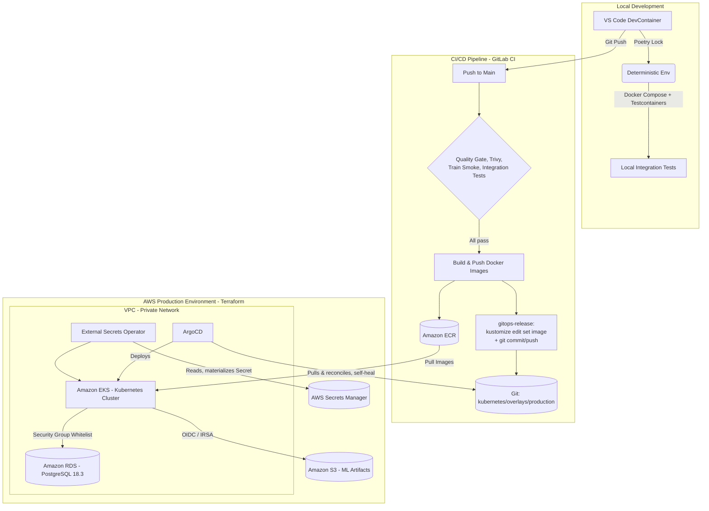

*Read this in other languages: [English](README.md)*

# Segmentación de Mercado en Reservas Hoteleras — Pipeline MLOps End-to-End

[](https://github.com/arguar13/hotel-booking-mlops)
[](LICENSE)
[](.gitlab-ci.yml)
[](Dockerfile)
[-326CE5?logo=kubernetes&logoColor=white)](kubernetes/base)
[](terraform)
[](core_ml/src/train.py)
[](gitops/argocd/application.yaml)
[](https://github.com/psf/black)
[](https://github.com/astral-sh/ruff)

---

## Resumen

**El problema.** Los hoteles reciben reservas a través de múltiples canales — reservas directas, agencias de viaje online, contratos corporativos, grupos — y el segmento de mercado de una reserva concreta afecta de forma directa a la estrategia de precios, la personalización y la previsión de demanda. Clasificar ese segmento a mano o con reglas estáticas no escala, y los modelos de machine learning que se entrenan una vez, se exportan como un archivo y nunca vuelven a revisarse se degradan silenciosamente a medida que cambian los patrones de reserva.

**La solución.** Este repositorio implementa un sistema MLOps de nivel producción que entrena, valida, versiona, sirve y redespliega de forma continua un clasificador de segmento de mercado sin intervención manual entre un `git push` y un cambio funcionando en producción. Cada dataset se valida contra un contrato antes de usarse, cada modelo entrenado queda versionado y es trazable hasta el código, los datos y los hiperparámetros exactos que lo produjeron, y todo modelo que llega a la API de serving ya ha superado una compuerta de calidad automatizada.

**El valor de ingeniería.** El sistema está construido alrededor de tres propiedades por las que se juzga el trabajo MLOps senior:

- **Reproducibilidad** — una versión de modelo, un commit de Git, un hash de datos de DVC y un tag de imagen de contenedor están siempre vinculados, de modo que cualquier predicción en producción puede rastrearse hasta exactamente lo que la produjo.
- **Seguridad ante el cambio** — nada llega al clúster de Kubernetes sin antes pasar análisis estático, escaneo de seguridad, una prueba de humo de entrenamiento end-to-end en vivo y pruebas de integración herméticas contra infraestructura real (contenedorizada); el despliegue en sí es pull-based y auto-reparable, por lo que CI nunca posee credenciales del clúster de producción.
- **Ciclos de vida desacoplados** — promover una nueva versión de modelo es una operación de metadatos contra el MLflow Model Registry, no un despliegue de código; publicar un cambio de aplicación no requiere reentrenar, y publicar un nuevo modelo no requiere reconstruir la imagen de la API.

---

## Arquitectura del Sistema

La arquitectura sigue principios de redes de confianza cero, alta disponibilidad y automatización completa del despliegue: CI solo puede cambiar *el estado deseado en Git*, nunca el clúster en ejecución.



**Flujo de datos y de control.** El cambio de un desarrollador pasa primero por el DevContainer y el stack local de Docker Compose. Una vez enviado, GitLab CI lo valida (compuerta de calidad, escaneo de seguridad, una ejecución de entrenamiento en vivo contra un dataset "toy" reducido y pruebas de integración contenedorizadas) antes de construir ninguna imagen — `build-push-ecr` y `gitops-release` son estructuralmente inalcanzables si alguna etapa anterior falla. `gitops-release` nunca toca AWS ni el clúster: solo confirma el nuevo tag de imagen en `kubernetes/overlays/production/kustomization.yaml`. ArgoCD, ejecutándose de forma independiente dentro del clúster, es el único componente que llega a cambiar lo que está desplegado — extrae ese commit, reconcilia el clúster para que coincida con él, y revierte cualquier desviación manual (`selfHeal: true`). External Secrets Operator cierra el mismo ciclo para las credenciales: los secretos se leen de AWS Secrets Manager y se materializan como Secrets nativos de Kubernetes, de modo que ninguna credencial se confirma jamás en Git.

Nótese la asimetría deliberada: CI (mitad superior del diagrama) solo escribe en **Git** y en **ECR** — no tiene ninguna flecha hacia el clúster de EKS. Todo lo que cambia producción (mitad inferior) se ejecuta dentro del clúster y extrae, con su propio calendario, de fuentes que CI no puede evitar.

---

## Stack Tecnológico

| Categoría | Herramientas | Propósito en el proyecto |
|---|---|---|
| **Infraestructura como Código** | Terraform, AWS (VPC, EKS, RDS, S3, ECR, IAM/IRSA) | Definición declarativa de toda la topología de AWS, con estado remoto (S3 + bloqueo en DynamoDB) |
| **Orquestación de Contenedores** | Kubernetes (EKS), Kustomize | Manifiestos de despliegue declarativos; patrón de overlay base + producción para valores específicos por entorno |
| **GitOps y Entrega** | ArgoCD, External Secrets Operator | Reconciliación pull-based y auto-reparable del clúster desde Git; secretos sincronizados de forma declarativa desde AWS Secrets Manager |
| **CI/CD** | GitLab CI, OpenID Connect (OIDC) | Compuerta de calidad, escaneo de seguridad, prueba de humo de entrenamiento, pruebas de integración, build/push de imágenes, commit de release GitOps — sin credenciales de AWS de larga duración en CI |
| **Tracking y Registro de Experimentos** | MLflow | Versionado inmutable de modelos, registro de runs/parámetros/métricas, promoción a serving basada en alias |
| **Versionado y Validación de Datos** | DVC, Pandera | Pipeline de datasets reproducible y con hash de contenido; validación de esquema antes del entrenamiento |
| **Serving del Modelo** | FastAPI, Uvicorn | Inferencia REST síncrona de baja latencia, con documentación OpenAPI automática |
| **Mensajería** | Apache Kafka | Feed asíncrono y desacoplado, opcional, de eventos de predicción |
| **Dashboard** | Streamlit | Interfaz de exploración y demostración orientada a personas |
| **Desarrollo Local** | Docker Compose, VS Code DevContainers, LocalStack | El stack completo, incluyendo una AWS simulada, ejecutable de punta a punta en una laptop |
| **Testing** | Pytest, Testcontainers | Pruebas unitarias rápidas más pruebas de integración herméticas y efímeras contra contenedores reales de Postgres/Kafka/LocalStack/API |
| **Observabilidad y Resiliencia** | structlog, tenacity, pybreaker | Logs JSON estructurados, reintentos acotados con backoff, un circuit breaker en la ruta no crítica |
| **Calidad de Código y Seguridad** | Ruff, Black, isort, mypy, Bandit, Trivy, detect-secrets, yamllint | Análisis estático, tipado, SAST, y escaneo de vulnerabilidades/secretos/IaC |
| **Gestión de Dependencias** | Poetry | Entornos reproducibles, con bloqueo criptográfico, por cada servicio |
| **Machine Learning** | Scikit-learn, Imbalanced-learn (SMOTE), Optuna, Pandas | Entrenamiento del modelo, manejo de desbalance de clases, búsqueda automatizada de hiperparámetros |

---

## El Pipeline de MLOps

### Data Pipeline

Cada dataset se valida contra un esquema de [Pandera](https://pandera.readthedocs.io/) ([`core_ml/src/data_contracts.py`](core_ml/src/data_contracts.py)) en dos puntos: inmediatamente después de leer el CSV crudo, y de nuevo inmediatamente antes de que los datos limpios lleguen a Optuna/SMOTE/entrenamiento. Un dataset malformado o fuera de rango se rechaza en milisegundos — fail fast — en lugar de después de minutos de cómputo desperdiciado.

**DVC** (respaldado por el mismo bucket de S3 que usa MLflow) versiona tanto el dataset crudo como un pequeño y fijo **dataset "toy"** estratificado (~1.000 filas, [`core_ml/scripts/make_toy_dataset.py`](core_ml/scripts/make_toy_dataset.py)). Un pipeline [`dvc.yaml`](core_ml/dvc.yaml) convierte el propio paso de limpieza en una etapa reproducible con hash de contenido (`dvc repro`), de modo que `dvc.lock` siempre registra exactamente qué bytes de datos produjeron qué CSV procesado. El dataset toy existe puramente por velocidad de iteración: permite que el ciclo completo limpiar → validar → tunear → entrenar → compuerta de calidad se ejecute de punta a punta en segundos (`make train-toy`), en lugar de gastar tiempo o cómputo real contra el dataset completo en cada cambio local o ejecución de CI.

### Training Pipeline

El entrenamiento ([`core_ml/src/train.py`](core_ml/src/train.py)) ejecuta una búsqueda de hiperparámetros con Optuna sobre un `RandomForestClassifier` envuelto en un `Pipeline` de scikit-learn (imputación, escalado/one-hot encoding, SMOTE para el desbalance de clases). **MLflow es la única fuente de verdad, inmutable, para los modelos entrenados** — no existe ningún `model.joblib` en este repositorio. Cada run se etiqueta con la tupla completa de trazabilidad:

| Elemento | Origen |
|---|---|
| Hash del commit de Git | `CI_COMMIT_SHA` en CI, `git rev-parse HEAD` en local |
| Hash de datos de DVC | `dvc.lock` / el archivo `.dvc` del dataset |
| Hiperparámetros | Registrados vía `mlflow.log_params` (desde el estudio de Optuna) |
| ID del run de MLflow | Asignado por `mlflow.start_run()` |
| Tag de la imagen de contenedor | `CI_COMMIT_SHA` / variable de entorno `IMAGE_TAG` |

Una **compuerta de calidad** decide entonces si el run es servible: el modelo se promueve al alias `staging` del Model Registry (`models:/HotelSegmentClassifier@staging`, el alias que `api/main.py` carga al arrancar) solo si su F1 ponderado sobre el split de validación supera `model.min_f1_threshold` en [`config.yaml`](core_ml/config/config.yaml). Un run que no alcanza el umbral se sigue registrando por completo para auditoría — métricas, parámetros, artefacto, tags de trazabilidad — simplemente nunca queda accesible para la API de serving, y el propio job de entrenamiento falla de forma explícita (`QualityGateError`) en lugar de publicar silenciosamente un modelo débil.

### Deployment Pipeline (CI/CD)

El orden de las etapas del pipeline — `test → build → deploy` — es una garantía estructural, no una convención: `build-push-ecr` y `gitops-release` no pueden ejecutarse a menos que todos los jobs de `test` ya hayan pasado.

```
Push a main
  └─ etapa test (todos deben pasar)
       ├─ quality-gate        → make ci (ruff, mypy, pytest+coverage, bandit, yamllint)
       ├─ trivy-scan          → escaneo de filesystem + IaC/secretos
       ├─ train-smoke         → ejecución en vivo limpiar→validar→tunear→entrenar→compuerta, dataset toy
       └─ integration-tests   → Testcontainers: Postgres, Kafka, LocalStack, el Dockerfile real de la API
  └─ etapa build
       └─ build-push-ecr      → build & push de las imágenes api / dashboard / mlflow a Amazon ECR
  └─ etapa deploy
       └─ gitops-release      → kustomize edit set image + git commit/push (solo confirma en Git)

ArgoCD (independiente, dentro del clúster, monitoreando Git) → extrae el nuevo commit → reconcilia el clúster
```

El `script:` de cada job es exactamente el mismo target de `make` (`make ci`, `make train-toy`, `make test-integration`) que un desarrollador ya ejecutó localmente vía pre-commit o a mano — no existe lógica exclusiva de CI que pueda desviarse de lo validado en una laptop. `gitops-release` en sí nunca ejecuta `kubectl apply` ni toca AWS; solo confirma en Git un incremento del tag de imagen. La autenticación en todo el proceso usa el OpenID Connect (OIDC) nativo de GitLab, federado a un rol de IAM con permisos acotados (`terraform/iam.tf`), de modo que nunca se almacena una clave de acceso de AWS de larga duración como secreto de CI.

---

## Prácticas de Ingeniería

**Dependencias deterministas (Poetry).** `api/`, `core_ml/` e `integration-tests/` son, cada uno, su propio proyecto de Poetry con su propio `poetry.lock` confirmado, de modo que el entorno validado en desarrollo es, byte a byte, el mismo que se ejecuta dentro de los contenedores de producción.

**Validación shift-left (pre-commit + Makefile).** Cada commit ejecuta `ruff`, `black`, `isort` y `mypy` para análisis estático y tipado, `pytest` para pruebas, `bandit` y `trivy` para seguridad, y `yamllint` / `detect-secrets` para manifiestos de infraestructura y fugas de credenciales — todo orquestado a través de [`Makefile`](Makefile) y [`.pre-commit-config.yaml`](.pre-commit-config.yaml). Un commit se rechaza automáticamente ante cualquier fallo, y GitLab CI ejecuta exactamente los mismos targets de `make`, por lo que existe una, y solo una, definición de "pasa."

**Desarrollo contenedorizado (DevContainers).** Abrir el repositorio en VS Code aprovisiona automáticamente un entorno contenedorizado con el runtime de Python correcto, las dependencias de sistema y las herramientas necesarias — no se requiere instalación local de Python, y no hay desviación de entorno entre colaboradores.

**Pruebas de integración locales (Docker Compose).** El stack completo de la aplicación — PostgreSQL, LocalStack (S3/SQS/Secrets Manager), Kafka, MLflow (con almacén de artefactos respaldado por S3, no por el sistema de archivos), FastAPI y Streamlit — se ejecuta localmente vía `make up`, ejerciendo las mismas rutas de código (llamadas de red, almacenamiento respaldado por S3, conectividad de base de datos) que en producción antes de que nada llegue a AWS.

**Pruebas de integración efímeras (Testcontainers) contra una nube simulada (LocalStack).** [`integration-tests/`](integration-tests) levanta contenedores reales y de corta vida para probar cada pieza móvil de forma aislada — el patrón de conexión de Postgres del que depende el backend de MLflow, el ciclo de producción/consumo de Kafka del que depende el feed de predicciones de la API, las llamadas exactas a S3/SQS/Secrets Manager que este proyecto hace en producción, y el `Dockerfile` real construyéndose y sirviendo `/health`. LocalStack respalda tanto esta suite como el stack de Docker Compose, de modo que las llamadas a S3/SQS/Secrets Manager llegan a un emulador local en lugar de a una cuenta real de AWS durante el desarrollo.

**GitOps sin `kubectl apply` manual y sin `sed`.** Todo patrón de sustitución de texto de iteraciones anteriores de este proyecto ha sido reemplazado por un equivalente estructural: CRDs `ExternalSecret` en lugar de contraseñas inyectadas con `sed`, `kustomize edit set image` en lugar de tags de imagen reescritos con `sed`, la propia CLI de DVC en lugar de URLs de remote editadas con `sed`. El estado deseado del clúster vive por completo bajo [`kubernetes/`](kubernetes), y [`gitops/argocd/application.yaml`](gitops/argocd/application.yaml) es lo único que le indica a ArgoCD que lo reconcilie. Se puede previsualizar exactamente lo que se desplegaría, sin necesitar acceso al clúster, con `make k8s-build`.

---

## Monitoreo y Observabilidad

**Logs estructurados.** Tanto `api/main.py` como `core_ml/src/train.py` registran a través de [structlog](https://www.structlog.org/), configurado para emitir un objeto JSON por evento (timestamp, nivel, nombre del evento, contexto estructurado) — el formato que CloudWatch Logs y Elasticsearch ingieren de forma nativa, sin una capa separada de parseo de logs:

```json
{"model_uri": "models:/HotelSegmentClassifier@staging", "event": "model_load_failed", "error": "...", "timestamp": "2026-08-25T21:48:11Z", "level": "error"}
```

**Señal de salud y latencia.** `/health` funciona a la vez como objetivo de los probes de readiness/liveness de Kubernetes y como endpoint de estado legible por máquina: informa si hay un modelo cargado actualmente (`model_loaded`) y el estado en vivo del circuit breaker de Kafka (`closed` / `open` / `half-open`), de modo que una degradación parcial es visible sin necesidad de leer logs.

**Fallo acotado en lugar de fallo en cascada.** La carga del modelo desde el MLflow Registry al arrancar reintenta con backoff exponencial acotado (`tenacity`, como máximo 3 intentos) en lugar de quedarse colgada indefinidamente — un pod que no puede alcanzar el registro termina de arrancar y reporta `model_loaded: false` en lugar de nunca quedar listo. La publicación opcional de eventos de predicción a Kafka está envuelta en un circuit breaker (`pybreaker`) que se abre tras 5 fallos consecutivos y permanece abierto 30 segundos, de modo que un broker caído degrada un canal secundario no crítico en lugar de añadir un timeout de conexión a cada petición `/predict`. Ambos mecanismos están cubiertos por pruebas ([`api/tests/test_api.py`](api/tests/test_api.py)) que simulan un Kafka caído y verifican que el breaker se abre y que la ruta de la petición nunca lanza una excepción.

**Rastro de auditoría de predicciones.** Cada predicción exitosa se publica opcionalmente como un evento en el tópico `predictions` de Kafka (características de la reserva, segmento predicho, nombre y alias del modelo, timestamp) — un feed de tipo fire-and-forget, desacoplado, que nunca bloquea ni hace fallar la respuesta HTTP, y la base natural para un futuro consumidor de detección de drift.

**Deliberadamente fuera de alcance por ahora.** Todavía no hay un stack de métricas Prometheus/Grafana ni detección automatizada de drift de datos o de concepto (por ejemplo, Evidently AI). El feed de predicciones de Kafka descrito arriba, junto con los tags de trazabilidad completos ya adjuntos a cada run de MLflow, son exactamente el trabajo previo que un servicio así consumiría — añadirlo es el incremento natural siguiente una vez que el modelo esté sirviendo tráfico real de producción y no un volumen de escala de portfolio.

---

## Decisiones Arquitectónicas y Trade-offs

La ingeniería senior se juzga tanto por lo que se decide deliberadamente no construir como por lo que sí se construye. Cada decisión de abajo se tomó bajo una restricción real, y cada una conlleva un costo que se aceptó conscientemente en lugar de descubrirse después.

**Inferencia REST síncrona (FastAPI) en lugar de scoring por batch o streaming.** La necesidad de negocio es conocer el segmento de mercado de una reserva en el momento en que entra al sistema, para que la lógica de precios y personalización aguas abajo pueda actuar de inmediato — un job de batch nocturno sería más barato de ejecutar, pero introduce una ventana de latencia inaceptable para ese caso de uso, mientras que una arquitectura de streaming completa (por ejemplo, un job de Kafka Streams/Flink que consuma reservas y emita predicciones) resolvería la latencia a un nivel de complejidad de infraestructura y operación que el volumen de peticiones actual no justifica. El compromiso implementado es petición/respuesta síncrona para la predicción en sí, con un feed de Kafka opcional y completamente desacoplado para todo lo que *sí* puede tolerar entrega asíncrona — registro de auditoría y, eventualmente, monitoreo de drift.

**FastAPI en lugar de Flask.** La base ASGI de FastAPI (Uvicorn) soporta trabajo concurrente ligado a I/O — hoy la publicación interna a Kafka, mañana otras llamadas salientes — sin necesitar un esquema separado de pool de workers, y la validación de petición/respuesta basada en Pydantic junto con un esquema OpenAPI autogenerado reemplazan lo que de otro modo serían serialización escrita a mano y documentación de API mantenida manualmente. Para un endpoint de predicción de un solo modelo, eso compensó la pequeña superficie conceptual adicional frente a la simplicidad de Flask.

**Los alias del MLflow Model Registry como único camino hacia un modelo servible — sin `model.joblib` en el repositorio ni en la imagen.** Empaquetar un modelo serializado dentro de la imagen Docker acopla cada actualización de modelo a una reconstrucción y redespliegue completos de la imagen. Cargar desde el registro por alias (`models:/HotelSegmentClassifier@staging`) desacopla "publicar una nueva versión de modelo" de "publicar una nueva versión de la aplicación" — promover un modelo es una operación de metadatos (`set_registered_model_alias`), no una ejecución de CI/CD. El costo aceptado es una dependencia en tiempo de ejecución: la API no puede servir si el registro es inalcanzable al arrancar, que es precisamente la razón por la que la carga del modelo está envuelta en un reintento acotado y `/health` reporta el fallo de forma explícita en lugar de que el pod colapse.

**GitOps (ArgoCD, pull-based) en lugar de que CI ejecute `kubectl apply` (push-based).** Un pipeline push-based es más simple y no tiene retraso de reconciliación, pero requiere que CI posea credenciales activas del clúster — un radio de impacto considerable para que lo cargue un runner de CI. El GitOps pull-based confina el radio de impacto de CI a Git y ECR; ArgoCD, ejecutándose dentro del clúster con su propio acceso acotado, es lo único que llega a modificarlo, y repara automáticamente cualquier desviación manual. El trade-off aceptado es una pequeña ventana entre el merge y el despliegue (el intervalo de sincronización de ArgoCD) en lugar de un push inmediato.

**Kustomize en lugar de Helm para los manifiestos propios de este repositorio.** Con exactamente un entorno (producción) y un puñado de valores específicos por entorno (tags de imagen, host de la base de datos, nombre del bucket), la parametrización de un motor de templates es complejidad innecesaria — los parches estructurales de Kustomize (`kustomize edit set image`) son suficientes, y mantienen los manifiestos base como YAML de Kubernetes plano y legible. Helm sí se usa, de forma deliberada, para las dos piezas de infraestructura que genuinamente son de terceros y se versionan aguas arriba: ArgoCD y External Secrets Operator, ambos instalados vía `helm_release` en Terraform.

**Poetry con lockfiles por servicio en lugar de un único `requirements.txt` para todo el repositorio.** `api/` y `core_ml/` tienen dependencias de runtime distintas (la API no necesita Optuna ni DVC; el entrenamiento no necesita Uvicorn) y ritmos de release distintos. Dos proyectos de Poetry con dos lockfiles confirmados permiten que cada uno evolucione y se redespliegue de forma independiente, a costa de cierto pineo (`numpy<2.0.0`, el piso de `scikit-learn`) que hay que mantener sincronizado a mano donde ambos genuinamente se solapan.

**RandomForest + Optuna en lugar de un modelo de deep learning.** El dataset es tabular, con un número moderado de features categóricas y numéricas — la clase de problema en la que los ensembles de árboles típicamente igualan o superan a las redes profundas, entrenan en segundos en lugar de horas de GPU, y cargan de forma confiable en una ruta de petición síncrona. Optuna añade búsqueda automatizada de hiperparámetros sobre esa base sin pagar el costo de un framework de entrenamiento más pesado ni de una historia de serving consciente de GPU.

**GitLab CI en lugar de GitHub Actions.** El pipeline en sí se ejecuta en GitLab CI — este repositorio se refleja en GitHub como pieza de portfolio. El factor decisivo fue la federación OIDC nativa de GitLab hacia IAM de AWS (`aws_iam_openid_connect_provider` en `terraform/iam.tf`), que elimina la necesidad de almacenar cualquier clave de acceso de AWS de larga duración como secreto de CI; existe un equivalente para GitHub Actions, pero el pipeline es anterior a esa migración específica, y la propiedad de seguridad subyacente — sin credenciales estáticas en CI — es idéntica en ambos casos.

---

## Cómo Empezar (Reproducibilidad)

### 1. Desarrollo Local (DevContainer)

1. Clona el repositorio.
2. Ábrelo en VS Code.
3. Selecciona **Reopen in Container** cuando se te indique.

El entorno construye y ejecuta automáticamente `make install`, que instala cada entorno de Poetry (`api/`, `core_ml/`, `integration-tests/`) desde su lockfile y registra los git hooks de pre-commit.

### 2. Compuertas de Calidad (Makefile + pre-commit)

| Comando | Qué hace |
|---|---|
| `make format` | Formatea el código automáticamente con `isort` + `black` |
| `make lint` | Análisis estático con `ruff` |
| `make typecheck` | Tipado estático con `mypy` |
| `make test` | Ejecuta ambas suites de pruebas unitarias con cobertura |
| `make security` | SAST con `bandit` + escaneo de IaC/vulnerabilidades con `trivy` |
| `make yaml-lint` | `yamllint` sobre los manifiestos de Kubernetes, la configuración de CI y docker-compose |
| `make ci` | Todo lo anterior, exactamente como se ejecuta en el pipeline |
| `make precommit` | Ejecuta todos los hooks de pre-commit contra todos los archivos |

### 3. Entrenamiento del Modelo (Data Contracts + DVC + MLflow)

| Comando | Qué hace |
|---|---|
| `make data-toy` | Regenera el dataset "toy" de ~1.000 filas versionado con DVC a partir del CSV crudo |
| `make dvc-pull` / `make dvc-push` | Descarga / publica los datasets versionados con DVC desde/hacia el remote de S3 |
| `make dvc-repro` | Vuelve a ejecutar el pipeline de limpieza de DVC (`dvc.yaml`), actualizando `dvc.lock` |
| `make train-toy` | Ciclo completo limpiar → validar → tunear → entrenar → compuerta de calidad contra el dataset toy, en segundos |
| `make train` | El mismo ciclo contra el dataset completo (necesita un servidor de MLflow accesible, p. ej. `make up`) |

Ambos fallan de forma explícita (`QualityGateError`) si el F1 ponderado del modelo entrenado no alcanza `model.min_f1_threshold` en [`core_ml/config/config.yaml`](core_ml/config/config.yaml) — un run que no supera la compuerta se sigue registrando en MLflow para auditoría, pero nunca se alía al alias `staging` del Model Registry del que sirve la API.

Para probar `make train-toy` sin Docker, apunta MLflow a un almacén SQLite local:

```bash
export MLFLOW_TRACKING_URI="sqlite:////tmp/mlflow-local.db"
make train-toy
```

### 4. Pruebas de Integración Locales

```bash
make up   # equivalente a: docker compose up --build
```

| Servicio | URL |
|---|---|
| Documentación de FastAPI | `http://localhost:8000/docs` |
| Health Check de FastAPI | `http://localhost:8000/health` |
| UI de MLflow | `http://localhost:5000` |
| Dashboard de Streamlit | `http://localhost:8501` |
| LocalStack (S3/SQS/Secrets Manager) | `http://localhost:4566` |
| Broker de Kafka | `localhost:9092` |

Ejecuta la suite efímera de Testcontainers (separada del stack de larga duración de arriba) con:

```bash
make test-integration
```

### 5. Despliegue de Infraestructura

Bootstrap único del backend de estado remoto:

```bash
aws s3api create-bucket --bucket hotel-mlops-tfstate-<account-id> --region us-east-1
aws dynamodb create-table --table-name hotel-mlops-tfstate-lock \
  --attribute-definitions AttributeName=LockID,AttributeType=S \
  --key-schema AttributeName=LockID,KeyType=HASH --billing-mode PAY_PER_REQUEST
```

Luego, desde `terraform/`:

```bash
make tf-fmt
terraform -chdir=terraform init \
  -backend-config="bucket=hotel-mlops-tfstate-<account-id>" \
  -backend-config="key=hotel-mlops/terraform.tfstate" \
  -backend-config="region=us-east-1" \
  -backend-config="dynamodb_table=hotel-mlops-tfstate-lock"
make tf-validate
terraform -chdir=terraform plan
terraform -chdir=terraform apply
```

Esto provisiona la VPC/EKS/RDS/S3/ECR/IAM *y* aprovisiona ArgoCD y External Secrets Operator en el clúster vía Helm.

### 6. Bootstrap de GitOps

Después de `terraform apply`, apunta ArgoCD a este repositorio una única vez:

```bash
kubectl apply -f gitops/argocd/application.yaml
```

A partir de aquí, cada push a `main` ejecuta el pipeline completo de CI/CD descrito arriba, y ArgoCD despliega el resultado por su cuenta.

---

## Ejemplo de Uso de la API

```http
POST /predict
```

```bash
curl -X 'POST' \
  'http://<LOAD_BALANCER_IP>:8000/predict' \
  -H 'Content-Type: application/json' \
  -d '{
    "hotel": "Resort Hotel",
    "lead_time": 10,
    "arrival_date_year": 2017,
    "arrival_date_week_number": 27,
    "arrival_date_day_of_month": 1,
    "stays_in_weekend_nights": 0,
    "stays_in_week_nights": 3,
    "adults": 2,
    "meal": "BB",
    "country": "PRT",
    "distribution_channel": "Direct",
    "reserved_room_type": "A",
    "assigned_room_type": "A",
    "deposit_type": "No Deposit",
    "customer_type": "Transient",
    "adr": 98.0,
    "month": 7
}'
```

```json
{
  "predicted_market_segment": "Direct"
}
```

---

## Estructura del Proyecto

```text
hotel-booking-mlops/
├── .devcontainer/           # Definiciones del entorno aislado de VS Code
├── .pre-commit-config.yaml  # Git hooks shift-left (lint, formato, tipado, tests, secretos, YAML)
├── .yamllint.yml            # Reglas de estilo/validez YAML para CI + manifiestos de Kubernetes
├── .secrets.baseline        # Baseline auditado de detect-secrets (bloquea solo secretos nuevos)
├── Makefile                 # Interfaz de comandos única, compartida entre dev local y GitLab CI
├── api/                     # Microservicio de inferencia FastAPI (pyproject.toml + poetry.lock propios)
│   ├── pyproject.toml
│   ├── poetry.lock
│   └── tests/
├── core_ml/                 # Pipeline de entrenamiento, procesamiento de datos, dashboard de Streamlit
│   ├── pyproject.toml
│   ├── poetry.lock
│   ├── .dvc/                # Raíz del proyecto DVC (`dvc init --subdir`), config del remote S3
│   ├── dvc.yaml             # Etapas del pipeline de limpieza de datos (completo + toy)
│   ├── dvc.lock             # Hashes de contenido de las deps/outs de cada etapa
│   ├── data/                # CSVs crudos + procesados - versionados con DVC, ignorados por git
│   │   └── toy/             # Muestra determinista de ~1000 filas para ejecuciones locales rápidas
│   ├── scripts/             # Herramientas puntuales (make_toy_dataset.py)
│   ├── src/                 # data_contracts.py, data_processing.py, train.py, traceability.py
│   ├── dashboard/
│   └── tests/
├── integration-tests/       # Testcontainers: pruebas efímeras de contenedores Postgres/Kafka/LocalStack/API
│   ├── pyproject.toml
│   ├── poetry.lock
│   └── tests/
├── localstack-init/         # Scripts que LocalStack ejecuta al arrancar (crea buckets S3, cola SQS, secreto)
├── kubernetes/              # Estado deseado del clúster - fuente de verdad GitOps para ArgoCD
│   ├── base/                # Deployments, Services, ConfigMap, ExternalSecret, ClusterSecretStore
│   └── overlays/
│       └── production/      # Tags de imagen + parches específicos del entorno (kustomize edit set image/...)
├── gitops/
│   └── argocd/
│       └── application.yaml # Application de ArgoCD: reconcilia kubernetes/overlays/production
├── terraform/               # Infraestructura como Código modular
│   ├── ecr.tf               # Registros de contenedores (api, dashboard, mlflow) y políticas de lifecycle
│   ├── eks.tf               # Clúster de Kubernetes con OIDC habilitado
│   ├── iam.tf               # Roles IRSA + el rol federado por OIDC de GitLab CI
│   ├── argocd.tf             # Helm release de ArgoCD (bootstrap del clúster)
│   ├── external-secrets.tf  # Helm release de External Secrets Operator (bootstrap del clúster)
│   ├── provider.tf           # Providers de AWS/Kubernetes/Helm, backend de estado remoto en S3
│   ├── rds.tf                # Base de datos PostgreSQL para el backend de MLflow
│   ├── s3.tf                 # Almacenamiento de objetos versionado para artefactos de ML
│   ├── variables.tf           # Variables paramétricas y gestión de secretos
│   └── vpc.tf                 # Topología de red (NAT, subredes privadas/públicas)
├── Dockerfile.mlflow        # Imagen de MLflow con boto3/psycopg2 incluidos (artifact store S3 + backend Postgres)
└── docker-compose.yml       # Entorno local de pruebas de integración (db, localstack, kafka, mlflow, api, dashboard)
```

Cada unidad desplegable (`api/`, `core_ml/`) es su propio proyecto de Poetry con su propio lockfile, de modo que los dos servicios pueden evolucionar y desplegarse de forma independiente compartiendo, aun así, una única compuerta de calidad dirigida por el Makefile.

---

## Licencia

Distribuido bajo la Licencia MIT. Consulta [LICENSE](LICENSE) para más detalles.
