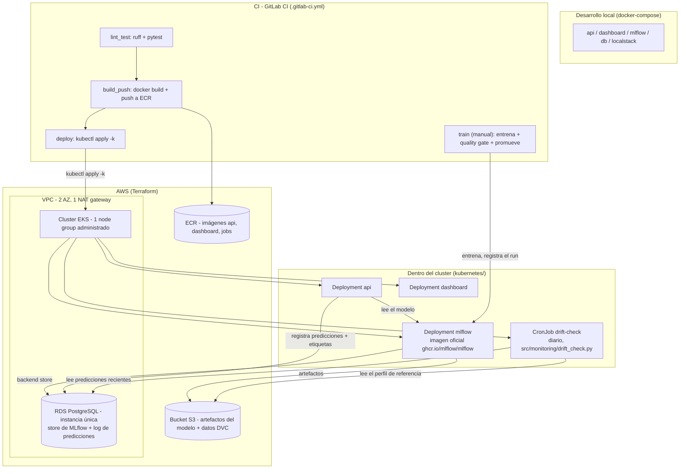

*Read this in other languages: [English](README.md)*

# Segmentación de Mercado de Reservas Hoteleras — Pipeline MLOps

[](core_ml/pyproject.toml)
[](LICENSE)
[](.gitlab-ci.yml)
[](Dockerfile)
[-326CE5?logo=kubernetes&logoColor=white)](kubernetes/base)
[](terraform)
[](core_ml/src/train.py)
[](https://github.com/astral-sh/ruff)

## El problema

Los hoteles reciben reservas por varios canales — directo, agencias de viaje
online, cuentas corporativas, grupos — y el **segmento de mercado** de una
reserva determina la estrategia de precios y la previsión de demanda aguas
abajo. Acertar ese segmento, y acertarlo *consistentemente* a medida que los
patrones de reserva cambian a lo largo de una temporada, es lo que convierte
esto en un problema real de MLOps y no en un notebook aislado: la parte
interesante no es entrenar un clasificador una vez, sino operarlo — saber qué
versión está sirviendo, detectar cuándo el mundo con el que fue entrenado
deja de parecerse al mundo que está prediciendo, y tener un camino repetible
y auditable desde un nuevo entrenamiento hasta el cambio de alias en
producción.

Este proyecto construye ese ciclo completo de punta a punta: un clasificador
de scikit-learn (RandomForest + SMOTE para el desbalance de clases entre
segmentos + Optuna para la búsqueda de hiperparámetros) entrenado sobre el
clásico
[dataset de demanda de reservas hoteleras](https://www.sciencedirect.com/science/article/pii/S2352340918315191),
servido detrás de un endpoint FastAPI, versionado en un Model Registry de
MLflow, y vigilado por un chequeo estadístico programado de drift de datos —
todo integrado con las piezas que un equipo pequeño realmente necesita para
operar esto en AWS: servicios en contenedores, infraestructura como código,
un pipeline de CI/CD, y manifiestos de Kubernetes que describen el sistema en
ejecución de forma declarativa.

## Arquitectura



### Por qué está construido así

**MLflow como única fuente de verdad para los modelos.** La API nunca carga
un `model.joblib` local; resuelve `models:/HotelSegmentClassifier@staging`
contra el registro al arrancar y en cada intervalo de refresco. Eso significa
que "qué está sirviendo en producción" siempre es una pregunta que el
registro puede responder, no un archivo que quedó guardado dentro de una
imagen.

**Un quality gate y luego una comparación canary, como dos pasos separados.**
`train.py` solo verifica a un candidato contra un piso absoluto
(`min_f1_threshold`) — suficientemente bueno como para siquiera ser
considerado. `promote_model.py` es el segundo gate, independiente: compara el
F1 del candidato contra lo que esté actualmente con el alias `staging` y solo
mueve el alias si el candidato no es significativamente peor
(`canary_tolerance`). Separar estas dos preocupaciones permite que un modelo
falle ruidosamente por ser simplemente malo, o por separado por ser una
regresión frente a lo que ya está en vivo — dos modos de falla distintos que
requieren respuestas distintas.

**Un chequeo de drift estadístico y por lotes, en vez de un pipeline de
streaming.** Cada corrida de entrenamiento registra un pequeño perfil de
referencia (media/desvío estándar por cada feature numérica, calculado sobre
los datos con los que el modelo fue efectivamente ajustado) como artefacto de
MLflow. Un `CronJob` diario lee una ventana reciente de predicciones
registradas en Postgres y corre una prueba z de una muestra por cada feature
contra esa línea base, registrando el veredicto de vuelta en MLflow. Este es
el nivel de complejidad adecuado para el volumen de tráfico involucrado: sin
bus de mensajería, sin infraestructura de streaming dedicada que operar —
solo un job programado cuya entrada ya es durable en una base de datos que
este proyecto de todos modos ya opera. Una persona lee el resultado y decide
si un reentrenamiento está justificado; nada reentrena ni redespliega por sí
solo.

**`kubectl apply -k` en CI en vez de un controlador GitOps.** El stage
`deploy` construye imágenes nuevas, actualiza el overlay de Kustomize, y lo
aplica directamente sobre el cluster. Para un despliegue de un solo entorno y
un solo equipo, esto mantiene todo el camino de release dentro de una única
definición de pipeline, con una sola herramienta (`kustomize`) que razonar,
en vez de introducir un segundo plano de control cuyo trabajo es reconciliar
lo que el primero ya aplicó.

**Un único node group administrado, una única instancia de RDS, un único NAT
gateway.** La VPC abarca dos zonas de disponibilidad para un aislamiento real
de subredes, pero las capas de cómputo y base de datos están dimensionadas
para lo que esta carga realmente necesita: un par de nodos `t3.medium`
corriendo la API, MLflow, el dashboard y el job de drift, y una base Postgres
de instancia única respaldando tanto el store de tracking de MLflow como el
log de predicciones. Escalar cualquiera de estos es un cambio de variable de
Terraform, no un cambio de arquitectura.

**Un Secret de Kubernetes para la contraseña de la base de datos, cargado una
vez a mano.** Terraform genera la contraseña de RDS (`random_password`) y el
operador la copia con un `kubectl create secret` — un paso manual pequeño y
explícito que mantiene la credencial fuera tanto del historial de Git como de
las salidas más ampliamente leídas del estado de Terraform, sin necesitar
aprovisionar y conectar por IAM un servicio de gestión de secretos solo para
entregarle una contraseña a un Deployment.

## Stack tecnológico

| Capa | Elección |
|---|---|
| Modelo | `RandomForestClassifier` de scikit-learn, `SMOTE` de imbalanced-learn, Optuna para la búsqueda de hiperparámetros |
| Validación de datos | Esquemas de Pandera (`core_ml/src/data_contracts.py`) — falla rápido antes de empezar un entrenamiento costoso |
| Versionado de datos | DVC, respaldado por el mismo bucket S3 que usa MLflow para artefactos |
| Tracking de experimentos / registro | MLflow (servidor + Model Registry, basado en alias) |
| Serving | FastAPI + Uvicorn, logging estructurado en JSON (`structlog`) |
| Monitoreo | Logger propio de predicciones/etiquetas a Postgres (`api/monitoring.py`) + un chequeo de drift programado con prueba z |
| Dashboard | Streamlit |
| Contenedores | Docker (una imagen por workload: `Dockerfile`, `Dockerfile.dashboard`, `Dockerfile.jobs`) |
| Stack local | Docker Compose (Postgres, LocalStack para S3, MLflow, API, dashboard) |
| Infraestructura como código | Terraform (VPC, EKS, RDS, S3, ECR, IAM, federación OIDC con GitLab) |
| Orquestación | Kubernetes sobre EKS, manifiestos gestionados con Kustomize (`base` + overlay `production`) |
| CI/CD | GitLab CI (`lint_test` → `build_push` → `deploy`, más un stage manual `train`) |
| Quality gates | Ruff, mypy, pytest, pre-commit |

## Correrlo en local

Requiere Docker y Docker Compose.

```bash
docker compose up --build
```

Esto levanta Postgres, un emulador local de S3 (LocalStack), MLflow
(respaldado por Postgres + S3), la app de serving FastAPI, y un dashboard de
Streamlit:

- API: http://localhost:8000/docs
- UI de MLflow: http://localhost:5050
- Dashboard: http://localhost:8501

La API reporta `model_loaded: false` en `/health` hasta que se entrene y
registre un modelo — ver la siguiente sección.

## Entrenar

`api/` y `core_ml/` son dos proyectos Poetry independientes.

```bash
cd core_ml
poetry install
poetry run dvc pull                       # descarga el dataset versionado
MLFLOW_TRACKING_URI=http://localhost:5050 poetry run python -m src.train
```

El entrenamiento corre un pipeline de scikit-learn (SMOTE + un RandomForest
ajustado) con Optuna, registra el run (parámetros, métricas, el modelo en sí,
y un pequeño perfil de referencia usado después para el chequeo de drift) en
MLflow, y escribe el id del run en `core_ml/run_id.txt`. Un run que no supera
`model.min_f1_threshold` (ver `core_ml/config/config.yaml`) queda igualmente
registrado para auditoría, pero nunca queda habilitado para promoción.

## Promover un modelo a campeón

Una versión registrada del modelo no se sirve hasta que se promueve
explícitamente:

```bash
poetry run python -m src.promote_model --run-id "$(cat run_id.txt)"
```

`promote_model.py` compara el F1 ponderado del candidato contra el modelo que
está sirviendo actualmente bajo el alias `staging` (el "campeón") y solo
mueve el alias si el candidato no es peor de lo que permite
`model.canary_tolerance`. La primera promoción siempre pasa, porque no hay
nada contra qué comparar todavía. Cada promoción etiqueta la versión nueva
con la que reemplazó, así que una promoción indeseada puede revertirse con:

```bash
poetry run python -m src.promote_model --rollback
```

`make train` / `make promote` envuelven ambos pasos de punta a punta; correr
`make help` para la lista completa de comandos.

## Chequear drift

`core_ml/src/monitoring/drift_check.py` corre un chequeo liviano y bien
acotado: al momento de entrenar registra la media y el desvío estándar de
cada feature numérica; con una frecuencia programada (diaria, vía el CronJob
`drift-check`) lee un lote reciente de predicciones registradas en Postgres y
corre una prueba z de una muestra por cada feature contra esa línea base. Una
feature cuya media en el lote se alejó muchos errores estándar de lo que vio
el entrenamiento queda marcada. El chequeo solo registra su veredicto en
MLflow y en stdout — nunca reentrena ni redespliega nada por sí mismo. Decidir
reentrenar, y revisar el resultado, sigue siendo trabajo de una persona
(`make train` + `make promote`, o el stage manual `train` en
`.gitlab-ci.yml`).

Probar el ciclo completo en local:

```bash
make replay          # repite reservas reales de 2016 contra /predict + /feedback
make drift-check      # corre el mismo chequeo que corre el CronJob, desde la misma imagen
```

## Desplegar

### 1. Infraestructura (Terraform)

```bash
cd terraform
terraform init -backend-config="bucket=<tu-bucket-de-tfstate>" \
                -backend-config="key=hotel-mlops/terraform.tfstate" \
                -backend-config="region=us-east-1"
terraform apply
```

Esto aprovisiona una VPC (2 zonas de disponibilidad, 1 NAT gateway), un
cluster EKS con un único node group administrado, una base de datos RDS
Postgres de instancia única, un bucket S3 para artefactos de MLflow/DVC, los
repositorios ECR, y el rol IAM que GitLab CI asume vía OIDC para construir,
publicar y desplegar. El stack está pensado para levantarse bajo demanda —
para una demo o una revisión— y destruirse de nuevo con `terraform destroy`
cuando no se necesita.

Una vez que el cluster existe, crear el único secreto que Terraform no
gestiona directamente:

```bash
kubectl create namespace hotel-mlops
kubectl create secret generic mlops-secrets \
  --from-literal=POSTGRES_PASSWORD="$(terraform -chdir=terraform output -raw db_password)" \
  -n hotel-mlops
```

### 2. Aplicación (kubectl / kustomize)

```bash
kubectl apply -k kubernetes/overlays/production
```

El stage `deploy` de `.gitlab-ci.yml` corre el mismo comando después de
construir y publicar imágenes nuevas, así que el estado del cluster siempre
refleja la última ejecución exitosa del pipeline sobre `main`.

## Testing y calidad

```bash
make lint    # ruff + mypy, ambos proyectos
make test    # pytest, ambos proyectos
make install # registra los hooks de pre-commit
```

Estos son exactamente los comandos que corre el stage `lint_test` de
`.gitlab-ci.yml` y que corre `pre-commit` en cada commit, así que hay una
única definición de "pasa" compartida entre una laptop y CI.

## Estructura del repositorio

```
api/            App de serving FastAPI (proyecto Poetry propio, con sus tests)
core_ml/        Pipeline de datos, entrenamiento, chequeo de drift, dashboard (proyecto Poetry propio)
terraform/      Infraestructura de AWS: VPC, EKS, RDS, S3, ECR, IAM
kubernetes/     Manifiestos Kustomize (base + overlay de production)
docker-compose.yml   Stack local: db, localstack (S3), mlflow, api, dashboard
Dockerfile*     Una imagen por workload: api, dashboard, jobs (código batch de core_ml)
.gitlab-ci.yml  lint_test -> build_push -> deploy -> train (manual)
```

## Licencia

MIT — ver [LICENSE](LICENSE).
